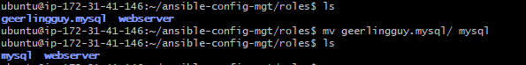
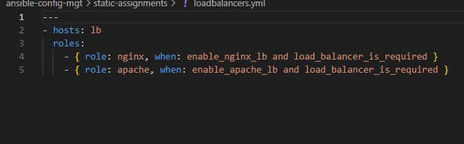

---

# **Ansible Dynamic Assignments and Community Roles**

## **Overview**

This project focuses on configuring UAT (User Acceptance Testing) servers with Ansible, introducing **dynamic assignments** using the `include` module and leveraging **community roles** from Ansible Galaxy. The main objectives are:

1. Understanding the difference between **static** and **dynamic** assignments.
2. Organizing Ansible files for better management of environment-specific configurations.
3. Integrating community roles to avoid reinventing common tasks, like MySQL configuration.
4. Introducing conditional logic for load balancer role selection between **Nginx** and **Apache**.

**Note:** Ansible is actively developed software. For the latest module information, visit the [Ansible Documentation](https://docs.ansible.com/).

---

## **Dynamic Assignments Using Include**

In Ansible, we differentiate between **static** and **dynamic** assignments. Here’s the breakdown:

- **Static Assignments** (using `import`): Ansible processes all referenced playbooks when the main playbook (`site.yml`) is parsed. This means any changes made to the statements after parsing will not be considered, making it static.
- **Dynamic Assignments** (using `include`): Statements are processed only during playbook execution. This allows for any changes to take effect in real time.

**Recommendation:** Use static assignments (`import`) for reliability and ease of debugging. Use dynamic assignments (`include`) selectively, especially for environment-specific variables.

### **Project Structure**

1. **Create a New Branch**:
   Start by creating a new branch in your GitHub repository named **dynamic-assignments**:
   ```bash
   git checkout -b dynamic-assignments
   ```

   

2. **Create Directory for Dynamic Assignments**:
   Within this branch, add a folder `dynamic-assignments` to store dynamic configurations.

   ```
   ├── dynamic-assignments
   │   └── env-vars.yml
   ```

3. **Configure Environment-Specific Variables**:
   Create an `env-vars.yml` file inside the `dynamic-assignments` folder. This file will collate environment-specific variables dynamically during playbook execution.

4. **Setup Environment Variables Directory**:
   Create a new folder named **env-vars** to hold YAML files for each environment:
   - `dev.yml`
   - `stage.yml`
   - `uat.yml`
   - `prod.yml`

   ```
   ├── env-vars
   │   ├── dev.yml
   │   ├── stage.yml
   │   ├── uat.yml
   │   └── prod.yml
   ```

   - Our folder structure now looks like this:
   ```
   ├── dynamic-assignments
   │   └── env-vars.yml
   ├── env-vars
       └── dev.yml
       └── stage.yml
       └── uat.yml
       └── prod.yml
   ├── inventory
       └── dev
       └── stage
       └── uat
       └── prod
   ├── playbooks
       └── site.yml
   └── static-assignments
       └── common.yml
       └── webservers.yml
   ```

   


5. **Edit `env-vars.yml` for Dynamic Assignment**:
   Insert the following code in `env-vars.yml` to use dynamic assignments:
```yaml
---
- name: Collate variables from environment-specific file
  include_vars:
    file: "{{ item }}"
  with_first_found:
    - files:
        - "{{ inventory_file | basename | splitext | first }}.yml"
        - dev.yml
        - staging.yml
        - prod.yml
        - uat.yml
      paths:
        - "{{ playbook_dir }}/../env-vars"
  tags:
    - always
```

   **Explanation**:
   - **`include_vars`**: Dynamically includes environment-specific variables.
   - **`playbook_dir`**: Refers to the playbook’s directory for accessing files.
   - **`with_first_found`**: Ensures that the first available file (matching environment) is selected.

   Notice 3 things to notice here:

     1. We used include_vars syntax instead of include, this is because Ansible developers decided to separate different features of the module. From Ansible version 2.8, the include module is deprecated and variants of include_* must be used. These are:
      - include_role
      - include_tasks
      - include_vars
   In the same version, variants of import were also introduces, such as:

      - import_role
      - import_tasks

   2. We made use of a special variables {{ playbook_dir }} and {{ inventory_file }}. {{ playbook_dir }} will help Ansible to determine the location of the running playbook, and from there navigate to other path on the filesystem. {{ inventory_file }} on the other hand will dynamically resolve to the name of the inventory file being used, then append .yml so that it picks up the required file within the env-vars folder.
   3. We are including the variables using a loop. with_first_found implies that, looping through the list of files, the first one found is used. This is good so that we can always set default values in case an environment specific env file does not exist.


6. **Update `site.yml` with Dynamic Assignments**:
   Add the `include` directive in `site.yml` to use dynamic variables:
```yaml
---
# Play for including dynamic variables
- name: Include dynamic variables
  hosts: all
  become: yes
  tasks:
    - name: Load dynamic variables
      include_tasks: ../dynamic-assignments/env-vars.yml
      tags:
        - always
- import_playbook: ../static-assignments/uat-webservers.yml
```


git commit to add new changes to github directory


---

## **Community Roles**

For repetitive tasks like setting up a MySQL database, we can leverage community roles available on [Ansible Galaxy](https://galaxy.ansible.com/).

### **Adding the MySQL Role**

1. **Initialize Git and Branch for Roles**:
   ```bash
   git init
   git pull https://github.com/<your-name>/ansible-config-mgt.git
   git remote add origin https://github.com/<your-name>/ansible-config-mgt.git
   git branch roles-feature
   git switch roles-feature
   ```

   

   

2. **Install MySQL Role from Galaxy**:
   Use the following command to install the MySQL role:
   ```bash
   ansible-galaxy install geerlingguy.mysql
   ```

   

   Rename the role folder:
   ```bash
   mv geerlingguy.mysql/ mysql
   ```

   

3. **Edit the Role Variables**:
   In the `roles/mysql/vars/main.yml` file, set up your database configuration, such as the root password, database name, and user credentials:
```yaml
mysql_root_password: ""

mysql_databases:
  - name: "( input your required db name )"
    encoding: latin1
    collation: latin1_general_ci

mysql_users:
  - name: "( include your required db user name )"
    host: "( include the required subnet cidr ip address of your webservers )"
    password: "( include your required password for the db )"
    priv: "(include the added db name).*:ALL"

```


- Follow the instructions in the `README.md` file inside the `mysql` role folder to ensure proper setup for your MySQL instance.
- You might need to tweak the configuration depending on your tooling website requirements.


4. **Push Changes to GitHub**:
   ```bash
   git add .
   git commit -m "Added MySQL role configuration"
   git push --set-upstream origin roles-feature
   ```


- Save. Create a new playbook inside static-assignments folder and call it db-servers.yml , update it with the created roles. use the code below:

```yaml
---
- hosts: db
  become: yes
  vars_files:
    - vars/main.yml
  roles:
    - role: mysql
```
- Next update `site.yml` with `- import_playbook: ../static-assignments/db-servers.yml`


Now, if you are satisfied with your codes, you can create a Pull Request on GitHub to merge your `roles-feature` branch into the `main` branch.

---

## **Configuring Load Balancer Roles**

To allow flexibility in choosing between **Nginx** and **Apache** load balancers:

1. **Create Load Balancer Roles**:
   - Develop or install community roles for `nginx` and `apache` from Ansible Galaxy.

   1. **Install Nginx Load Balancer Role**:
   ```bash
   ansible-galaxy install geerlingguy.nginx
   mv geerlingguy.nginx nginx
   ```

   

   

2. **Install Apache Load Balancer Role**:
   ```bash
   ansible-galaxy install geerlingguy.apache
   mv geerlingguy.apache apache
   ```

   

> NB: Since only one load balancer (either Nginx or Apache) will be enabled in each environment, we will use conditional logic in our roles.

   
2. **Setup Conditional Variables**:
   In the `defaults/main.yml` file inside both the `nginx` and `apache` roles, define variables to control whether the load balancer should be enabled:

   ```yaml
   # roles/nginx/defaults/main.yml
   enable_nginx_lb: false
   load_balancer_is_required: false

   # roles/apache/defaults/main.yml
   enable_apache_lb: false
   load_balancer_is_required: false
   ```

   

   

3. **Configure Load Balancer Assignments**:
   Create a `loadbalancers.yml` file, Use conditional role execution to decide whether to enable Nginx or Apache based on environment variables:
   ```yaml
   - hosts: lb
     roles:
       - { role: nginx, when: enable_nginx_lb and load_balancer_is_required }
       - { role: apache, when: enable_apache_lb and load_balancer_is_required }
   ```

   

4. **Update `site.yml` to Import `loadbalancers.yml`**:
   Insert the following:
   ```yaml

    - import_playbook: ../static-assignments/loadbalancers.yml
      when: load_balancer_is_required
   ```


5. **Environment-Specific Configuration**:
   In the `env-vars` file, enable either `nginx` or `apache`:
   ```yaml
   enable_nginx_lb: true
   load_balancer_is_required: true
   ```

   
   To switch to Apache, set:
   ```yaml
   enable_nginx_lb: false
   enable_apache_lb: true
   load_balancer_is_required: true
   ```


6. **For nginx**

- In the roles/nginx/tasks/main.yml file, create a similar task like we did above to check if apache is active and enabled, if it is, it should disable and stop apache before proceeding with the tasks of installing nginx. use the code below :

```yaml
- name: Check if Apache is running
  ansible.builtin.service_facts:
                     
- name: Stop and disable Apache if it is running
  ansible.builtin.service:
    name: apache2 
    state: stopped
    enabled: no
  when: "'apache2' in services and services['apache2'].state == 'running'"
  become: yes
```


- In the roles/nginx/handlers/main.yml file, set nginx to always perform the tasks with sudo privileges, use the function : `become: yes` to achieve this
    -  Do the same for all tasks that require sudo privileges

    

- In the role/nginx/defaults/main.yml file, uncomment the nginx_vhosts, and nginx_upstream section:
```bash
nginx_vhosts:
# Example vhost below, showing all available options:
- listen: "80" # default: "80"
  server_name: "example.com" # default: N/A
  root: "/var/www/html" # default: N/A
  index: "index.php index.htm" # default: "index.html index.htm"
  locations:
          - path: "/"
            proxy_pass: "http://myapp1"

#   filename: "example.com.conf" # Can be used to set the vhost filename.

  server_name_redirect: "www.example.com"
  error_page: ""
  access_log: ""
  error_log: ""
  extra_parameters: ""
  template: "{{ nginx_vhost_template }}"
  state: "present"
  become: yes


nginx_upstreams: 
- name: myapp1
  strategy: "ip_hash" # "least_conn", etc.
  keepalive: 16 # optional
  servers:
    - "172.31.26.143 weight=5"
    - "172.31.18.71 weight=5"
  become: yes
   ```
7. Under the nginx_upstream section, you wil need to update the servers address to include your webservers or uat servers.:
```bash
nginx_upstreams: 
- name: myapp1
  strategy: "ip_hash" # "least_conn", etc.
  keepalive: 16 # optional
  servers:
    - "<uat-server1-private-ip> weight=5"
    - "<uat-server2-private-ip> weight=5"
  become: yes
```


8. **Update `roles/nginx/templates/nginx.conf.j2`**

Comment the line include {{ nginx_vhost_path }}/*;

This line renders the /etc/nginx/sites-enabled/ to the http configuration of Nginx.

Create a server block template in Nginx.conf.j2 for nginx configuration file to override the default in nginx role.
```yaml

    server {
        listen {{ vhost.listen }};
        server_name {{ vhost.server_name }};
        root {{ vhost.root }};
        index {{ vhost.index }};

    
        location {{ location.path }} {
            proxy_pass {{ location.proxy_pass }};
        }
    
  }

```


finally, update the inventory/uat.yml to include the neccesary details for ansible to connect to each of these servers to perform all the roles we have specified. use the code below :
```bash
[db]
<db private ip> ansible_ssh_user=ubuntu

[lb]
<lb private ip> ansible_ssh_user=ubuntu
```


9. To configure Apache as Loadbalancer
- in the roles/apache/tasks/main.yml file, wwe need to include a task that tells ansible to first check if nginx is currently running and enabled, if it is, ansible should first stop and disable nginx before proceeding to install and enable apache. this is to avoid confliction and should always free up the port 80 for the required load balancer. use the code beow to achieve this :

```yaml
- name: Check if nginx is running
  ansible.builtin.service_facts:
                     
- name: Stop and disable nginx if it is running
  ansible.builtin.service:
    name: nginx 
    state: stopped
    enabled: no
  when: "'nginx' in services and services['nginx'].state == 'running'"
  become: yes

```


-  To use apache as a load balancer, we will need to allow certain apache modules that will enable the load balancer. this is the APACHE A2ENMOD.
In the roles/apache/tasks/configure-debian.yml file, Create a task to install and enable the required apache a2enmod modules, use the code below :
```yaml
- name: Enable Apache modules
  ansible.builtin.shell:
    cmd: "a2enmod {{ item }}"
  loop:
    - rewrite
    - proxy
    - proxy_balancer
    - proxy_http
    - headers
    - lbmethod_bytraffic
    - lbmethod_byrequests
  notify: restart apache
  become: yes
```


- Create another task to update the apache configurations with required code block needed for the load balancer to function. use the code below :

```yaml
- name: Insert load balancer configuration into Apache virtual host
  ansible.builtin.blockinfile:
  path: /etc/apache2/sites-available/000-default.conf
  block: |
    <Proxy "balancer://mycluster">
      BalancerMember http://<webserver1-private-ip-address>:80
      BalancerMember http://<webserver2-private-ip-address>:80
      ProxySet lbmethod=byrequests
    </Proxy>
    ProxyPass "/" "balancer://mycluster/"
    ProxyPassReverse "/" "balancer://mycluster/"
  marker: "# {mark} ANSIBLE MANAGED BLOCK"
  insertbefore: "</VirtualHost>"
notify: restart apache
become: yes
```


## Configure your webserver roles to install php and all its dependencies , as well as cloning your tooling website from your github repo

In the roles/webserver/tasks/main.yml ,
write the following tasks. use the code below :

```yaml
- name: Install Apache
  remote_user: ec2-user
  become: true
  become_user: root
  ansible.builtin.yum:
    name: "httpd"
    state: present

- name: Install Git
  remote_user: ec2-user
  become: true
  become_user: root
  ansible.builtin.yum:
    name: "git"
    state: present

- name: Install EPEL release
  remote_user: ec2-user
  become: true
  become_user: root
  ansible.builtin.command:
    cmd: sudo dnf install https://dl.fedoraproject.org/pub/epel/epel-release-latest-9.noarch.rpm -y

- name: Install dnf-utils and Remi repository
  remote_user: ec2-user
  become: true
  become_user: root
  ansible.builtin.command:
    cmd: sudo dnf install dnf-utils http://rpms.remirepo.net/enterprise/remi-release-9.rpm -y

- name: Reset PHP module
  remote_user: ec2-user
  become: true
  become_user: root
  ansible.builtin.command:
    cmd: sudo dnf module reset php -y

- name: Enable PHP 7.4 module
  remote_user: ec2-user
  become: true
  become_user: root
  ansible.builtin.command:
    cmd: sudo dnf module enable php:remi-7.4 -y

- name: Install PHP and extensions
  remote_user: ec2-user
  become: true
  become_user: root
  ansible.builtin.yum:
    name:
      - php
      - php-opcache
      - php-gd
      - php-curl
      - php-mysqlnd
    state: present

- name: Install MySQL client
  remote_user: ec2-user
  become: true
  become_user: root
  ansible.builtin.yum:
    name: "mysql"
    state: present

- name: Start PHP-FPM service
  remote_user: ec2-user
  become: true
  become_user: root
  ansible.builtin.service:
    name: php-fpm
    state: started

- name: Enable PHP-FPM service
  remote_user: ec2-user
  become: true
  become_user: root
  ansible.builtin.service:
    name: php-fpm
    enabled: true

- name: Set SELinux boolean for httpd_execmem
  remote_user: ec2-user
  become: true
  become_user: root
  ansible.builtin.command:
    cmd: sudo setsebool -P httpd_execmem 1

- name: Clone a repo
  remote_user: ec2-user
  become: true
  become_user: root
  ansible.builtin.git:
    repo: https://github.com/AyopoB/tooling.git
    dest: /var/www/html
    force: yes

- name: Copy HTML content to one level up
  remote_user: ec2-user
  become: true
  become_user: root
  command: cp -r /var/www/html/html/ /var/www/

- name: Start httpd service, if not started
  remote_user: ec2-user
  become: true
  become_user: root
  ansible.builtin.service:
    name: httpd
    state: started

- name: Recursively remove /var/www/html/html directory
  remote_user: ec2-user
  become: true
  become_user: root
  ansible.builtin.file:
    path: /var/www/html/html
    state: absent

```

Update roles/nginx/tasks/main.yml with the code below to create a task that check and stop apache if it is running


## **Testing and Validation**

1. **Setup Inventory for Each Environment**:
   Update inventory files to include environment-specific servers.
```yaml
[uat-webservers]
<server1-ip-address> ansible_ssh_user=<ec2-username> 
<server2-ip-address> ansible_ssh_user=<ec2-username> 

[lb]
<lb-instance-ip> ansible_ssh_user=<ec2-username> 

[db-servers]
<db-instance-ip> ansible_ssh_user=<ec2-username>

```

2. **Run Playbooks**:
   Execute playbooks for different environments to validate that variables and roles are correctly applied.

   ```bash
   ansible-playbook -i inventory/uat.yml playbooks/site.yml
   ```

  

3. **Commit the Updated Roles**:

   After testing, commit the changes to GitHub:
   ```bash
   git add .
   git commit -m "Add MySQL and load balancer roles with conditional execution"
   git push origin roles-feature
   ```
   


4. Test Loadbalancer public IP on browser:


- Confirm tooling database was created in DB server:


5. **Merge Pull Request**:
   On GitHub, create a Pull Request to merge the `roles-feature` branch into `main` and review the changes.
---


## **Conclusion**

In this project, we utilized **dynamic assignments** to configure environment-specific variables, integrated **community roles** for MySQL, and implemented conditional load balancer roles for Nginx and Apache. This approach demonstrates modular configuration management in Ansible, enabling scalability and flexibility across environments.

--- 


---
# Play 1: Loads dynamic variables for all hosts
- name: Include dynamic variables
  hosts: all
  tasks:
    - name: Load dynamic variables
      include_tasks: ../dynamic-assignments/env-vars.yml
      tags:
        - always

# Play 2: Imports common configuration for all hosts
- name: Import common playbook
  import_playbook: ../static-assignments/common.yml

# Play 3: Specific configuration for UAT webservers only
- name: Configure UAT webservers
  hosts: uat-webservers
  tasks:
    - name: Import UAT specific tasks
      import_tasks: ../static-assignments/uat-webservers.yml
