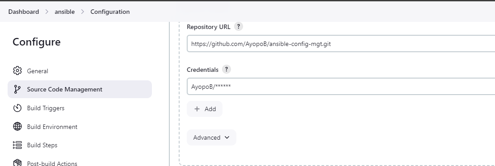
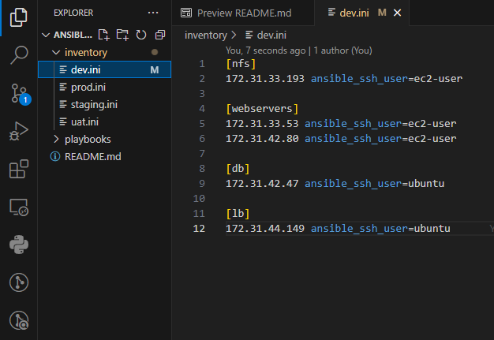

# Ansible Configuration Management  

## **Step 1: Install and Configure Ansible on EC2 Instance**

##### 1.1 **Update the EC2 Instance Name Tag**
First, update the **Name** tag of your **Jenkins** EC2 instance to `Jenkins-Ansible`. This instance will serve as your control node for running Ansible playbooks.
Secondly, create new instances for your db, nfs, lb and 2 webservers. We will make use of them for this project.


##### 1.2 **Create a GitHub Repository**
In your GitHub account, create a new repository named `ansible-config-mgt`. This repository will store your Ansible configurations, playbooks, and inventory files.


##### 1.3 **Install Ansible on the EC2 Instance**
To install Ansible on the `Jenkins-Ansible` server, follow these steps:

1. Update your package index:
   ```bash
   sudo apt update
   ```
2. Install Ansible:
   ```bash
   sudo apt install ansible
   ```
3. Verify the installation by checking the Ansible version:
   ```bash
   ansible --version
   ```

   


##### 1.4 **Configure Jenkins to Build Your Ansible Repository**

Now that Ansible is installed, let's automate the integration between Jenkins and your GitHub repository:

1. **Create a Jenkins Freestyle Project:**
   - In Jenkins, create a new freestyle project called **ansible**.
   - Set the source control to point to your newly created `ansible-config-mgt` GitHub repository.




2. **Configure a Webhook in GitHub:**
   - Go to your GitHub repository’s settings and configure a webhook. This webhook should point to your Jenkins server and trigger the **ansible** project build every time changes are pushed to the `master` (or `main`) branch.
   


3. **Configure a Post-Build Action:**
   - In Jenkins, configure a post-build action to archive all files generated during the build


##### 1.5 **Testing the Setup**
To confirm everything is functioning as expected:

1. Make a minor change in the `README.md` file in the `master` branch of your GitHub repository.
2. Push the changes and verify that Jenkins automatically triggers the build.


3. Check that the build artifacts are saved in the specified directory.
     ```bash
     ls /var/lib/jenkins/jobs/ansible/builds/<build_number>/archive/
     ```


Now our setup will look like this:


##### 1.6 **Elastic IP Allocation**
To ensure your Jenkins instance is always accessible without reconfiguring webhooks:

- Allocate an **Elastic IP** to your `Jenkins-Ansible` instance by following the steps from [Project 10](https://github.com/AyopoB/StegHub-PBL/tree/main/Load-Balancer-Solution-With-Nginx-and-SSL-TLS) (Elastic IP allocation for Load Balancer).


---


## **Step 2: Prepare Your Development Environment Using Visual Studio Code**

The development phase of DevOps requires proper coding tools, and setting up your development environment in **Visual Studio Code (VSC)** will streamline your process:

1. **Install Visual Studio Code:**
   - Download and install [Visual Studio Code](https://code.visualstudio.com/).
   
2. **Connect VSC to Your GitHub Repository:**
   - Use VSC to connect to your newly created `ansible-config-mgt` GitHub repository for seamless code management.

3. **Clone Your Repository:**
   - Clone the `ansible-config-mgt` repository to your `Jenkins-Ansible` EC2 instance:
     ```bash
     git clone <ansible-config-mgt repo link>
     ```

     


---

## **Step 3: Begin Ansible Development**

#### 3.1 **Create a New Development Branch**

To manage changes effectively, create a new branch in your `ansible-config-mgt` repository, dedicated to developing new features or configurations. 

1. **Create the Branch:**
   Use descriptive branch names:
   ```bash
   git checkout -b feature/prj-11-ansible-config
   ```


2. **Push the Branch to GitHub:** 

   After creating the branch, push it to GitHub to keep it available for tracking and collaboration:
   ```bash
   git push -u origin feature/prj-11-ansible-config
   ```

#### 3.2 **Organize Code Structure**

With a new branch set up, start organizing directories to follow best practices:

1. **Create the `playbooks` Directory:**
   This folder will hold your `.yml` files, each file representing a playbook that defines tasks Ansible will execute on target servers:
   ```bash
   mkdir playbooks
   ```

2. **Create the `inventory` Directory:**
   To organize server environments by function, create an `inventory` directory:
   ```bash
   mkdir inventory
   ```

3. **Add Initial Files:**
   - Inside `playbooks`, create your first playbook file named `common.yml`:
     ```bash
     touch playbooks/common.yml
     ```
   - Inside `inventory`, add initial files for different environments:
     ```bash
     touch inventory/dev.yml inventory/staging.yml inventory/uat.yml inventory/prod.yml
     ```

These initial files will help you manage different server groups, like Development, Staging, Testing (UAT), and Production.


---

## **Step 4: Set up an Ansible Inventory**

An **Ansible inventory** organizes your servers into groups, allowing targeted deployments based on server roles. 

#### 4.1  **Configure SSH Access for Ansible**

To execute tasks on remote servers, set up SSH key access:

1. **Start the SSH Agent:**
   ```bash
   eval `ssh-agent -s`
   ```

2. **Add Your Private Key to SSH Agent:**
   ```bash
   ssh-add <path-to-private-key>
   ```

3. **Verify SSH Key Addition:**
   Confirm your private key was added by checking the loaded keys:
   ```bash
   ssh-add -l
   ```

4. **Enable Agent Forwarding for SSH into Jenkins-Ansible Server:**
   ```bash
   ssh -A ubuntu@<Jenkins-Ansible-Instance-Public-IP>
   ```

   

Using **SSH agent forwarding** lets Ansible access other servers within your AWS environment using the private key stored on your local machine. This setup ensures secure access without direct key storage on the Ansible host.


#### 4.2  **Define Inventory Structure for Development**

To configure your development environment, start by adding server details to the `inventory/dev.ini` file. Replace placeholders with actual IP addresses from your AWS setup:

```ini
[nfs]
<NFS-Server-Private-IP-Address> ansible_ssh_user=ec2-user

[webservers]
<Web-Server1-Private-IP-Address> ansible_ssh_user=ec2-user
<Web-Server2-Private-IP-Address> ansible_ssh_user=ec2-user

[db]
<Database-Private-IP-Address> ansible_ssh_user=ubuntu

[lb]
<Load-Balancer-Private-IP-Address> ansible_ssh_user=ubuntu
```



Each server group (`nfs`, `webservers`, `db`, `lb`) represents a different function within your infrastructure. You can refer to each group individually within playbooks to apply specific configurations.
---


## **Step 5: Create a Common Playbook**

The goal is to set up a `common.yml` playbook with configurations applicable across servers in the inventory. This playbook contains tasks for updating software and performing common administrative actions on different types of servers.

#### 5.1 **Examine the Common Playbook Structure**

The playbook is divided into two sections, each specifying tasks for distinct server groups:

1. **Update Web and NFS Servers:**
   - Uses the **`yum` package manager** (common to RHEL-based systems).
   - Ensures that Wireshark, a network packet analyzer, is installed and updated on the servers.
2. **Update Load Balancer  and DB  Servers:**
   - Uses **`apt`** for Ubuntu servers.
   - Updates the `apt` cache and ensures Wireshark is installed on the Load Balancer.

The YAML code structure in `common.yml` looks as follows:

```yaml
---
- name: update web and nfs servers
  hosts: webservers, nfs
  become: yes
  tasks:
    - name: ensure wireshark is at the latest version
      yum:
        name: wireshark
        state: latest

- name: update LB server, db
  hosts: lb,db
  become: yes
  tasks:
    - name: Update apt repo
      apt: 
        update_cache: yes

    - name: ensure wireshark is at the latest version
      apt:
        name: wireshark
        state: latest
```


#### 5.2 **Expand the Common Playbook**

Add more tasks to make the playbook comprehensive for common configurations:

1. **Create a Directory and File:**
   - This example creates a directory called `/etc/ansible-config` and a file named `config.txt` on each target machine.

   ```yaml
   - name: Create directory and file
     hosts: all
     become: yes
     tasks:
       - name: Create directory
         file:
           path: /etc/ansible-config
           state: directory
       - name: Create file inside the directory
         file:
           path: /etc/ansible-config/config.txt
           state: touch
   ```

2. **Change Timezone:**
   - Sets the timezone to Lagos across all servers for standardization.

   ```yaml
   - name: Change timezone to Lagos
     hosts: all
     become: yes
     tasks:
       - name: Set timezone to Africa/Lagos
         command: timedatectl set-timezone Africa/Lagos

   ```


#### **Updating the Playbook File**

Update the `common.yml` playbook with these new tasks.

---

## **Step 6: Update Git with the Latest Code**

Collaboration in a DevOps environment involves using Git for version control, where changes are reviewed before merging into the main branch.

#### 6.1 **Stage and Commit Changes**

1. **Check the Status of Modified Files:**
   ```bash
   git status
   ```

2. **Add Files to Staging Area:**
   Specify files to be committed, or use `.` to stage all changes:
   ```bash
   git add playbooks/common.yml inventory/dev.ini
   ```

3. **Commit the Changes with a Message:**
   Include a clear and descriptive commit message:
   ```bash
   git commit -m "Add common.yml playbook with initial configuration tasks"
   ```

#### 6.2 **Push Changes to GitHub**

Push your changes to the feature branch:

```bash
git push origin feature/prj-11-ansible-config
```

#### 6.3 **Create a Pull Request (PR)**

1. **Navigate to Your Repository on GitHub** and locate your branch.
2. Click on **Pull Request** to compare changes between the feature branch and `main`.
3. **Add a Title and Description** for the PR and submit it for review.


#### 6.4 **Review and Merge the PR**

Switch roles to review the PR. Check the code for accuracy and adherence to standards. If satisfied:

1. Approve the PR and **Merge** it into the `main` branch.
2. Once merged, delete the feature branch if no longer needed.


#### 6.5 **Sync Local Master Branch**

On your local machine, switch back to `main`, pull the latest changes, and confirm the merge:

```bash
git checkout main
git pull origin main
```


After the changes are merged, Jenkins will automatically trigger a build, archiving the files in the following directory:
```plaintext
/var/lib/jenkins/jobs/ansible/builds/<build_number>/archive/
```


---

## **Step 7: Run the First Ansible Test**

After configuring the playbook and setting up inventory files, it’s time to test if the playbook runs correctly across your servers. This step verifies if Ansible is correctly applying configurations specified in the `common.yml` playbook.

#### 7.1 **Connecting to the Instance in VS Code**

Before executing the playbook, ensure your **VSCode is properly configured to connect** to your Jenkins-Ansible instance over SSH. This setup simplifies command execution directly from VSCode

Configuring Visual Studio Code (VSCode) for SSH access to your Jenkins-Ansible instance streamlines running Ansible commands, editing files, and viewing logs directly from your local VSCode interface. Below are the steps for setting up this SSH connection.

   1. Install the VSCode Remote - SSH Extension**

      1. Open **VSCode** and go to the **Extensions** sidebar (or press `Ctrl+Shift+X`).
      2. Search for the extension called **Remote - SSH** (developed by Microsoft).
      3. Click **Install** to add it to VSCode.
      
   2. Configure the SSH Connection in VSCode**

      1. **Access the Remote Explorer**:
         - In VSCode, go to the **Remote Explorer** sidebar.
         - Select **SSH Targets** from the dropdown.
         

      2. **Add SSH Target**:
         - Click on the **plus (+)** icon next to **SSH Targets**.
         - You will be prompted to **Enter SSH Connection Command**. This command specifies the user and IP address of your Jenkins-Ansible instance:
         ```bash
         ssh ubuntu@<Jenkins-Ansible-Public-IP>
         ```
         Replace `<Jenkins-Ansible-Public-IP>` with the actual IP address of your Jenkins-Ansible instance.
      
      3. **Select the SSH Configuration File**:
         - After entering the command, VSCode will prompt you to select an SSH configuration file (usually `~/.ssh/config` if it exists).
         - If you don’t have an SSH config file, VSCode will create one for you in your `~/.ssh/` directory.

   3. Set Up SSH Key Authentication**

   To authenticate using your SSH private key, follow these steps to integrate it with your `ssh-agent` and configure VSCode:


      1. **Modify the SSH Config File **:
         - Open the `~/.ssh/config` file in a text editor.
         - Add an entry for your Jenkins-Ansible instance:
         ```plaintext
         Host jenkins-ansible
            HostName <Jenkins-Ansible-Public-IP>
            User ubuntu
            IdentityFile <path-to-private-key>
         ```
         Replace `<Jenkins-Ansible-Public-IP>` and `<path-to-private-key>` with your instance’s IP and the path to your SSH key, respectively.


   4. Connect to the Jenkins-Ansible Instance**

      1. In the **Remote Explorer** sidebar in VSCode, under **SSH Targets**, you should see your newly added SSH target.
      2. Click on **Connect** next to `jenkins-ansible` (or the alias you created).
      3. VSCode will open a new remote window connected to your Jenkins-Ansible instance, allowing you to use the terminal, edit files, and run commands directly.

   5. Open the Ansible Project Directory in VSCode**

   Once connected, navigate to your Ansible project directory (`ansible-config-mgt`) on the Jenkins-Ansible instance:
   1. In the remote VSCode window, open the **File Explorer**.
   2. Browse to the `ansible-config-mgt` directory and open it.
   3. You can now edit, save, and run commands directly in this directory, simplifying management and execution.

**Testing the SSH Connection**

   To confirm the SSH connection works smoothly:
   1. Open the VSCode terminal (`Ctrl+` or `Terminal > New Terminal`).
   2. Run a simple command to verify access:
   ```bash
   whoami
   ```
   It should display the `ubuntu` user or whatever username is configured for your Jenkins-Ansible instance.

   3. Optionally, list the contents of the `ansible-config-mgt` directory:
   ```bash
   ls ansible-config-mgt
   ```
   This ensures you have the correct permissions and that your SSH setup is working as expected.

   With this setup complete, you’re ready to execute Ansible playbooks directly from VSCode, streamlining your development and testing workflow for Ansible automation.

#### 7.2 **Navigate to the Project Directory**

1. Open a terminal in VS Code or SSH into your Jenkins-Ansible instance.
2. Navigate to your project directory:

   ```bash
   cd ansible-config-mgt
   ```

#### 7.3 **Run the Playbook with Ansible**

To execute the `common.yml` playbook on the `dev` environment servers, use the following Ansible command. This command specifies the inventory file and playbook to use:

```bash
ansible-playbook -i inventory/dev.yml playbooks/common.yml
```


This command does the following:
- Uses `-i inventory/dev.yml` to specify the **inventory file** for the development environment.
- Targets the **`playbooks/common.yml`** playbook.

> **Note:** Make sure you’re in the `ansible-config-mgt` directory before running the command.

#### 7.4 **Verify Installation on Each Server**

After the playbook runs, verify that Wireshark was successfully installed on the servers. To confirm, SSH into each server and check the installation status by running:

```bash
which wireshark
```

or

```bash
wireshark --version
```


If Wireshark is installed, these commands should output the path to Wireshark or display its version number.

---

### **Updated Ansible Architecture**

Your updated architecture with Ansible now involves:
- **Ansible Control Node (Jenkins-Ansible Server):** Hosts your Ansible configuration and executes playbooks.
- **Managed Nodes (Inventory Servers):** The playbook applies tasks to these nodes (web servers, NFS, database, and load balancer servers).
- **Inventory Files:** Organize managed nodes by environment (e.g., `dev`, `staging`, `uat`, `prod`), allowing targeted configurations.

Each playbook you create will ensure consistent and automated configurations across your environments, streamlining tasks like package installations, system configurations, and maintenance tasks on multiple servers. 


### Lessons Learned

1. **Importance of Automation and Configuration Management**: Setting up Ansible with Jenkins and GitHub highlighted the importance of automated configuration management. Automating these tasks allowed for consistent and repeatable configurations across multiple environments, reducing human error and manual effort.

2. **Repository and Branching Practices**: Managing configurations in a structured GitHub repository and creating a dedicated development branch helped reinforce best practices in version control. This approach not only makes collaboration smoother but also keeps production code stable by isolating changes for testing and review.

3. **Webhooks for Continuous Integration**: Configuring GitHub webhooks with Jenkins to trigger builds automatically with each code push was valuable in ensuring continuous integration. This setup emphasized the need for real-time code testing and deployment as part of a CI/CD pipeline.

4. **Inventory Management and SSH Configuration**: Defining Ansible inventory files for different environments (e.g., Development, Staging, Production) was key to organizing infrastructure roles effectively. Additionally, setting up SSH agent forwarding was crucial for secure and hassle-free remote access to the servers, demonstrating the significance of secure access configurations.

5. **VSCode Integration with Remote Servers**: Using Visual Studio Code's SSH integration streamlined the workflow by enabling code edits and command executions directly on the remote server. This made it convenient to test and modify configurations without switching between interfaces, speeding up the development process.

6. **Structured Playbooks for Scalability**: Writing modular and role-based playbooks, like the `common.yml` for general configurations, underscored the value of structure and reusability. Organizing playbooks by function and server groups is a sustainable practice, especially as infrastructure scales.

7. **Challenges in Network Management and IP Allocation**: Allocating an Elastic IP for the Jenkins-Ansible server was essential to maintain persistent access, reinforcing the importance of stable IP allocation for core infrastructure components. This step minimized reconfiguration needs and ensured reliability for continuous integration processes.

8. **Debugging and Iterative Testing**: Running the initial Ansible playbook test and troubleshooting any SSH or configuration errors was a reminder of the iterative process in DevOps. Debugging and testing helped refine the setup and validate that each component was correctly configured and working as expected.

Through this project, I gained a deeper understanding of how powerful configuration management tools like Ansible can be when integrated with CI/CD systems like Jenkins, setting a foundation for scalable and reliable DevOps practices.


