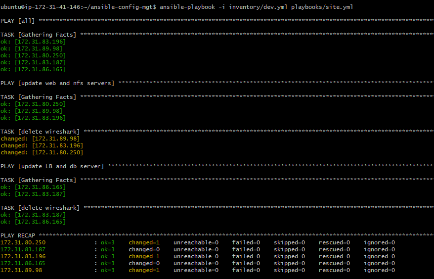
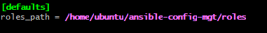
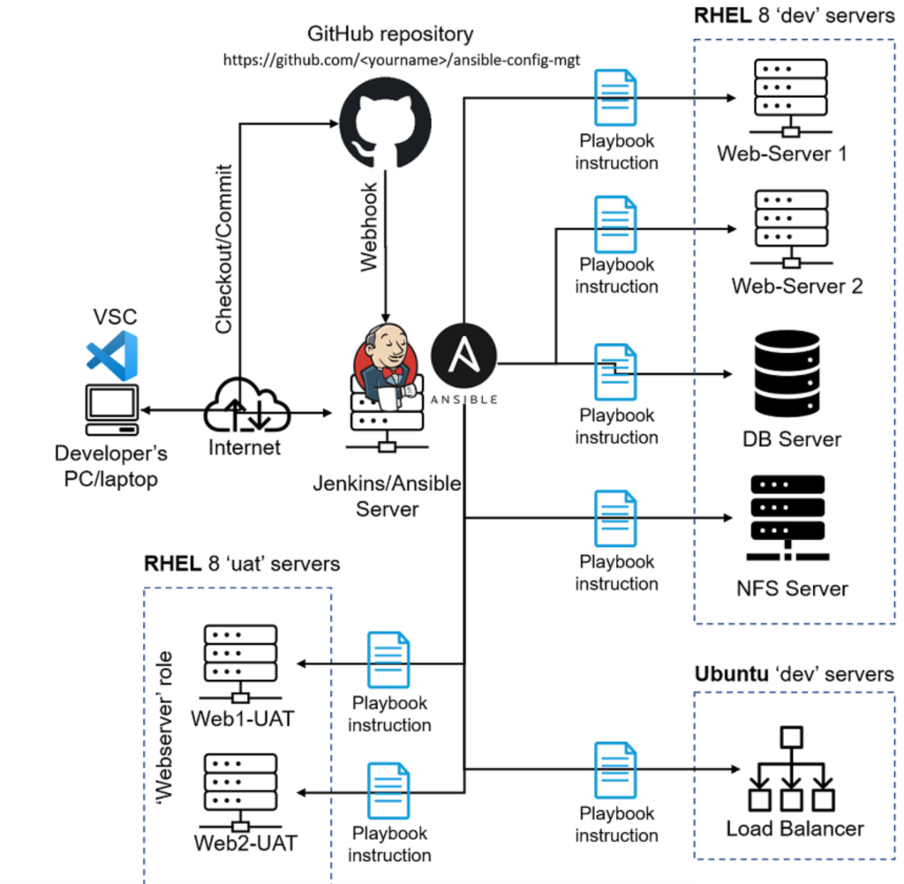

# Ansible Refactoring and Jenkins Job Enhancement Documentation

### **Objective:**
The goal of this project is to enhance the Ansible configuration by organizing playbooks in a modular way using imports and to optimize Jenkins job performance by centralizing artifacts, preventing directory clutter, and improving storage efficiency.

---

## **Step 1 - Jenkins Job Enhancement**

As our project evolves, we want to avoid multiple directories filling up with each build. Instead, we’ll centralize our artifacts into a single directory, making it easier to manage, save space, and maintain a clean workspace. This step involves setting up a dedicated directory on the Jenkins server and configuring the job to store artifacts in one place.

1. **Create Artifact Directory**  
   Log into the Jenkins-Ansible server and create a new directory for storing artifacts:
   ```bash
   sudo mkdir /home/ubuntu/ansible-config-artifact
   ```
   Update permissions to allow Jenkins write access:
   ```bash
    sudo chmod -R 0777 /home/ubuntu/ansible-config-artifact
   ```

2. **Install Copy Artifact Plugin in Jenkins**
   - Go to **Jenkins Web Console** > **Manage Jenkins** > **Manage Plugins**.
   - In the **Available** tab, search for `Copy Artifact` and install it.


   

3. **Create a New Jenkins Job for Artifact Storage**  
   - Create a new Freestyle project in Jenkins called `save_artifacts`.
   - Configure this project to be triggered by the completion of your existing `ansible` project.
        1. **Open Jenkins Job Configuration**  
   Go to your `save_artifacts` job settings.

        2. **Add Build Trigger**  
   In the **Build Triggers** section, select **Build after other projects are built**.


   


        3. **Specify Project**  
    Enter `ansible` as the project to trigger this job upon completion.

        4. **Save Configuration**  
    Click **Save** to apply changes.

4. **Configure Artifact Copying**  
   - In the **Build step** section, add a **Copy artifacts from other projects** step.
   - Set `ansible` as the **Source Project** and `/home/ubuntu/ansible-config-artifact` as the **Target Directory**.

   

5. **Run a Test Build**  
   - Make a small change in the `README.md` file in the `ansible-config-mgt` repository.
   - Confirm that Jenkins saves artifacts in the centralized directory and that the artifacts are updated with each new commit to the `main` branch.

      >If permission issues occur, try:
      `sudo chmod 755 /home/ubuntu`

      


   This new setup enhances our pipeline’s clarity, efficiency, and cleanliness by consolidating build outputs.

---

### **Step 2 - Refactor Ansible Code by Importing Playbooks into `site.yml`**

Refactoring is essential in DevOps for making the codebase modular, scalable, and maintainable. By splitting tasks into multiple files, each playbook can handle specific tasks or configurations, improving code readability and maintainability.

1. **Preparation**  
   - Pull down the latest code from the `main` branch of ansible-config-mgt and create a new branch called `refactor`.
    1. **Pull the Latest Code**  
    Fetch and merge the latest updates from the `main` branch:
    ```bash
    git pull origin main
    ```
    
    
    2. **Create a New Branch**  
    Create a new branch named `refactor` in your ansible-config-mgt repository using this command::
    ```bash
    git checkout -b refactor
    ```

    
    

2. **Create the Entry Point Playbook (`site.yml`)**  
   - Inside the `playbooks` folder, create `site.yml`. This playbook will serve as the primary entry point for running Ansible commands across the infrastructure.

3. **Organize Playbooks in a New Folder (`static-assignments`)**  
   - In the root of the repository, create a folder named `static-assignments`.
   - Move `common.yml` (or any other playbooks you’d like to modularize) into this folder.

4. **Import `common.yml` in `site.yml`**  
   - Open `site.yml` and include the following code to import `common.yml`:
     ```yaml
      ---
      - hosts: all
      - import_playbook: ../static-assignments/common.yml
     ```
   - This `import_playbook` structure allows you to add, remove, or update configurations without modifying the main playbook. It is efficient and keeps the `site.yml` organized.

5. **Folder Structure After Refactoring**
   After completing this setup, your directory structure should resemble:
   ```
   ├── static-assignments
   │   └── common.yml
   ├── inventory
   │   ├── dev
   │   ├── stage
   │   ├── uat
   │   └── prod
   └── playbooks
       └── site.yml
   ```

   

6. **Running the Playbook**

Add Deletion Playbook (`common-del.yml`), 
For testing and ensuring modularity, add a new playbook that removes an application (in this case, Wireshark).

1. **Create `common-del.yml` Playbook**  
   - Inside the `static-assignments` folder, create `common-del.yml`:
     ```yaml
     ---
     - name: update web and nfs servers
       hosts: webservers, nfs
       remote_user: ec2-user
       become: yes
       become_user: root
       tasks:
         - name: delete wireshark
           yum:
             name: wireshark
             state: removed

     - name: update LB and db server
       hosts: lb, db
       remote_user: ubuntu
       become: yes
       become_user: root
       tasks:
         - name: delete wireshark
           apt:
             name: wireshark
             state: absent
             autoremove: yes
             purge: yes
             autoclean: yes
     ```

2. **Update `site.yml` to Import `common-del.yml`**  
   - Modify `site.yml` to import `common-del.yml` for testing:
     ```yaml
     ---
     - import_playbook: ../static-assignments/common-del.yml
     ```

3. **Test Deletion Playbook**  
   - Run the playbook to ensure `wireshark` is removed across all specified servers:
      ```bash
     cd /home/ubuntu/ansible-config-mgt/
     ```

     ```bash
     ansible-playbook -i inventory/dev.yml playbooks/site.yml
     ```
 
     
   - Check for successful deletion:
     ```bash
     wireshark --version
     ```
   - Confirm that Wireshark is no longer available.


   - LB server

      

   - webserver 1
      


---

This refactoring exercise has demonstrated how to use `import_playbooks` for organizing tasks and creating a modular infrastructure configuration. With one command, you can now manage packages across multiple servers, enhancing efficiency and control in configuration management.


---

## **Step 3 - Configure UAT Webservers with a role 'Webserver'**

As we develop our infrastructure further, it is essential to maintain organization and reusability in our Ansible configurations. In this step, we will configure two new Web Servers designated as UAT (User Acceptance Testing) environments using a dedicated Ansible role. This will ensure that our configurations are both clean and reusable for future implementations.

### **3.1 Launching UAT EC2 Instances**

1. **Provisioning New Instances**  
   We will begin by launching two fresh EC2 instances using the RHEL 9 image. These instances will serve as our UAT servers, and we will name them accordingly:
   - **Web1-UAT**
   - **Web2-UAT**

   Ensure that you select the appropriate instance type and security group settings that allow SSH access and necessary HTTP traffic.

2. **Stopping Unused Instances**  
   To optimize costs, it is important to stop any EC2 instances that are not actively in use. For this project, you only need the two new RHEL 8 servers as Web Servers and your existing Jenkins-Ansible server running.

### **3.2 Creating the Ansible Role**

To create a role for configuring the web servers, we need to establish a directory structure that follows Ansible best practices. This can be done using either the `ansible-galaxy` utility or manually.

#### **Using Ansible Galaxy**

1. **Creating Roles Directory**  
   First, create a `roles` directory within your `ansible-config-mgt` repository:
   ```bash
   mkdir roles
   cd roles
   ```

2. **Initialize the Webserver Role**  
   Run the following command to create the necessary folder structure for the webserver role:
   ```bash
   ansible-galaxy init webserver
   ```

#### **Manual Creation**

Alternatively, if you choose to create the directory structure manually, or if you used `ansible-galaxy` remove tests, files, and vars, ensure that your roles folder looks like this:
```
└── webserver
    ├── README.md
    ├── defaults
    │   └── main.yml
    ├── handlers
    │   └── main.yml
    ├── meta
    │   └── main.yml
    ├── tasks
    │   └── main.yml
    └── templates
```


### **3.3 Updating Inventory for UAT Servers**

1. **Edit Inventory File**  
   Navigate to your inventory directory and open the `ansible-config-mgt/inventory/uat.yml` file. Add the private IP addresses of your two UAT Web servers with the corresponding Ansible SSH user:
   ```yaml
   [uat-webservers]
   <Web1-UAT-Server-Private-IP-Address> ansible_ssh_user='ec2-user'
   <Web2-UAT-Server-Private-IP-Address> ansible_ssh_user='ec2-user'
   ```

### **3.4 Configuring Ansible Roles Path**

1. **Update Ansible Configuration**  
   Open the Ansible configuration file located at `/etc/ansible/ansible.cfg` and uncomment the `roles_path` line. Set it to the full path of your roles directory:
   ```ini
   roles_path = /home/ubuntu/ansible-config-mgt/roles
   ```

   

### **3.5 Adding Logic to the Webserver Role**

Next, we will define the tasks that our webserver role will execute to configure Apache and deploy the tooling website.

1. **Navigate to Tasks Directory**  
   Go to the `tasks` directory of the `webserver` role and open the `main.yml` file for editing.

2. **Define Configuration Tasks**  
   Here is an outline of the tasks to include in `main.yml`:
   ```yaml
   ---
   - name: Install Apache
     become: true
     ansible.builtin.yum:
       name: "httpd"
       state: present

   - name: Install Git
     become: true
     ansible.builtin.yum:
       name: "git"
       state: present

   - name: Clone Tooling Website from GitHub
     become: true
     ansible.builtin.git:
       repo: https://github.com/<your-name>/tooling.git
       dest: /var/www/html
       force: yes

   - name: Copy HTML content to one level up
     become: true
     ansible.builtin.command:
       cmd: cp -r /var/www/html/html/ /var/www/

   - name: Start HTTPD Service
     become: true
     ansible.builtin.service:
       name: httpd
       state: started

   - name: Remove HTML Directory
     become: true
     ansible.builtin.file:
       path: /var/www/html/html
       state: absent
   ```

### **3.6 Summary of Tasks**

- **Install Apache and Git**: The configuration starts with ensuring the necessary packages are installed.
- **Clone the Tooling Website**: This task pulls the latest version of your tooling website from your GitHub repository to the web server's HTML directory.
- **Copy HTML Content**: This step ensures the website content is properly deployed to the correct directory.
- **Start the HTTPD Service**: The Apache web server service is started to serve the cloned website.
- **Cleanup**: The temporary directory created during the cloning process is removed to keep the server tidy.


---

### Step 4: Reference the `Webserver` Role

1. **Create `uat-webservers.yml`**:
   Inside the `static-assignments` folder, you’ll create a new playbook file called `uat-webservers.yml`. This file will assign the `webserver` role to your UAT web servers.
   
   In `ansible-config-mgt/static-assignments/uat_webservers.yml`, add:
   ```yaml
   ---
   - hosts: uat_webservers
     roles:
       - webserver
   ```

2. **Update `site.yml`**:
   Since `site.yml` serves as the central entry point for your Ansible playbooks, you need to include the new `uat-webservers.yml` playbook so that it’s executed as part of the `site.yml` setup.

   Open `ansible-config-mgt/playbooks/site.yml` and add the following configuration:
   ```yaml
   ---
   - hosts: all
   - import_playbook: ../static-assignments/common.yml
   - hosts: uat-webservers
   - import_playbook: ../static-assignments/uat_webservers.yml
   ```

### Step 5: Commit, Test, and Deploy

1. **Commit Changes**:
   After configuring the playbooks, commit the changes in Git:
   ```bash
   git add .
   git commit -m "Added UAT Webservers configuration using Webserver role"
   git push origin <your-branch-name>
   ```

   

2. **Create a Pull Request (PR)**:
   - Go to GitHub, create a pull request (PR), and merge it into the `master` branch.
   
   - Ensure that your Jenkins job is triggered by the webhook and that two jobs run successfully (indicating the build process was triggered by your commit and deployed to the Jenkins-Ansible server).
   

      -  Sync Local Master Branch

         On your local machine, switch back to main, pull the latest changes, and confirm the merge:
         ```bash
         git checkout main
         git pull origin main
         ```
   

3. **Verify Files on Jenkins-Ansible Server**:
   After the Jenkins job runs successfully, verify that all necessary files are copied to `/home/ubuntu/ansible-config-mgt/` on the Jenkins-Ansible server.

4. **Run the Playbook**:
   - SSH into your Jenkins-Ansible server using `ssh-agent` to forward your keys and gain access.
   - Execute the Ansible playbook targeting the UAT inventory:
     ```bash
     cd /home/ubuntu/ansible-config-mgt
     ```
     ```bash
     ansible-playbook -i inventory/uat.yml playbooks/site.yml
     ```

     

5. **Verify the Setup**:
   Once the playbook runs successfully, check if both UAT Web servers are configured correctly. You should be able to access the tooling website from a browser.

   - Visit:
     ```
     http://<Web1-UAT-Server-Public-IP-or-Public-DNS-Name>/index.php
     ```


     


   - And:
     ```
     http://<Web2-UAT-Server-Public-IP-or-Public-DNS-Name>/index.php
     ```

     

You should see the deployed tooling website if everything is set up correctly on the UAT servers.

   Our setup now looks like this:

   
---

## Conclusion

By refactoring our Ansible code and enhancing our Jenkins job setup, we have taken significant steps towards creating a cleaner, more modular, and maintainable DevOps infrastructure. The improvements achieved through this project include:

1. **Centralized Artifact Management**: By configuring a dedicated artifact directory on the Jenkins server, we streamlined storage, improved workspace organization, and reduced clutter, which leads to better performance and simpler troubleshooting.

2. **Modular Ansible Playbooks**: The introduction of the `site.yml` entry point with playbook imports allows us to maintain a clear and organized structure for configurations, making it easier to extend and maintain our setup as our infrastructure grows.

3. **Reusable Roles**: Creating and assigning a reusable role, `Webserver`, for the UAT web servers improves efficiency and ensures consistency in configurations across environments. This role-based approach allows us to manage configurations for similar servers effortlessly, promoting flexibility and scalability.

4. **Automated and Continuous Deployment**: Integrating these changes with Jenkins ensures that each update to the codebase is automatically deployed, making the entire setup adaptable to real-time changes with minimal manual intervention.

With this approach, our Ansible and Jenkins configurations are better aligned to handle growing complexity, provide reliable deployments, and enable easy scalability for future projects. This structured setup will support continuous improvement, reduce operational risks, and enhance the efficiency of the entire development and deployment lifecycle.