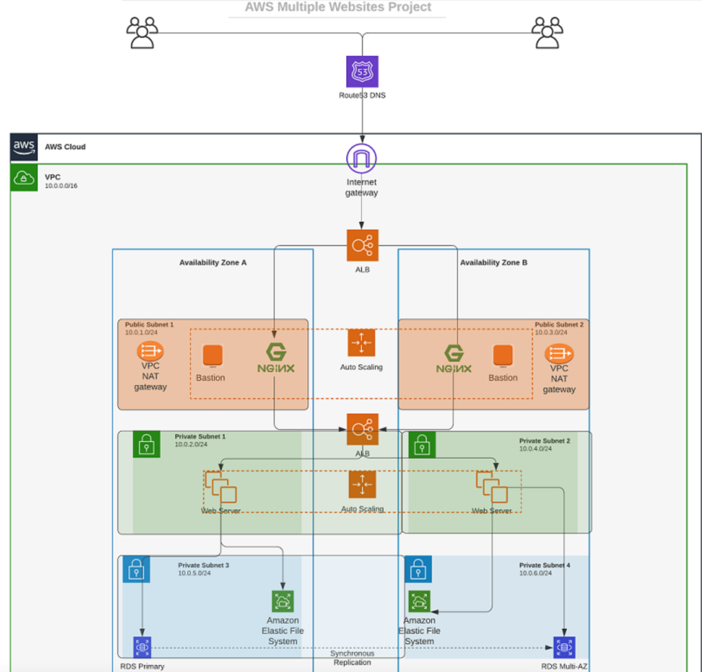

# Automating AWS Infrastructure with Terraform - 1

## Introduction

After building AWS infrastructure for two websites manually, it's time to automate this process using Infrastructure as Code (IaC) with Terraform. This comprehensive guide will walk you through every step of the process, including detailed installation instructions for both Windows and Linux systems, and provide a complete implementation path following best practices.




## Prerequisites

Before you begin writing Terraform code, you need to set up your environment properly. Let's go through each prerequisite in detail:

### 1. Create an IAM User for Terraform

1. Sign in to your AWS Management Console
2. Navigate to IAM (Identity and Access Management)
3. Click on "Users" in the left sidebar, then click "Create user"

    

4. Set Username as "terraform"
5. Leave the console check box unticked.

    

6. Click "Next: Permissions"
7. Select "Attach existing policies directly"
8. Search for and select "AdministratorAccess" 


9. Click "Next: Review"

  
  
10. Click "Create user"
11. Next click the newly created user "terraform"
12. Then click create access key.


13. Select for AWS CLI in the options.


14. Set description for access key.

15. **IMPORTANT**: Copy the displayed Access key ID and Secret access key. Store them in a temporary, secure location (e.g., a password manager or temporary text file)


### 2. Install Required Software

#### For Windows:

1. **Install Python 3.6 or higher**:
   - Download the latest Python installer from [python.org](https://www.python.org/downloads/windows/)
   - Run the installer, selecting "Add Python to PATH"
   - Verify installation by opening Command Prompt and typing:
     ```
     python --version
     ```

     


2. **Install Git and GitBash**:
   - Download Git for Windows from [git-scm.com](https://git-scm.com/download/win)
   - Run the installer with default options
   - Verify installation by opening Command Prompt and typing:
     ```
     git --version
     ```

3. **Install AWS CLI**:
   - Download the AWS CLI MSI installer from [AWS CLI website](https://aws.amazon.com/cli/)
   - Run the installer
   - Verify installation by opening Command Prompt and typing:
     ```
     aws --version
     ```

     

4. **Install Terraform**:
   - Download the Windows zip file from [Terraform Downloads](https://www.terraform.io/downloads.html)
   - Extract the zip file
   - Move the terraform.exe file to a directory in your PATH (e.g., `C:\terraform`)
   - Add the directory to your system PATH:
     - Right-click on "This PC" > Properties > Advanced system settings > Environment Variables
     - Edit the "Path" variable to include your Terraform directory (`C:\terraform`)

    - Alternatively, Install Terraform with:
      ```bash
      choco install terraform
      ```

   - Verify installation by opening a new Command Prompt and typing:
     ```
     terraform --version
     ```

      

5. **Install Boto3 (Python SDK for AWS)**:
   - Open Gitbash and run:
     ```
     pip install boto3
     ```

     


   - Verify installation by running Python:
     ```
     python -c "import boto3; print(boto3.__version__)"
     ```


    


#### For Linux (Ubuntu/Debian):

1. **Install Python 3.6 or higher**:
   ```bash
   sudo apt update
   sudo apt install python3 python3-pip
   python3 --version
   ```

2. **Install Git**:
   ```bash
   sudo apt update
   sudo apt install git
   git --version
   ```

3. **Install AWS CLI**:
   ```bash
   curl "https://awscli.amazonaws.com/awscli-exe-linux-x86_64.zip" -o "awscliv2.zip"
   unzip awscliv2.zip
   sudo ./aws/install
   aws --version
   ```

4. **Install Terraform**:
   ```bash
   sudo apt-get update && sudo apt-get install -y gnupg software-properties-common curl
   curl -fsSL https://apt.releases.hashicorp.com/gpg | sudo apt-key add -
   sudo apt-add-repository "deb [arch=amd64] https://apt.releases.hashicorp.com $(lsb_release -cs) main"
   sudo apt-get update && sudo apt-get install terraform
   terraform --version
   ```

5. **Install Boto3 (Python SDK for AWS)**:
   ```bash
   pip3 install boto3
   python3 -c "import boto3; print(boto3.__version__)"
   ```

### 3. Configure AWS CLI with Your Credentials

Run the AWS CLI configuration command:

```bash
aws configure
```

Enter the requested information:
- AWS Access Key ID: [Enter the access key ID you saved earlier]
- AWS Secret Access Key: [Enter the secret access key you saved earlier]
- Default region name: us-east-1
- Default output format: json

### 4. Create an S3 Bucket for Terraform State

1. **Create the bucket using AWS CLI**:
   ```bash
   aws s3api create-bucket --bucket <yourname>-dev-terraform-bucket --region us-east-1
   ```
   aws s3api create-bucket --bucket 
   ayopo-dev-terraform-bucket --region us-east-1
   **Note**: Replace `<yourname>` with your actual name. S3 bucket names must be globally unique.

  

2. **Enable versioning on the bucket** (recommended for state files):
   ```bash
   aws s3api put-bucket-versioning --bucket <yourname>-dev-terraform-bucket --versioning-configuration Status=Enabled
   ```

  
3. Confirm Bucket with:
  ```bash
  aws s3 ls
  ```

  

### 5. Verify AWS Programmatic Access

Write a Python script to test bucket creation:

1. In the terminal start python with 'python' then paste the following script:
   ```python
   import boto3
   
   s3 = boto3.resource('s3')
   print("Listing all S3 buckets:")
   for bucket in s3.buckets.all():
       print(bucket.name)
   ```


2. You should see your previously created S3 bucket `<yourname>-dev-terraform-bucket` in the output.


## Understanding Terraform Concepts

Before proceeding, familiarize yourself with these essential Terraform concepts:

1. **Attribute**: Properties of resources that can be referenced or exported
2. **Resource**: Represents an infrastructure object (e.g., EC2 instance, VPC)
3. **Interpolations**: Expressions that allow you to reference values from other parts of your configuration
4. **Argument**: Input parameters you provide to resources
5. **Providers**: Plugins that interact with cloud providers like AWS
6. **Provisioners**: Used to execute scripts on local or remote machines as part of resource creation
7. **Input Variables**: Parameters that can be passed to modules
8. **Output Variables**: Values that are made available to the user when applying Terraform
9. **Module**: Reusable container for resources
10. **Data Source**: Allows Terraform to use information defined outside of Terraform
11. **Local Values**: Named values that can be reused within a module
12. **Backend**: Where Terraform stores state data

Also understand these common data types used in Terraform:
- **Integer**: Whole numbers (e.g., `5`, `10`)
- **Float**: Decimal numbers (e.g., `5.0`, `10.5`)
- **String**: Text enclosed in quotes (e.g., `"vpc"`, `"subnet"`)
- **Boolean**: `true` or `false`
- **List**: Ordered sequence of values (e.g., `["us-east-1a", "us-east-1b"]`)
- **Map**: Collection of key-value pairs (e.g., `{Name = "terraform-vpc", Environment = "dev"}`)

## Best Practices

### Resource Tagging
Ensure every resource is tagged using multiple key-value pairs. Examples of useful tags:
- Name
- Environment (e.g., dev, staging, prod)
- Project
- Department/Team
- Purpose
- Managed-by (e.g., terraform)

### Reusable Code
Avoid hard coding values wherever possible:
- Use variables instead of hardcoded strings
- Use data sources to fetch information from AWS
- Use functions for dynamic values
- Implement loops for repeated resources
- Organize code into logical modules

## Project Structure Setup

Let's set up the directory structure for our Terraform project:

1. Create a folder named `PBL`:
   - On Windows (using GitBash or Command Prompt):
     ```
     mkdir PBL
     cd PBL
     ```
   - On Linux:
     ```bash
     mkdir PBL
     cd PBL
     ```

2. Inside this folder, create a file named `main.tf`:
   - On Windows/Linux:
     ```bash
     touch main.tf
     ```
   - Or use a text editor to create the file

## VPC Creation

### Initial Setup - Provider and VPC

1. Open the `main.tf` file in your preferred text editor and add the following content:

```hcl
provider "aws" {
  region = "us-east-1"
}

# Create VPC
resource "aws_vpc" "main" {
  cidr_block                     = "172.16.0.0/16"
  enable_dns_support             = "true"
  enable_dns_hostnames           = "true"

}
```

2. Initialize Terraform to download required plugins:
```bash
terraform init
```


This command will:
- Create a `.terraform` directory to store plugins
- Download and install the AWS provider plugin
- Set up initial backend configuration

You should see output similar to:
```
Initializing the backend...
Initializing provider plugins...
- Finding latest version of hashicorp/aws...
- Installing hashicorp/aws v4.x.x...
- Installed hashicorp/aws v4.x.x (signed by HashiCorp)

Terraform has created a lock file .terraform.lock.hcl to record the provider
selections it made above. Include this file in your version control repository
so that Terraform can guarantee to make the same selections by default when
you run "terraform init" in the future.

Terraform has been successfully initialized!

You may now begin working with Terraform. Try running "terraform plan" to see
any changes that are required for your infrastructure. All Terraform commands
should now work.
```

3. Preview what Terraform will create:
```bash
terraform plan
```


This will show what resources will be created without actually creating anything. Review the output to ensure it matches your expectations.

4. Apply the configuration:
```bash
terraform apply
```

When prompted with `Do you want to perform these actions?`, type `yes` and press Enter.

Terraform will create the VPC in your AWS account.


Confirm VPC creation on AWS console:


**Observations:**
- The `.terraform` directory contains the downloaded plugins
- A `terraform.tfstate` file has been created, which contains the current state of your infrastructure
- A temporary `terraform.tfstate.lock.info` file was created during execution to prevent concurrent modifications

### Understanding the State File

The `terraform.tfstate` file is critical for Terraform's operation:
- It tracks the current state of your infrastructure
- It maps Terraform resources to real-world resources
- It stores metadata and resource dependencies
- It enables Terraform to calculate changes needed during updates

The lock file (`terraform.tfstate.lock.info`) contains information like:
```json
{
  "ID": "e5e5ad0e-9cc5-7af1-3547-77bb3ee0958b",
  "Operation": "OperationTypePlan",
  "Info": "",
  "Who": "username@hostname",
  "Version": "1.x.x",
  "Created": "2025-03-03T20:08:41.6489414Z",
  "Path": "terraform.tfstate"
}
```

This prevents other users from modifying the same infrastructure simultaneously.

## Creating Subnets

### Initial Subnet Configuration

Now, let's add public subnets to our VPC. Open your `main.tf` file and add the following:

```hcl
# Create public subnet1
resource "aws_subnet" "public1" {
  vpc_id                  = aws_vpc.main.id
  cidr_block              = "172.16.0.0/24"
  map_public_ip_on_launch = true
  availability_zone       = "us-east-1a"
}

# Create public subnet2
resource "aws_subnet" "public2" {
  vpc_id                  = aws_vpc.main.id
  cidr_block              = "172.16.1.0/24"
  map_public_ip_on_launch = true
  availability_zone       = "us-east-1b"
}
```

Let's understand what's happening here:
- `vpc_id = aws_vpc.main.id` uses resource interpolation to reference the ID of the VPC we created earlier
- `cidr_block` defines the IP address range for each subnet
- `map_public_ip_on_launch = true` automatically assigns a public IP to instances launched in these subnets
- `availability_zone` specifies the AZ where each subnet will be created

Apply the changes:
```bash
terraform plan
terraform apply
```

When prompted, type `yes` and press Enter.


Confirm subnet on AWS


### Identifying Issues in the Initial Configuration

While the above configuration works, it has several issues:

1. **Hard-coded values**: The availability zones and CIDR blocks are hard-coded, making the configuration inflexible and region-dependent.

2. **Multiple resource blocks**: We've defined two separate blocks for subnets, which would become unwieldy if we needed to create more subnets.

### Code Refactoring

Let's refactor our code to address these issues.

#### Step 1: Destroy Current Infrastructure

Before refactoring, let's destroy the current resources to start fresh:
```bash
terraform destroy
```

When prompted, type `yes` and press Enter.


#### Step 2: Fix Hard-Coded Values with Variables

Update your `main.tf` file to use variables instead of hard-coded values:

```hcl
variable "region" {
  default = "us-east-1"
}

variable "vpc_cidr" {
  default = "172.16.0.0/16"
}

variable "enable_dns_support" {
  default = "true"
}

variable "enable_dns_hostnames" {
  default = "true"
}

variable "enable_classiclink" {
  default = "false"
}

variable "enable_classiclink_dns_support" {
  default = "false"
}

provider "aws" {
  region = var.region
}

# Create VPC
resource "aws_vpc" "main" {
  cidr_block                     = var.vpc_cidr
  enable_dns_support             = var.enable_dns_support
  enable_dns_hostnames           = var.enable_dns_hostnames
  enable_classiclink             = var.enable_classiclink
  enable_classiclink_dns_support = var.enable_classiclink_dns_support
}
```

This improves our code by:
- Making it configurable through variables
- Making it easier to change values in one place
- Making it reusable for different environments

#### Step 3: Fix Multiple Resource Blocks Using Data Sources and Count

Now, let's address the duplicate subnet blocks by using data sources and the `count` parameter:

```hcl
# Get list of availability zones
data "aws_availability_zones" "available" {
  state = "available"
}

# Create public subnets
resource "aws_subnet" "public" {
  count                   = 2
  vpc_id                  = aws_vpc.main.id
  cidr_block              = cidrsubnet(var.vpc_cidr, 4, count.index)
  map_public_ip_on_launch = true
  availability_zone       = data.aws_availability_zones.available.names[count.index]
}
```

Let's understand what's happening here:

1. **Data Source**: `data "aws_availability_zones" "available"` fetches all available AZs in the current region.

2. **Count Parameter**: `count = 2` tells Terraform to create two instances of this resource.

3. **Dynamic CIDR Blocks**: `cidrsubnet(var.vpc_cidr, 4, count.index)` dynamically calculates subnet CIDR blocks:
   - `var.vpc_cidr` is our base CIDR (172.16.0.0/16)
   - `4` means we're adding 4 bits to the netmask (resulting in /20 subnets)
   - `count.index` is the current iteration (0, 1) to create unique subnets

4. **Dynamic AZ Assignment**: `data.aws_availability_zones.available.names[count.index]` selects AZs from the list based on the current count index.

Let's explore the `cidrsubnet` function in more detail:

The format is `cidrsubnet(prefix, newbits, netnum)`:
- `prefix`: The base CIDR block (e.g., "172.16.0.0/16")
- `newbits`: Number of additional bits to extend the prefix
- `netnum`: Which subnet number to calculate

You can experiment with this in the Terraform console:

```bash
terraform console
```

Then type:
```
cidrsubnet("172.16.0.0/16", 4, 0)
```

Output: `"172.16.0.0/20"`

Try other values:
```
cidrsubnet("172.16.0.0/16", 4, 1)
```

Output: `"172.16.16.0/20"`

Type `exit` to leave the console.


#### Step 4: Make Count Dynamic

Let's make the `count` parameter dynamic by adding a variable:

```hcl
variable "preferred_number_of_public_subnets" {
  default = 2
}
```

Now, update the subnet resource with conditional logic:

```hcl
# Create public subnets
resource "aws_subnet" "public" {
  count                   = var.preferred_number_of_public_subnets == null ? length(data.aws_availability_zones.available.names) : var.preferred_number_of_public_subnets
  vpc_id                  = aws_vpc.main.id
  cidr_block              = cidrsubnet(var.vpc_cidr, 4, count.index)
  map_public_ip_on_launch = true
  availability_zone       = data.aws_availability_zones.available.names[count.index]
}
```

This conditional expression works as follows:
- `var.preferred_number_of_public_subnets == null`: Check if the variable is null
- If true (`?`), use `length(data.aws_availability_zones.available.names)` (dynamically count available AZs)
- If false (`:`), use `var.preferred_number_of_public_subnets` (the specified number)

This provides flexibility to either specify a fixed number of subnets or use all available AZs.

Test this by setting the variable to different values:

```hcl
variable "preferred_number_of_public_subnets" {
  default = null  # Will create subnets in all available AZs
}
```

run `terraform plan` and `terraform apply`


or:

```hcl
variable "preferred_number_of_public_subnets" {
  default = 2  # Will create exactly 2 subnets
}
```

## Organizing the Code

Let's improve our code organization by separating variables and values into different files.

### Step 1: Create Variables File

Create a file named `variables.tf` with all variable declarations:

```hcl
variable "region" {
  default = "us-east-1"
}

variable "vpc_cidr" {
  default = "172.16.0.0/16"
}

variable "enable_dns_support" {
  default = "true"
}

variable "enable_dns_hostnames" {
  default = "true"
}

variable "enable_classiclink" {
  default = "false"
}

variable "enable_classiclink_dns_support" {
  default = "false"
}

variable "preferred_number_of_public_subnets" {
  default = null
}
```

### Step 2: Create Terraform Variables File

Create a file named `terraform.tfvars` with specific values:

```hcl
region                             = "us-east-1"
vpc_cidr                           = "172.16.0.0/16"
enable_dns_support                 = "true"
enable_dns_hostnames               = "true"
enable_classiclink                 = "false"
enable_classiclink_dns_support     = "false"
preferred_number_of_public_subnets = 2
```

### Step 3: Clean Up Main.tf

Your `main.tf` should now look like this:

```hcl
# Get list of availability zones
data "aws_availability_zones" "available" {
  state = "available"
}

provider "aws" {
  region = var.region
}

# Create VPC
resource "aws_vpc" "main" {
  cidr_block                     = var.vpc_cidr
  enable_dns_support             = var.enable_dns_support
  enable_dns_hostnames           = var.enable_dns_hostnames
  enable_classiclink             = var.enable_classiclink
  enable_classiclink_dns_support = var.enable_classiclink_dns_support
  
  tags = {
    Name = "main-vpc"
    Environment = "development"
    Managed-by = "terraform"
  }
}

# Create public subnets
resource "aws_subnet" "public" {
  count                   = var.preferred_number_of_public_subnets == null ? length(data.aws_availability_zones.available.names) : var.preferred_number_of_public_subnets
  vpc_id                  = aws_vpc.main.id
  cidr_block              = cidrsubnet(var.vpc_cidr, 4, count.index)
  map_public_ip_on_launch = true
  availability_zone       = data.aws_availability_zones.available.names[count.index]
  
  tags = {
    Name = "Public-Subnet-${count.index + 1}"
    Environment = "development"
    Managed-by = "terraform"
  }
}
```

Notice that we've added proper tags to the resources, following best practices.

### Step 4: Apply the Changes

Run Terraform to apply the changes:

```bash
terraform init    # Only necessary if you're starting fresh
terraform plan    # Review the planned changes
terraform apply   # Apply the changes
```

When prompted, type `yes` and press Enter.


## Final Structure and Verification

Your project should have the following structure:
```
PBL/
├── main.tf                 # Contains the main infrastructure code
├── variables.tf            # Contains variable declarations
├── terraform.tfvars        # Contains variable values
├── terraform.tfstate       # State file (auto-generated)
└── terraform.tfstate.backup # Backup state file (auto-generated)
```

Verify your infrastructure:

1. **Verify the VPC**:
   ```bash
   aws ec2 describe-vpcs --filters "Name=tag:Name,Values=main-vpc" --query "Vpcs[].{VpcId:VpcId,CidrBlock:CidrBlock,State:State}" --output table
   ```


2. **Verify the subnets**:
   ```bash
   aws ec2 describe-subnets --filters "Name=vpc-id,Values=$(aws ec2 describe-vpcs --filters "Name=tag:Name,Values=main-vpc" --query "Vpcs[0].VpcId" --output text)" --query "Subnets[].{SubnetId:SubnetId,CidrBlock:CidrBlock,AvailabilityZone:AvailabilityZone}" --output table
   ```


## Troubleshooting Common Issues

1. **"Error: No valid credential sources found"**
   - Ensure you've run `aws configure` and provided valid credentials
   - Check that your IAM user has the necessary permissions

2. **"Error: Error acquiring the state lock"**
   - If a previous Terraform operation was interrupted, the lock might still be in place
   - Run `terraform force-unlock [LOCK_ID]`, where [LOCK_ID] is from the error message

3. **"Error: Error creating VPC: VpcLimitExceeded"**
   - You've reached the AWS limit for VPCs in the region
   - Delete unused VPCs or request a limit increase from AWS Support

4. **"Error: AccessDenied when calling the CreateBucket operation"**
   - Ensure your IAM user has S3 permissions
   - Try a different bucket name (S3 bucket names must be globally unique)

5. **"Error: Missing required argument"**
   - Check your resource blocks for required arguments that might be missing
   - Refer to the Terraform AWS provider documentation for required arguments


## Additional Terraform Best Practices

1. **Use Remote State Storage**: Configure Terraform to store state in your S3 bucket for team collaboration:
   ```hcl
   terraform {
     backend "s3" {
       bucket  = "<yourname>-dev-terraform-bucket"
       key     = "terraform.tfstate"
       region  = "us-east-1"
       encrypt = true
     }
   }
   ```

2. **Use Workspaces**: Terraform workspaces allow you to manage multiple environments (dev, staging, prod) with the same configuration:
   ```bash
   terraform workspace new dev
   terraform workspace new prod
   terraform workspace select dev
   ```

3. **Use Modules**: Break down your infrastructure into reusable modules for better organization:
   ```
   modules/
   ├── networking/
   │   ├── main.tf
   │   ├── variables.tf
   │   └── outputs.tf
   ├── compute/
   │   ├── main.tf
   │   ├── variables.tf
   │   └── outputs.tf
   ```

4. **Version Control**: Store your Terraform code in a version control system like Git to track changes over time.

5. **CI/CD Integration**: Integrate Terraform into your CI/CD pipeline for automated infrastructure deployment.

## Conclusion

You have successfully created a VPC and subnets using Terraform, following best practices for Infrastructure as Code. This approach allows you to version, reuse, and automatically deploy your infrastructure, making it more maintainable and scalable.

Remember:
- Keep your code DRY (Don't Repeat Yourself)
- Use variables for flexibility
- Organize code logically
- Document your infrastructure
- Use proper tagging
- Store state securely
- Test changes before applying to production