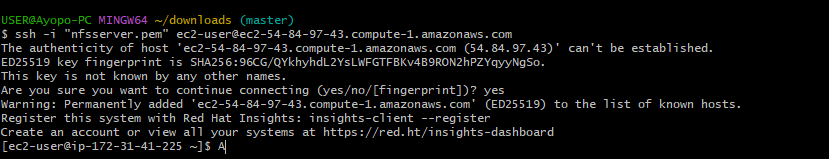
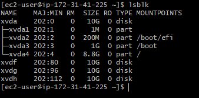
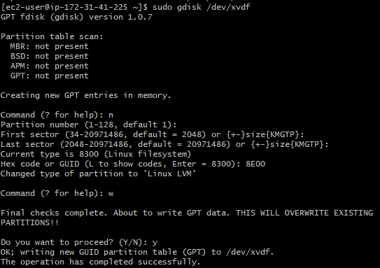
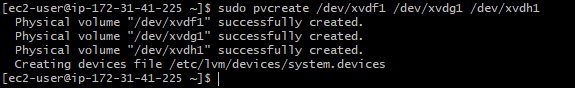
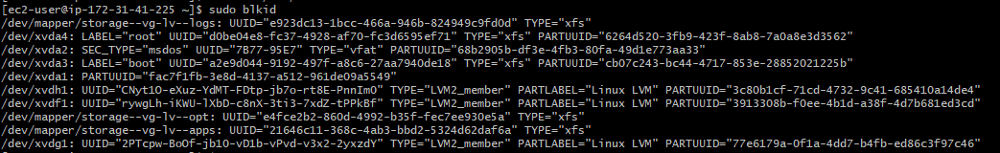
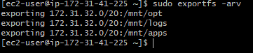
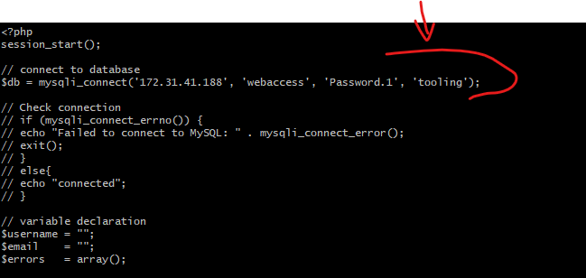

# DevOps Tooling Website Solution

This documentation outlines the step-by-step process of setting up a network file system (NFS) server on Red Hat Enterprise Linux 9, configuring MySQL on an Ubuntu server, and deploying a tooling website across multiple web servers. The goal is to ensure a scalable, fault-tolerant infrastructure that maintains data consistency across web servers using shared storage, while keeping the system stateless.

This project involved setting up logical volumes on the NFS server, configuring Apache and PHP, and deploying a website that connects to a MySQL database. The setup was done using AWS EC2 instances and aimed to ensure seamless functionality and shared storage solutions.


## STEPS INVOLVED

- [Step 1: Prepare NFS Server](#step-1-prepare-nfs-server)

- [Step 2: Configure Database Server](#step-2-configure-database-server)
- [Step 3: Prepare the Web Servers](#step-3-prepare-the-web-servers)


## Step 1: Prepare NFS Server
1. Launch a new EC2 instance with Red Hat Enterprise Linux 9 as the operating system.

- SSH into the server:


2. Configure LVM on the server.
    1. Attach 3 volumes of 10 GB each to the NFS server:
    
    2. Inspect Block Devices
        - Use the command  below to list all block devices connected to the server:
            ```bash
            lsblk
            ```
            
        - Check for the newly attached volumes. As seen above, it is /dev/xvdf, /dev/xvdg, and /dev/xvdh.
        - Run the following command to view all mounted filesystems and their free space:
            ```bash
            df -h
            ```
            
    3. Partition the disk
        - Use gdisk to create a partition on each of the disks, run `sudo gdisk /dev/xvdf`:

            1. Press `n` to create a new partition:
            2. First sector: The system will suggest a starting sector for the partition. Press `Enter` to accept the default.
            3. Last sector: By default, it will fill the partition with all available space (10 GiB in your case). Press Enter to accept the default.
            4. Partition type code: You’ll need to specify a partition type. Since you're using LVM, type `8E00 `for "Linux LVM". If not using LVM, you can leave it as default by pressing `Enter`.
            5. Writing the Partition Table to Disk, Once you’ve created the partition, you need to write the changes to the disk. To do this:
            - Press `w` to write the changes.
            - Confirm the action by typing yes when asked to proceed.

            At this point, the partition has been created, and gdisk will exit:
            
            6. Repeat the above process for the Other Disks:
            ```bash
            sudo gdisk /dev/xvdg
            ```
            ```bash
            sudo gdisk /dev/xvdh
            ```
    4. View the Partitions
        ```bash
        lsblk
        ```

        

    5. Create logical volumes `lv-opt` `lv-apps`, and `lv-logs`.

        1. Install the lvm2 package:
        ```bash
        sudo yum install lvm2
        ```

        2. Check available partitions with lvmdiskscan
        ```bash
        sudo lvmdiskscan
        ```
        

        3. Use pvcreate to mark the partitions as physical volumes:
        ```bash
        sudo pvcreate /dev/xvdf1 /dev/xvdg1 /dev/xvdh1
        ```
        

        4. Confirm the successful creation of physical volumes by running:
        ```bash
        sudo pvs
        ```
        

        5. Use `vgcreate` to combine the physical volumes into a single volume group named `storage-vg`:
        ```bash
        sudo vgcreate storage-vg /dev/xvdf1 /dev/xvdg1 /dev/xvdh1

        ```
        6. Verify the volume group creation with:
        ```bash
        sudo vgs
        ```
        


        7. Create three logical volumes (lv-opt, lv-apps, and lv-logs) within the vg_storage volume group:

            1. Create Logical Volume for lv-apps (10GB):
            ```bash
            sudo lvcreate -n lv-apps -L 10G storage-vg
            ```

            2. Create Logical Volume for lv-logs (9GB):
            ```bash
            sudo lvcreate -n lv-logs -L 9G storage-vg
            ```

            3. Create Logical Volume for lv-opt (5GB):
            ```bash
            sudo lvcreate -n lv-opt -L 8G storage-vg
            ```

            4. Confirm logical volumes creation by running:
            ```bash
            sudo lvs
            ```
         

        8. Format the Logical Volumes as XFS

            Format each of the logical volumes using the XFS file system, which is known for better scalability and performance in environments with large files.
            1. Format lv-apps:
            ```bash
            sudo mkfs.xfs /dev/storage-vg/lv-apps
            ```
            
            2. Format lv-logs:
            ```bash
            sudo mkfs.xfs /dev/storage-vg/lv-logs
            ```

            3. Format lv-opt:
            ```bash
            sudo mkfs.xfs /dev/storage-vg/lv-opt
            ```

        


            > Alternatively we can use `sudo mkfs -t xfs /dev/storage-vg/lv-apps` 

        9. Create Mount Points
            1. Create directories where these logical volumes will be mounted, typically under `/mnt`:

            ```bash
            sudo mkdir -p /mnt/apps /mnt/logs /mnt/opt
            ```
        10. Mount the logical volumes to their respective directories.
            1. Mount lv-apps:
            ```bash
            sudo mount /dev/storage-vg/lv-apps /mnt/apps
            ```

            2. Mount lv-logs:
            ```bash
            sudo mount /dev/storage-vg/lv-logs /mnt/logs
            ```
            
            3. Mount lv-opt:
            ```bash
            sudo mount /dev/storage-vg/lv-opt /mnt/opt
            ```
        11. Make the Mounts Persistent
            1. Update the /etc/fstab file to ensure the mounts persist after a reboot. First, get the UUIDs of the devices:
            ```bash
            sudo blkid
            ```
            


            2. To ensure the volumes are mounted automatically after a reboot, edit the /etc/fstab file to include these entries. Open the file:
            ```bash
            sudo vi /etc/fstab
            ```
            3. Add the following lines at the end of the file:
            ```vim
            UUID=<UUID-of-lv-apps> /mnt/apps xfs defaults 0 0
            UUID=<UUID-of-lv-logs> /mnt/logs xfs defaults 0 0
            UUID=<UUID-of-lv-opt> /mnt/opt xfs defaults 0 0
            ```

            


            4.  Reload the daemon and mount all filesystems:
            ```bash
            sudo mount -a
            sudo systemctl daemon-reload
            ```


        12. Check that everything is mounted correctly by running:
        ```bash
        df -h
        ```

        
3. Install the NFS server, and configure it to start on reboot:
```bash
sudo yum -y update
sudo yum install nfs-utils -y
sudo systemctl start nfs-server.service
sudo systemctl enable nfs-server.service
sudo systemctl status nfs-server.service
```


4. Configure Exports for the  NFS

    1. Set Permissions for the mounted directories to be accessed by the web servers:
    ```bash
    sudo chown -R nobody: /mnt/apps /mnt/logs /mnt/opt
    sudo chmod -R 777 /mnt/apps /mnt/logs /mnt/opt

    sudo systemctl restart nfs-server
    ```

    2. Navigate to the EC2 dashboard in the AWS Management Console. Select the  NFS server EC2 instance, then click the "Networking" tab. Under "Network interfaces", click on the link for your instance's subnet. This will take you to the VPC (Virtual Private Cloud) dashboard, where you can view the CIDR block of the subnet. This CIDR block defines the range of IP addresses that belong to the subnet and can be used to configure access permissions, such as for NFS exports:

    

    3. Configure access to the NFS for clients within the same subnets( e.g 172.31.32.0/20 ):
    ```bash
    sudo vi /etc/exports
    ```
    Paste the code below in the file:

    ```bash
    # exporting the nfs mount points

    /mnt/apps 172.31.32.0/20(rw,sync,no_all_squash,no_root_squash)
    /mnt/logs 172.31.32.0/20(rw,sync,no_all_squash,no_root_squash)
    /mnt/opt 172.31.32.0/20(rw,sync,no_all_squash,no_root_squash)
    ```


    >- **`/mnt/apps`, `/mnt/logs`, and `/mnt/opt`** are the directories being shared via NFS.
    >- **`172.31.32.0/20`** is the CIDR block for the subnet where your web servers are located.
    >- **`rw`** allows both read and write access.
    >- **`sync`** ensures changes are written immediately to disk.
    >- **`no_all_squash`** preserves the user permissions for the files (does not map users to a `nobody` user).
    >- **`no_root_squash`** allows the root user on the client machine to act as the root on the NFS server, which is useful for administrative tasks on the web server.

    3. **Save and exit** the file (`:wq`).

    4. **Apply the changes** by running the following command to reload the exports configuration:

    ```bash
    sudo exportfs -arv
    ```
    >The command `sudo exportfs -arv` is used to update the NFS server with the new or modified export entries. Here's a breakdown of what each flag means:
    >- **`-a`**: Exports all directories listed in the `/etc/exports` file.
    >- **`-r`**: Re-exports all directories, updating any changes made to `/etc/exports`.
    >- **`-v`**: Verbose mode, which provides detailed output about what is being exported and to which clients.


    

5. Firewall Configuration

    1. Check which port is used by NFS and open it using Security Groups, by adding new inbound rules: 
    ```bash
    rpcinfo -p | grep nfs
    ```
    > The command rpcinfo -p | grep nfs is used to check the port numbers and protocols that the NFS (Network File System) service is using on the server.

    Add the following ports to the security group for the nfs-server on the AWS console:
    - TCP 111
    - TCP 2049
    - UDP 111
    - UDP 2049

    

---
After configuring the logical volumes and ensuring they were correctly mounted, I formatted them with XFS and mounted them to specific directories for apps, logs, and other resources. Following that, I made the mounts persistent and installed the NFS utilities to allow the web servers to access shared storage.

---

## Step 2: Configure Database Server

1. Install MySQL Server

We will be using an Ubuntu server 24.04 LTS instance to install and configure MySQL:


- Connect to MySQL server instance via SSH. Install the MySQL server:

    ```bash
    sudo apt update
    sudo apt install mysql-server -y
    ```
    
2. Secure MySQL Installation using:
```bash
sudo mysql_secure_installation
```
>Follow the prompts to set up security options(i.e root password and co.).
3. Login to MySQL:
```bash 
sudo mysql -u root -p
```

4. Create the  database `tooling`, create the `webaccess` user, and grant permissionns to the `webaccess` user on the `tooling` database:

```sql
CREATE DATABASE tooling;
CREATE USER 'webaccess'@'172.31.32.0/20' IDENTIFIED BY 'Password.1';
GRANT ALL PRIVILEGES ON tooling.* TO 'webaccess'@'172.31.32.0/20';
FLUSH PRIVILEGES;
```

5. Verify the User and Database with:
```sql
SHOW GRANTS FOR 'webaccess'@'172.31.32.0/20';
```


6. Make sure the MySQL server is configured to allow remote connections by editing the MySQL configuration:
```bash
sudo vi /etc/mysql/mysql.conf.d/mysqld.cnf
```
- change the bind number from `127.0.0.1 to 0.0.0.0

7. Restart Mysql:
```bash
sudo systemctl restart mysql
```
8. Add a new inbound rule for MySQL

## Step 3: Prepare the Web Servers
To ensure our web servers can deliver consistent content from shared storage solutions, we will utilize an NFS server and a MySQL database. As you know, a single database can be accessed for both reads and writes by multiple clients. For shared file storage used by our web servers, we will mount the previously created logical volume `lv-apps` to the directory where Apache serves files to users (`/var/www`).

This strategy will enable us to maintain stateless web servers, allowing for the seamless addition or removal of servers as needed while preserving data integrity in both the database and the NFS.


1. Deploy EC2 Instances and Install NFS Client, Launch three new EC2 instances using Red Hat Enterprise Linux 9
2.  Install NFS client:
    ```bash
    sudo yum -y update
    sudo yum install nfs-utils nfs4-acl-tools -y
    ```
    
3. Mount /var/www/ and target the NFS server's export for apps:
```bash
sudo mkdir /var/www
sudo mount -t nfs -o rw,nosuid 172.31.41.225:/mnt/apps /var/www
```
    -  sudo mount -t nfs -o rw,nosuid <private-Ip-of-nfs-server>:/mnt/apps /var/www


4. Verify that NFS was mounted successfully by running:
```bash
df -h
```


- Make sure that the changes will persist on Web Server after reboot:
```bash
sudo vi /etc/fstab
```
- Add the following line:
```
172.31.41.225:/mnt/apps /var/www nfs defaults 0 0
```


5. Install Remi's Repository, Apache and PHP:

- Install Apache
```bash
sudo yum install httpd -y
```


-  Install the EPEL (Extra Packages for Enterprise Linux) and Remi repositories to get access to more up-to-date versions of PHP and other software:

```bash
sudo dnf install https://dl.fedoraproject.org/pub/epel/epel-release-latest-9.noarch.rpm
```

```bash
sudo dnf install dnf-utils http://rpms.remirepo.net/enterprise/remi-release-9.rpm
``` 


- Running the above command caused the t2.micro instance to freeze
    - this may be due to low RAM(1GB) so try to add virtual Memory:
    ```bash
    sudo fallocate -l 2G /swapfile   # Allocate 2GB of swap space
    sudo chmod 600 /swapfile         # Set the correct permissions
    sudo mkswap /swapfile            # Create the swap space
    sudo swapon /swapfile            # Enable the swap space
    ```
    - Clear DNF Cache
    ```bash
    sudo dnf clean all
    sudo rm -rf /var/cache/dnf
    ```

    


    - Try the commands again:
    ```bash 
    sudo dnf install https://dl.fedoraproject.org/pub/epel/epel-release-latest-9.noarch.rpm

    sudo dnf install dnf-utils http://rpms.remirepo.net/enterprise/remi-release-9.rpm
    ```


>Installation was successful after adding virtual memory with swapspace

- Enable PHP 8.2 from Remi's Repository

```bash
sudo dnf module reset php
```


```bash
sudo dnf module enable php:remi-8.2
```


- Install PHP and Required Extensions
```bash
sudo dnf install php php-opcache php-gd php-curl php-mysqlnd
```


- Start and Enable PHP-FPM (FastCGI Process Manager)
```bash
sudo systemctl start php-fpm
```
```bash
sudo systemctl enable php-fpm
```
- Configure SELinux for Apache
```bash
sudo setsebool -P httpd_execmem 1
```


> **Repeat steps 2 to 5 on the other 2 webservers.**

6. Verify NFS Mount and Apache Configuration
- Create a test file in the /var/www directory on one web server:
```bash
sudo touch /var/www/test.txt
```
Ensure Apache is running and configured correctly by checking the availability of /var/www on each web server:
```bash
ls /var/www
```


Check on nfs server:
```bash
ls /mnt/apps
```


>The contents should be the same.

7.  Mount Apache Logs to NFS for Shared Log Storage
- Locate Apache’s log directory (typically /var/log/httpd) and mount it to the NFS server's export for logs:
```bash
sudo mount -t nfs -o rw,nosuid 172.31.41.225:/mnt/logs /var/log/httpd
```
- Update /etc/fstab to ensure the logs directory is remounted after a reboot:

```bash
172.31.41.225:/mnt/logs /var/log/httpd nfs defaults 0 0
```


>Do this step for all 3 webservers

8. Deploy Tooling Website from GitHub
- Clone the repository:
```bash
sudo yum install git -y

sudo git clone https://github.com/AyopoB/tooling.git
```

- Deploy the code: Copy the contents of the html folder from the repository to /var/www/html:
```bash
sudo cp -r ./tooling/html/* /var/www/html/
```


> Ensure TCP port 80 (HTTP) is open on all 3 webservers.
9. Update Website Configuration to Connect to the MySQL Database
- Modify the functions.php file in /var/www/html to connect to the MySQL database:
```bash
sudo vi /var/www/html/functions.php
```
- Update the database connection details:
```php

$db = mysqli_connect('172.31.41.188', 'webaccess', 'Password.1', 'tooling');
```

- $db = mysqli_connect('private-ip-of-DB-server', 'username', 'password', 'Db name');




10. Apply Database Schema
- install mysql client in webserver  
```bash
sudo yum install mysql -y
```

```bash
sudo mysql -h 172.31.41.188 -u webaccess -p tooling < tooling-db.sql
```
sudo mysql -h 172.31.41.188 -u webaccess -p tooling < tooling-db.sql
- Access the database server from the Web Server:
```bash
sudo mysql -h 172.31.41.188 -u webaccess -p tooling
```

11. Create an Admin User
```sql
INSERT INTO users (id, username, password, email, user_type, status) 
VALUES (2, 'myuser', '5f4dcc3b5aa765d61d8327deb882cf99', 'user@mail.com', 'admin', '1');

```

12. Open your browser and navigate to the following URL:
```
http://<Web-Server-Public-IP-Address-or-Public-DNS-Name>/index.php
```
>Log into the website with the myuser user.
>Login using username: myuser and password: password


- If url is not opening, permanently disable SELinux,
    - Open the SELinux configuration file:
    ```bash 
    sudo vi /etc/sysconfig/selinux
    ```
    - Change the SELINUX directive, Find the line:
    ```
    SELINUX=enforcing
    ```
    Change it to

    ```
    SELINUX=disabled
    ```
- Restart Apache:
```bash
sudo systemctl restart httpd
```


#### Challenges and Obstacles
One of the most significant obstacles encountered during this project was the **EC2 t2.micro instance freezing** when running package installations with limited memory. This issue arose while installing Apache and PHP. To overcome it, I **added a 2GB swap file** to the system to provide additional virtual memory, which resolved the freezing issue and allowed the installation to proceed.


#### Lessons Learned
1. **Memory Management**: The importance of understanding the resource limitations of EC2 instances was a critical takeaway. Adding swap space solved the freezing issue and underscored the need for system monitoring and scaling in production environments.
   


2. **Shared Storage for Stateless Applications**: This project provided valuable insights into the advantages of stateless web servers, where scaling is simplified, and server replacements do not affect data integrity due to the use of NFS for shared storage.

3. **Networking and Firewall Adjustments**: Configuring both the MySQL server and NFS required careful attention to network security groups and firewalls to ensure that services were accessible but secure.

---


