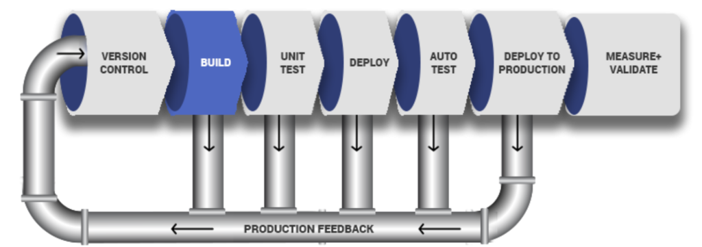
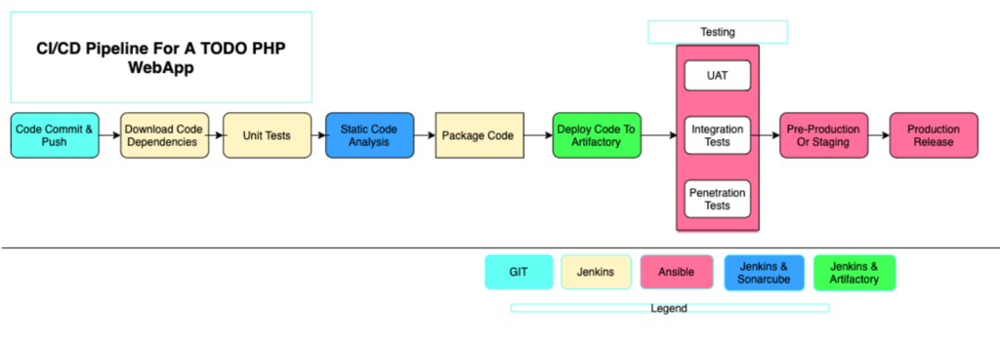
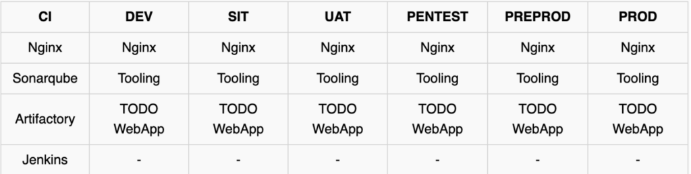
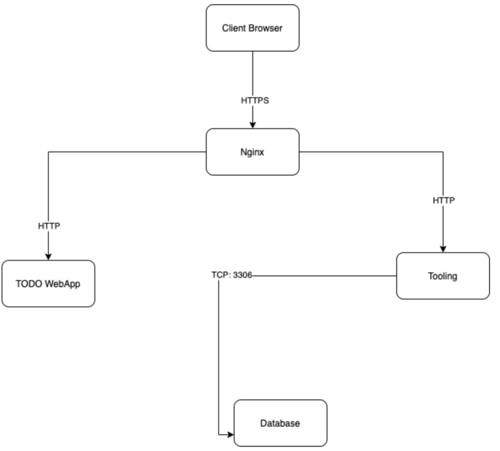
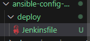
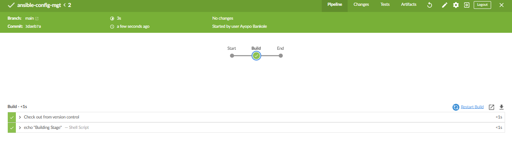

### Continuous Integration (CI) and Continuous Delivery/Deployment (CD) - Theoretical Overview

This document is designed to provide a foundational understanding of Continuous Integration and Continuous Delivery/Deployment concepts before delving into the practical aspects. These principles are crucial for any DevOps practitioner, as they form the backbone of modern software delivery pipelines. Read this carefully and ensure you grasp these concepts thoroughly.

---

#### **Introduction to CI/CD**

**CI/CD** refers to a set of practices that aim to automate and streamline the process of delivering software applications. The key goals include:

1. **Continuous Integration (CI):** Ensuring that developers’ code changes are frequently integrated into a shared repository to avoid conflicts and enable early defect detection.


2. **Continuous Delivery (CD):** Guaranteeing that the codebase is always in a deployable state and that deployment to production is manual but straightforward.

3. **Continuous Deployment (also CD):** Extending automation to the production release, making the deployment process fully automated.

---

### **Why CI/CD?**

In traditional development practices, code is often integrated late, leading to massive conflicts known as "merge hell" or "integration hell." CI/CD solves this by enabling:
- **Early conflict detection:** Developers push small, incremental changes multiple times a day.
- **Automated testing:** Issues are caught early in the development lifecycle.
- **Faster release cycles:** By automating build, test, and deployment stages.

---

### **Understanding Programming Languages in CI/CD**

- **Compiled Languages (e.g., Java, .NET):**
  - Require a build stage to create executable files (e.g., `.jar`, `.exe`) containing the application code and all dependencies.
  - CI/CD pipelines include build, test, and packaging phases.

- **Interpreted Languages (e.g., PHP, Python, JavaScript):**
  - Do not require compilation; the code runs directly on a compatible runtime environment.
  - Pipelines typically focus on packaging and testing without a build stage.

**Note:** Deploying code directly from version control (e.g., Git) to production servers is not ideal. Instead, package the code with dependencies into artifacts (e.g., `.tar.gz`, `.zip`) for better version control and portability.

---

### **Core Concepts of Continuous Integration (CI)**

#### 1. **Version Control System (VCS):**
   - Central repository where developers commit and push code frequently.
   - Prevents “merge hell” by promoting the principle of **"Commit early, push often."**

#### 2. **Local Testing:**
   - Developers perform **unit tests** locally before committing changes to ensure code stability.
   - Encourages **Test-Driven Development (TDD)** practices.

#### 3. **CI Server and Build Automation:**
   - A CI server (e.g., Jenkins) automatically:
     - Fetches code from VCS.
     - Builds the application (for compiled languages).
     - Packages the code with dependencies (for interpreted languages).

#### 4. **Automated Testing in CI:**
   - CI pipelines run additional tests, including:
     - **Unit tests:** Validate individual components.
     - **Integration tests:** Ensure different components work together.
     - **Static Code Analysis:** Check for coding standards and vulnerabilities.
     - **Compliance Analysis:** Verify adherence to regulatory standards.

#### 5. **Artifact Storage:**
   - Packaged code is stored in an **artifact repository** (e.g., JFrog Artifactory, Nexus).
   - Enables version control and simplifies deployment across environments.

---

### **Core Concepts of Continuous Delivery/Deployment (CD)**

#### 1. **Environments and Testing Phases:**
   - Code progresses through multiple environments for rigorous testing:
     - **Development (Dev):** Developers test features locally or on shared servers.
     - **Staging:** Mimics production for pre-deployment testing.
     - **User Acceptance Testing (UAT):** Ensures the application meets business requirements.
     - **Production (Prod):** Live environment for end users.

#### 2. **Automated Testing in CD:**
   - Includes advanced tests like:
     - **Penetration Testing:** Identifies security vulnerabilities.
     - **System Integration Testing (SIT):** Ensures seamless operation within larger systems.

#### 3. **Manual Approval (Continuous Delivery):**
   - Deployment to production requires manual authorization from a release manager or product owner.

#### 4. **Automated Deployment (Continuous Deployment):**
   - Fully automated process where successful tests trigger immediate deployment to production.

---

### **CI/CD Workflow**

1. **Version Control:** Developers commit and push changes to a shared repository.
2. **Build Stage:**
   - Code is compiled (if applicable) or packaged with dependencies.
3. **Testing Stage:**
   - Automated tests validate the code’s functionality, quality, and security.
4. **Artifact Deployment:**
   - Packaged code is stored in an artifact repository.
5. **Staging:**
   - Code is deployed to staging for further testing and validation.
6. **Production Deployment:**
   - After final approvals or automated checks, the code is deployed to production.

---

### **Key Success Metrics for CI/CD**

1. **Frequency of Deployments:**
   - Indicates agility and responsiveness to changes.

2. **Mean Time to Recovery (MTTR):**
   - Measures the speed of recovery from production issues.

3. **Change Failure Rate:**
   - Percentage of deployments that lead to incidents.

4. **Lead Time:**
   - Time taken from code commit to production deployment.

---

### **Note**

This project will focus on implementing CI/CD for a PHP application. You will:
- Set up Jenkins as the CI server.
- Automate code builds, testing, and packaging.
- Deploy artifacts across multiple environments.
- Gain hands-on experience with core DevOps tools (e.g., Jenkins, Git, artifact repositories).

By the end of this project, we will have a solid understanding of how CI/CD pipelines work and how they enable efficient, high-quality software delivery. This foundation will be invaluable as we explore more advanced topics in DevOps, including Docker, Kubernetes, and Terraform.

## Project Objectives

1. **Set Up Jenkins as the CI/CD Hub**:
   - Install and configure Jenkins on an AWS EC2 instance.
   - Configure Jenkins jobs to trigger on code commits using GitHub webhooks.

2. **Incorporate Ansible for Configuration Management**:
   - Use Ansible to automate server configuration and application deployment.
   - Implement dynamic playbooks to manage environment-specific setups.

3. **Integrate Artifactory for Artifact Management**:
   - Set up JFrog Artifactory for storing and managing build artifacts.
   - Configure Jenkins to push build artifacts to Artifactory.

4. **Leverage SonarQube for Code Quality Assurance**:
   - Configure SonarQube for static code analysis.
   - Integrate SonarQube with Jenkins for automated code quality checks.

5. **Build and Test PHP Applications**:
   - Create a sample PHP application repository.
   - Automate the build and testing process within the pipeline.


## Continuous Integration and Delivery Pipeline with Ansible

As part of the ongoing infrastructure development with Ansible, which began in **[Ansible Configuration Management Project](https://github.com/AyopoB/StegHub-PBL/tree/main/Ansible-Configuration-Management)**, this project focuses on creating a pipeline that simulates Continuous Integration (CI) and Continuous Delivery (CD). The target end-to-end CI/CD pipeline is designed to manage multiple environments efficiently, ensuring a seamless flow from development to production.

## Previous projects leading up to this in order
If you haven't, Do checkout previous projects leading up to this in the following order.
1. **[Ansible Configuration Management Project](https://github.com/AyopoB/StegHub-PBL/tree/main/Ansible-Configuration-Management)**
2. **[Ansible Refactoring and Jenkins Job Enhancement Project](https://github.com/AyopoB/StegHub-PBL/tree/main/Ansible-Refactoring-%26-Static-Assignments)**
3. **[Ansible Dynamic Assignments and Community Roles project](https://github.com/AyopoB/StegHub-PBL/tree/main/Ansible%20Dynamic%20Assignments%20(Include)%20and%20Community%20Roles)**

This project highlights how to use Ansible's `uri` module for deployments, moving away from directly pulling code from Git repositories. By doing so, we address challenges associated with packaging and versioning software releases for PHP-based web applications like **Tooling** and **TODO Web Applications**. PHP is an interpreted language, meaning it does not require compilation, but this also makes version control and release management more complex.

The documentation covers the setup, inventory structure, and environment configurations needed to implement the CI/CD pipeline. Below is a step-by-step guide to achieve this, along with DNS requirements, inventory file structure, and other critical details.



---

## Setup

This project builds on previous Ansible work. The configuration requires multiple servers to simulate different environments, such as Development Dev/ CI, and Production. To minimize cloud costs, the servers should be created progressively based on the environment being worked on.

### Recommendations for Cloud Setup:
- **AWS Free Tier**: Maximize usage. If the free tier is exhausted, register a new account.
- **Google Cloud (GCP)**: Alternatively, utilize the $300 free credit to rent virtual machines.
- Ensure minimal configurations for all environments initially; advanced configurations will be addressed in subsequent projects.

### Key Considerations:
1. **Environment-Specific Servers**:
   - Create only the servers needed for the current task.
   - For example, spin up servers for the **Development Environment** first before progressing to CI or Production.
2. **Focus on Virtual Machines**:
   - Advanced cloud configurations are not required. We need basic VM instances accessible via SSH.
3. **Cost Management**:
   - Minimize server setups to avoid unnecessary cloud costs.

### Initial Environments to Set Up:
1. **CI**
2. **Dev**
3. **Pentest**

Both **SIT** (System Integration Testing) and **UAT** (User Acceptance Testing) environments will only host the applications and require minimal configuration. **Pentest**, however, will need additional tools for security, performance, and load testing.

---

What we want to achieve, is having Nginx to serve as a reverse proxy for our sites and tools. Each environment setup is represented in the below table and diagrams.



**CI-Environment**


**Other Environments from Lower To Higher**



## DNS Requirements

For seamless access across environments, subdomains must be configured for each environment. Assuming the primary domain is `newdevops.com.ng`, the subdomains would look like:

| Environment          | Subdomain URL                                      |
|----------------------|----------------------------------------------------|
| Jenkins             | `https://ci.infradev.newdevops.com.ng`                  |
| SonarQube           | `https://sonar.infradev.newdevops.com.ng`               |
| Artifactory         | `https://artifacts.infradev.newdevops.com.ng`           |
| Production Tooling  | `https://tooling.newdevops.com.ng`                      |
| Pre-Prod Tooling    | `https://tooling.preprod.newdevops.com.ng`              |
| Pentest Tooling     | `https://tooling.pentest.newdevops.com.ng`              |
| UAT Tooling         | `https://tooling.uat.newdevops.com.ng`                  |
| SIT Tooling         | `https://tooling.sit.newdevops.com.ng`                  |
| Dev Tooling         | `https://tooling.dev.newdevops.com.ng`                  |
| Production TODO-App | `https://todo.newdevops.com.ng`                         |
| Pre-Prod TODO-App   | `https://todo.preprod.newdevops.com.ng`                 |
| Pentest TODO-App    | `https://todo.pentest.newdevops.com.ng`                 |
| UAT TODO-App        | `https://todo.uat.newdevops.com.ng`                     |
| SIT TODO-App        | `https://todo.sit.newdevops.com.ng`                     |
| Dev TODO-App        | `https://todo.dev.newdevops.com.ng`                     |

---

## Ansible Inventory Structure

The inventory structure reflects the different environments. Each environment is represented as a directory:

```
├── ci
├── dev
├── pentest
├── pre-prod
├── prod
├── sit
└── uat
```

### CI Inventory File

```ini
[jenkins]
<Jenkins-Private-IP-Address>

[nginx]
<Nginx-Private-IP-Address>

[sonarqube]
<SonarQube-Private-IP-Address>

[artifact_repository]
<Artifact-Repository-Private-IP-Address>
```

### Dev Inventory File

```ini
[tooling]
<Tooling-Web-Server-Private-IP-Address>

[todo]
<TODO-Web-Server-Private-IP-Address>

[nginx]
<Nginx-Private-IP-Address>

[db:vars]
ansible_user=ec2-user
ansible_python_interpreter=/usr/bin/python

[db]
<DB-Server-Private-IP-Address>
```

### Pentest Inventory File

```ini
[pentest:children]
pentest-todo
pentest-tooling

[pentest-todo]
<Pentest-for-TODO-Private-IP-Address>

[pentest-tooling]
<Pentest-for-Tooling-Private-IP-Address>
```

---

## Observations

1. **Child Groups in Inventory**:
   - The `pentest` group uses `pentest:children` to manage tasks across both `pentest-todo` and `pentest-tooling` simultaneously.
   - This approach provides flexibility to target specific groups if required.

2. **Different User and Python Configurations**:
   - The `db` group uses RedHat/CentOS Linux, requiring:
     - `ansible_user=ec2-user`
     - `ansible_python_interpreter=/usr/bin/python`
   - Other environments are Ubuntu-based, using the default `ubuntu` user.

3. **Group Variables**:
   - To streamline configuration, use **group_vars** to define common variables for a group.
   - Example: Variables shared by `pentest-todo` and `pentest-tooling` can be declared once in `group_vars/pentest`.

   For example, If there are variables we need to be common between both `pentest-todo` and pentest-tooling, rather than setting these variables in many places, we can simply use the `group_vars` for `pentest`. Since in the inventory file it has been created as `pentest:children` Ansible recognizes this and simply applies that variable to both children.
---


# Ansible Roles for CI Environment

## Adding SonarQube and Artifactory Roles to Ansible

To enhance our CI environment, we will add two more roles to Ansible:

### SonarQube Role

SonarQube is an open-source platform developed by SonarSource for continuous inspection of code quality. It performs automatic reviews with static analysis of code to detect bugs, code smells, and security vulnerabilities. Here’s why SonarQube is essential:

- **Code Quality Assurance:** Detects issues in the codebase to maintain high standards.
- **Improved Maintainability:** Highlights code smells that could complicate future modifications.
- **Enhanced Security:** Identifies potential vulnerabilities early in the development lifecycle.

**Learn More:** Watch a [short description](https://www.youtube.com/watch?v=vE39Fg8pvZg&feature=youtu.be) to get an overview of SonarQube’s functionality. More hands-on experience with SonarQube and Jenkins will follow.

### Artifactory Role

Artifactory by JFrog is a binary repository manager. It extends the source code repository by storing the outcomes of your build processes (artifacts). Here’s why Artifactory is critical:

- **Centralized Artifact Management:** Efficiently stores build artifacts.
- **Automation Ready:** Facilitates automated build, test, and deployment pipelines.
- **Scalability:** Supports large teams and enterprise-level projects.

**Learn More:** Watch the [first 10 minutes](https://www.youtube.com/watch?v=upJS4R6SbgM) of this video to understand Artifactory’s core capabilities.

## Configuring Ansible for Jenkins Deployment

Previously, Ansible commands were executed manually from the CLI. With Jenkins, we can automate and run Ansible tasks via the Jenkins UI.

### Steps to Configure Jenkins with Ansible

1. **Install and Open Blue Ocean Plugin:** Navigate to the Jenkins URL from our Jenkins-ansible AWS instance  from **[Ansible Configuration Management Project](https://github.com/AyopoB/StegHub-PBL/tree/main/Ansible-Configuration-Management)** and install the Blue Ocean plugin for an enhanced UI.
   - On Jenkins url, go to Manage Jenkins and click plugins

   

   - Under available plugins, search for 'Blue Ocean' then click install.

   

   - on the Jenkins Dashboard, you should see 'Open blue ocean'

   

2. **Create a New Pipeline:**
    - Click 'Open Blue Ocean', and then click on 'New Pipeline' Button

    

    - Connect Jenkins to your GitHub repository.
      - click github

      

    - Login to GitHub and generate an access token.

      - Navigate to settings on your Github.

      

      - Then Developers settings

      

      - Navigate to personal access tokens, Click on personal access token classic to generate token.

      

      - Click as shown in the screenshots below then save and generate new token

      

      


    - Copy and paste the token into Jenkins to establish a connection.

      

      - click create new pipeline

      


3. **Create a `Jenkinsfile`:**

   At this point you may not have a Jenkinsfile in the Ansible repository, so Blue Ocean will attempt to give you some guidance to create one. But we do not need that. We will rather create one ourselves. So, click on Administration to exit the Blue Ocean console.

   


    - Inside your Ansible project, create a `deploy` directory.

    

    - Add a `Jenkinsfile` and paste the following code:

      ```groovy
      pipeline {
         agent any

         stages {
            stage('Build') {
               steps {
                  script {
                     sh 'echo "Building Stage"'
                  }
               }
            }
         }
      }
      ```

4. **Configure the Pipeline in Jenkins:**
    - Go to the pipeline project in Jenkins.

    

    - Navigate to the Build Configuration section and specify the path to the `Jenkinsfile` as `deploy/Jenkinsfile`.
      - Click configure

      

      - Then add "deploy/"before jenkinsfile
      
      

      - Push changes to github if you are adding the Jenkinsfile locally on the instance.


5. **Trigger the Build:**
    - Click `main` 

    

    - Click "Build Now" to execute the pipeline.

    

    - View the build’s console output to confirm the configuration.
    
    This will trigger a build and you will be able to see the effect of our basic Jenkinsfile configuration by going through the console output of the build.
    
    To really appreciate and feel the difference of Cloud Blue UI, it is recommended to try triggering the build again from Blue Ocean interface.
      
      

    1. Click on Blue Ocean 
    2. Select your project
    3. Click on the play button against the branch
    
    

### Enhancing the Pipeline with Multiple Stages

#### Adding a Test Stage

1. Create a new branch, `feature/jenkinspipeline-stages`.

   

2. Update the `Jenkinsfile` to include a `Test` stage:

    ```groovy
    pipeline {
        agent any
        stages {
            stage('Build') {
                steps {
                    script {
                        sh 'echo "Building Stage"'
                    }
                }
            }
            stage('Test') {
                steps {
                    script {
                        sh 'echo "Testing Stage"'
                    }
                }
            }
        }
    }
    ```

3. Push changes to GitHub.
4. In Jenkins, 
- click on the "Administration" button ,
- click on "scan repository now" to detect the new branch, 

   
5. Refresh the page and both the `main` and `feature` branches  will start building automatically  .

   

6. View the results in the Blue Ocean interface.

   
   


#### Adding Additional Stages

1. Merge the `feature/jenkinspipeline-stages` branch into `main`.
2. Create a new branch and add the following stages:

      

    - **Package:** Simulate packaging tasks.
    - **Deploy:** Simulate deployment tasks.
    - **Clean Up:** Simulate cleanup tasks.

    Example `Jenkinsfile`:

    ```groovy
    pipeline {
        agent any
        stages {
            stage('Build') {
                steps {
                    script {
                        sh 'echo "Building Stage"'
                    }
                }
            }
            stage('Test') {
                steps {
                    script {
                        sh 'echo "Testing Stage"'
                    }
                }
            }
            stage('Package') {
                steps {
                    script {
                        sh 'echo "Packaging Stage"'
                    }
                }
            }
            stage('Deploy') {
                steps {
                    script {
                        sh 'echo "Deploying Stage"'
                    }
                }
            }
            stage('Clean Up') {
                steps {
                    script {
                        sh 'echo "Cleaning Up Stage"'
                    }
                }
            }
        }
    }
    ```

3. Push changes to GitHub and verify the pipeline stages in Blue Ocean.

   

4. Merge the changes into the `main` branch.

### Final Task

1. **Create a Pull Request:** Merge the latest code into the `main` branch.
2. **Pull Changes:** Switch to the `main` branch locally and pull the latest changes.

   

3. **Verify Pipeline:** Ensure the pipeline reflects all stages correctly in Blue Ocean.

      

## Running Ansible Playbook from Jenkins

This part details the steps to configure and execute an Ansible playbook through Jenkins, parameterize the process for different environments, and introduce best practices for debugging and efficient pipeline management. Follow the steps below to streamline your CI/CD deployment pipeline using Jenkins and Ansible.

---

#### Step 1: Install Ansible on Jenkins
1. Log into the Jenkins server.
2. Install Ansible using your system’s package manager (e.g., `yum`, `apt`).
   ```bash
   sudo yum install ansible -y   # For RHEL-based systems
   sudo apt install ansible -y   # For Debian-based systems
   ```
3. Verify the installation:
   ```bash
   ansible --version
   ```

   >If you dont have it installed.

   


---

#### Step 2: Install the Ansible Plugin in Jenkins
1. Navigate to **Jenkins Dashboard** > **Manage Jenkins** > **Manage Plugins**.
2. Search for the “Ansible” plugin in the **Available** tab and install it.

   

3. Restart Jenkins if prompted.
4. Click on Dashboard > Manage Jenkins > Tool > Add Ansible. Add a name and the path ansible is installed on the jenkins server
```bash
 which ansible
 ```
 

   Then enter the above path in Jenkins GUI:
   
   
---

## Step 3: Create a New Jenkinsfile
To configure Jenkins to run your Ansible playbook, create a new `Jenkinsfile` and follow the steps below:
```groovy
pipeline {
    agent any

    environment {
        ANSIBLE_CONFIG = "${WORKSPACE}/deploy/ansible.cfg"
        ANSIBLE_HOST_KEY_CHECKING = 'False'
    }

    stages {
        stage("Initial cleanup") {
            steps {
                dir("${WORKSPACE}") {
                    deleteDir()
                }
            }
        }

        stage('Checkout SCM') {
            steps {
                git branch: 'main', url: 'https://github.com/AyopoB/ansible-config-mgt.git'
            }
        }

        stage('Prepare Ansible For Execution') {
            steps {
                sh """
                echo ${WORKSPACE}
                if grep -q '^roles_path=' ${WORKSPACE}/deploy/ansible.cfg; then
                    sed -i "s|^roles_path=.*|roles_path=${WORKSPACE}/roles|" ${WORKSPACE}/deploy/ansible.cfg
                else
                    echo "roles_path=${WORKSPACE}/roles" >> ${WORKSPACE}/deploy/ansible.cfg
                fi
                """
            }
        }


        stage('Test SSH Connections') {
            steps {
                script {
                    def hosts = [
                        [group: 'uat-webservers', ip: '172.31.26.143', user: 'ec2-user'],
                        [group: 'uat-webservers', ip: '172.31.18.71', user: 'ec2-user'],
                        [group: 'lb', ip: '172.31.18.31', user: 'ubuntu'],
                        [group: 'db', ip: '172.31.30.166', user: 'ubuntu']
                    ]
                    for (host in hosts) {
                        sshagent(['ssh-ansible']) {
                            sh "ssh -o StrictHostKeyChecking=no -i /home/ubuntu/.ssh/key.pem ${host.user}@${host.ip} exit"
                        }
                    }
                }
            }
        }

        stage('Run Ansible playbook') {
            steps {
                sshagent(['ssh-ansible']) {
                    ansiblePlaybook(
                        become: true,
                        credentialsId: 'ssh-ansible',
                        disableHostKeyChecking: true,
                        installation: 'ansible',
                        inventory: "${WORKSPACE}/inventory/dev.yml",
                        playbook: "${WORKSPACE}/playbooks/site.yml"
                    )
                }
            }
        }

        stage('Clean Workspace after build') {
            steps {
                cleanWs(cleanWhenAborted: true, cleanWhenFailure: true, cleanWhenNotBuilt: true, cleanWhenUnstable: true, deleteDirs: true)
            }
        }
    }
}

```


**line-by-line explanation** of the Jenkins Pipeline script:

---

### **Pipeline Declaration**
```groovy
pipeline {
    agent any
```
- **`pipeline {}`**: Defines the start of the pipeline script.
- **`agent any`**: Specifies that the pipeline can run on any available Jenkins agent (node).

---

### **Environment Variables**
```groovy
environment {
    ANSIBLE_CONFIG = "${WORKSPACE}/deploy/ansible.cfg"
    ANSIBLE_HOST_KEY_CHECKING = 'False'
}
```
- **`environment {}`**: Sets environment variables for the entire pipeline.
- **`AN`SIBLE_CONFIG**: Points to the Ansible configuration file (`ansible.cfg`) located in the `deploy` directory of the current workspace.
- **`ANSIBLE_HOST_KEY_CHECKING`**: Disables strict host key checking, preventing SSH from prompting for key confirmation.

---

### **Stages Declaration**
```groovy
stages {
```
- **`stages {}`**: A block that contains all the stages of the pipeline.

---

### **Stage: Initial Cleanup**
```groovy
stage("Initial cleanup") {
    steps {
        dir("${WORKSPACE}") {
            deleteDir()
        }
    }
}
```
- **`stage("Initial cleanup")`**: Defines a stage for cleaning the workspace.
- **`dir("${WORKSPACE}")`**: Points to the current workspace directory.
- **`deleteDir()`**: Deletes all files and folders within the workspace to ensure a clean slate for the build.

---

### **Stage: Checkout SCM**
```groovy
stage('Checkout SCM') {
    steps {
        git branch: 'main', url: 'https://github.com/AyopoB/ansible-config-mgt.git'
    }
}
```
- **`stage('Checkout SCM')`**: Pulls the source code from the Git repository.
- **`git branch: 'main', url: ...`**: Specifies the branch (`main`) and the GitHub repository URL to clone into the workspace.

---

### **Stage: Prepare Ansible For Execution**
```groovy
stage('Prepare Ansible For Execution') {
    steps {
        sh """
        echo ${WORKSPACE}
        if grep -q '^roles_path=' ${WORKSPACE}/deploy/ansible.cfg; then
            sed -i "s|^roles_path=.*|roles_path=${WORKSPACE}/roles|" ${WORKSPACE}/deploy/ansible.cfg
        else
            echo "roles_path=${WORKSPACE}/roles" >> ${WORKSPACE}/deploy/ansible.cfg
        fi
        """
    }
}
```
- **`stage('Prepare Ansible For Execution')`**: Prepares Ansible for the pipeline run by updating the `roles_path` in the `ansible.cfg` file.
- **`sh """ ... """`**: Executes the enclosed shell script:
  - Prints the `WORKSPACE` path.
  - **`grep -q '^roles_path=' ...`**: Checks if `roles_path` is already defined in `ansible.cfg`.
  - **`sed -i`**: Updates `roles_path` if it exists.
  - **`echo ... >>`**: Appends `roles_path` if it doesn't exist.

---

### **Stage: Test SSH Connections**
```groovy
stage('Test SSH Connections') {
    steps {
        script {
            def hosts = [
                [group: 'uat-webservers', ip: '172.31.26.143', user: 'ec2-user'],
                [group: 'uat-webservers', ip: '172.31.18.71', user: 'ec2-user'],
                [group: 'lb', ip: '172.31.18.31', user: 'ubuntu'],
                [group: 'db', ip: '172.31.30.166', user: 'ubuntu']
            ]
            for (host in hosts) {
                sshagent(['ssh-ansible']) {
                    sh "ssh -o StrictHostKeyChecking=no -i /home/ubuntu/.ssh/key.pem ${host.user}@${host.ip} exit"
                }
            }
        }
    }
}
```
- **`stage('Test SSH Connections')`**: Verifies that SSH connections to all target servers work properly.
- **`script {}`**: Allows executing custom Groovy scripts.
- **`def hosts`**: Defines a list of servers, including group names, IP addresses, and SSH usernames.
- **`for (host in hosts)`**: Iterates over the list of servers.
- **`sshagent(['ssh-ansible'])`**: Uses the `ssh-ansible` credentials to authenticate via SSH.
- **`sh "ssh -o StrictHostKeyChecking=no ..."`**: Executes an SSH command to test connectivity to each server.

---

### **Stage: Run Ansible Playbook**
```groovy
stage('Run Ansible playbook') {
    steps {
        sshagent(['ssh-ansible']) {
            ansiblePlaybook(
                become: true,
                credentialsId: 'ssh-ansible',
                disableHostKeyChecking: true,
                installation: 'ansible',
                inventory: "${WORKSPACE}/inventory/dev.yml",
                playbook: "${WORKSPACE}/playbooks/site.yml"
            )
        }
    }
}
```
- **`stage('Run Ansible playbook')`**: Runs the Ansible playbook.
- **`sshagent(['ssh-ansible'])`**: Uses the `ssh-ansible` credentials for Ansible.
- **`ansiblePlaybook`**: Executes the Ansible playbook with the following options:
  - **`become: true`**: Enables privilege escalation (e.g., `sudo`).
  - **`credentialsId: 'ssh-ansible'`**: Uses the specified credentials for SSH.
  - **`disableHostKeyChecking: true`**: Skips SSH host key verification.
  - **`installation: 'ansible'`**: Specifies the Ansible installation to use.
  - **`inventory`**: Points to the inventory file (`dev.yml`).
  - **`playbook`**: Specifies the playbook file (`site.yml`) to execute.

---

### **Stage: Clean Workspace After Build**
```groovy
stage('Clean Workspace after build') {
    steps {
        cleanWs(cleanWhenAborted: true, cleanWhenFailure: true, cleanWhenNotBuilt: true, cleanWhenUnstable: true, deleteDirs: true)
    }
}
```
- **`stage('Clean Workspace after build')`**: Cleans up the workspace after the pipeline execution.
- **`cleanWs(...)`**: Removes all files and directories in the workspace, with options to clean in specific scenarios:
  - **`cleanWhenAborted`**: Clean if the pipeline was aborted.
  - **`cleanWhenFailure`**: Clean if the pipeline failed.
  - **`cleanWhenNotBuilt`**: Clean if the pipeline was skipped.
  - **`cleanWhenUnstable`**: Clean if the pipeline completed but with warnings.

---

### **Summary**
- **Initial cleanup**: Ensures a fresh workspace.
- **Checkout SCM**: Pulls the latest code.
- **Prepare Ansible**: Configures Ansible for the pipeline.
- **Test SSH Connections**: Verifies connectivity to all servers.
- **Run Ansible playbook**: Deploys infrastructure or applications.
Ansible playbook. :
            - Uses the sshagent step to ensure the SSH key is available for Ansible.
            - Runs the ansiblePlaybook step with the specified parameters .
            ####  To ensure jenkins properly connects to all servers, you will need to install another plugin known as `ssh agent` , after that, go to `manage jenkins` > `credentials` > `global` > `add credentials` , usee `ssh username and password` , fill out the neccesary details and save.
- **Clean Workspace**: Cleans up files post-build.

 - Now back to your `inventory/dev.yml` , update the inventory with thier respective servers private ip address
 - Ensure that the Git plugin is configured correctly in Jenkins:

   - Go to Manage Jenkins → Global Tool Configuration.
Ensure the Git executable is set up properly (e.g., /usr/bin/git).

- Specify credentials for cloning:

   - Create GitHub credentials in Jenkins under Manage Jenkins > Manage Credentials.


---

### Update SIT Inventory
Define servers in the `sit` inventory file:
```yaml
[tooling]
SIT-Tooling-Web-Server-Private-IP-Address

[todo]
SIT-Todo-Web-Server-Private-IP-Address

[lb]
SIT-Nginx-Private-IP-Address

[db:vars]
ansible_user=ec2-user
ansible_python_interpreter=/usr/bin/python

[db]
SIT-DB-Server-Private-IP-Address
```

### Add Parameters to Jenkinsfile
1. Introduce parameters for environment and tags:
   ```groovy
   pipeline {
       agent any
       parameters {
          string(name: 'inventory', defaultValue: 'dev',  description: 'This is the inventory file for the environment to deploy configuration')
          string(name: 'tags', defaultValue: '', description: 'Ansible tags to limit execution')
        }
   }
   ```
   
2. Update the inventory path with this : `${inventory}`

3. Default values ensure the `dev` environment is used if no other value is specified.

4. Update the jenkins file to included the ansible tags before it runs playbook:


---

## Step 6: Test and Deploy to Other Environments

### Test Ansible Locally
Run the playbook with parameters to test the changes locally:
```bash
ansible-playbook -i inventory/dev.yml playbook.yml --tags "webserver"
```

### Execute Pipeline in Jenkins
1. Go to the pipeline job in Jenkins.
2. Select **Build with Parameters**.
3. Input values for the environment (e.g., `sit`) and tags (e.g., `webserver`).
4. Click **Build Now** to execute the deployment.


---


## Step 7: Debugging Tips

### Common Issues and Fixes
- **Code Not Updated in Workspace:**
   - Ensure `cleanWs()` is called at the start of the pipeline.
   - Check the workspace manually on the Jenkins server.

- **Environment Variables Not Set:**
   - Verify `ANSIBLE_CONFIG` is correctly set.

- **Branch Mismatch:**
   - Confirm the correct branch is being used with `git branch` in the Jenkins workspace.

---


## CI/CD Pipeline for PHP TODO Application

We previously set up a **tooling website** deployment through Ansible. Now, we are adding another PHP application to our infrastructure management. This application includes unit tests, making it ideal for demonstrating an end-to-end CI/CD pipeline.

The deployment goal is to use **Artifactory** for storing and deploying code artifacts, bypassing direct Git integration.

### Install Artifactory 
Install artifactory by following this guide [Install artifactory on Ubuntu 24.04 LTS](https://www.fosstechnix.com/install-jfrog-artifactory-on-ubuntu-24-04-lts/)


> `cd /opt/artifactory-oss-6.9.6`

>`sudo ./bin/artifactory.sh start`

>http://<your-server-ip>:8081

## Phase 1: Prepare Jenkins

### 1. Fork the Repository
Fork the following repository into your GitHub account:

> [https://github.com/StegTechHub/php-todo.git](https://github.com/StegTechHub/php-todo.git)


### 2. Install PHP and Dependencies
On your Jenkins server, install PHP, its dependencies, and the Composer tool. You can do this manually initially and update Ansible later:

```bash
sudo apt update
sudo apt install -y zip libapache2-mod-php phploc php-{xml,bcmath,bz2,intl,gd,mbstring,mysql,zip}
```


### 3. Install Required Jenkins Plugins
- **Plot Plugin**: For displaying test reports and code coverage.


- **Artifactory Plugin**: For uploading code artifacts to Artifactory.


### 4. Configure Artifactory in Jenkins
- Go to the Jenkins UI,  manage Jenkins> system> Jfrog Platform Instances.
- Add Artifactory server details (ID, URL, and credentials).
- Test the connection to ensure it’s working.


Create a local repository and call it `todo-dev-local`, set the repository type to `generic`


## Phase 2: Integrate Artifactory Repository with Jenkins


### 1. Create a Dummy `Jenkinsfile`
Add a basic `Jenkinsfile` to the repository.
-  Install mysql client

```bash
sudo apt update
sudo apt install mysql-client -y
```

### 2. Set Up a Multibranch Pipeline
Use the Blue Ocean interface to create a multibranch Jenkins pipeline.


### 3. Configure the Database
Update the env_vars/dev.yml file to include the todo app database named `homestead`.:

```yml
# MySQL configuration for the development environment
mysql_root_username: "root"
mysql_root_password: "Password.123"

# Define databases and users to be created for the dev environment
mysql_databases:
  - name: homestead
    encoding: utf8
    collation: utf8_general_ci

mysql_users:
  - name: homestead
    host: "%"
    password: Password.123
    priv: "*.*:ALL,GRANT"
```


Update the `.env.sample` file with the database details.


- Save the actual details as environment variables in the Jenkins UI Navigate to Manage jenkins > System > Global properties > Environment variables


Run the playbook

```bash
cd ansible-config-mgt
ansible-playbook -i inventory/dev.yml playbooks/site.yml
```
- Navigate to the db server and verify the creation of the databases and users.
```bash
sudo mysql -u root -p #(enter password 'Passw0rd123#' when prompted)

# Verify databases
SHOW DATABASES;

#Verify users
SELECT User, Host FROM mysql.user;

#Verify privileges
SHOW GRANTS FOR 'username'@'hostname'; #(Replace 'username' and 'hostname' with the actual username and hostname you want to check.)
```


### 4. Update the `Jenkinsfile`

```groovy
pipeline {
  agent any
  stages {
    stage('Initial cleanup') {
      steps {
        dir(path: "${WORKSPACE}") {
          deleteDir()
        }

      }
    }

    stage('Checkout SCM') {
      steps {
        git(branch: 'main', url: 'https://github.com/AyopoB/php-todo.git')
      }
    }

    stage('Prepare Dependencies') {
      steps {
        sh 'mkdir -p bootstrap/cache'
        sh 'chmod -R 775 bootstrap/cache'
        sh 'mv .env.sample .env'
        sh 'composer install'
        sh 'php artisan migrate'
        sh 'php artisan db:seed'
        sh 'php artisan key:generate'
      }
    }

  }
}
```

If the above fails it might be due to composer compatibility issues with your php version, for that try the step below to fix the potential issues:
- **STEP** :
1. Downgrade your PHP version to 7.4 if possible:

- Add the Required Repository Ubuntu does not include older PHP versions in its default repositories. Use the ondrej/php PPA (a popular source for PHP packages):
```bash
sudo apt update
sudo apt install -y software-properties-common
sudo add-apt-repository -y ppa:ondrej/php
sudo apt update
```
- Install PHP 7.4 Install PHP 7.4 and any necessary modules:
```bash
sudo apt install -y php7.4 php7.4-cli php7.4-fpm php7.4-mbstring php7.4-xml php7.4-curl php7.4-mysql
```

- Update Alternatives Register PHP 7.4 with the update-alternatives system:
```bash
sudo update-alternatives --install /usr/bin/php php /usr/bin/php7.4 74
sudo update-alternatives --install /usr/bin/php php /usr/bin/php8.3 83
```
- Switch to PHP 7.4 Use update-alternatives to select PHP 7.4:
```bash
sudo update-alternatives --config php
```
- Verify the PHP Version Confirm the active PHP version:
```bash
php -v
```


### Notice the Prepare Dependencies section**: 

- Sets up the `.env` file, installs libraries with Composer, and initializes the database using `php artisan` commands.
- After running `php artisan migrate`, check the database tables with `SHOW TABLES` to verify creation.

> - The required file by PHP is .env so we are renaming .env.sample to .env
>- Composer is used by PHP to install all the dependent libraries used by the application
>- php artisan uses the .env file to setup the required database objects - (After successful run of this step, login to the database, run show tables and you will see the tables being created for you)


- add unit test stage 

```groovy
pipeline {
    agent any
    stages {
        stage("Initial Cleanup") {
            steps {
                dir("${WORKSPACE}") {
                    deleteDir()
                }
            }
        }
        stage('Checkout SCM') {
            steps {
                git branch: 'main', url: 'https://github.com/AyopoB/php-todo.git'
            }
        }
        stage('Prepare Dependencies') {
            steps {
                sh 'mv .env.sample .env'
                sh '''
                    mkdir -p bootstrap/cache
                    mkdir -p storage/framework/sessions
                    mkdir -p storage/framework/views
                    mkdir -p storage/framework/cache                        
                    chown -R jenkins:jenkins bootstrap storage 
                    chmod -R 775 bootstrap storage 
                '''
                sh 'composer install'
                sh 'php artisan migrate'
                sh 'php artisan db:seed'
                sh 'php artisan key:generate'
            }
        }
        stage('Execute Unit Tests') {
            steps {
                sh './vendor/bin/phpunit'
            }
        }
    }
}
```


## Phase 3: Code Quality Analysis

1. Set Up `phploc`
`phploc` is a tool for code quality analysis in PHP. Install it and configure Jenkins to plot the data.

 2. Add Code Analysis to the `Jenkinsfile`

```groovy
stage('Code Analysis') {
    steps {
        sh 'phploc app/ --log-csv build/logs/phploc.csv'
    }
}
```

3. Configure the Plot Plugin
Use the Plot plugin to graphically display `phploc` data in Jenkins. Add the following stage to the `Jenkinsfile`:

```groovy
stage('Plot Code Coverage Report') {
      steps {

            plot csvFileName: 'plot-396c4a6b-b573-41e5-85d8-73613b2ffffb.csv', csvSeries: [[displayTableFlag: false, exclusionValues: 'Lines of Code (LOC),Comment Lines of Code (CLOC),Non-Comment Lines of Code (NCLOC),Logical Lines of Code (LLOC)                          ', file: 'build/logs/phploc.csv', inclusionFlag: 'INCLUDE_BY_STRING', url: '']], group: 'phploc', numBuilds: '100', style: 'line', title: 'A - Lines of code', yaxis: 'Lines of Code'
            plot csvFileName: 'plot-396c4a6b-b573-41e5-85d8-73613b2ffffb.csv', csvSeries: [[displayTableFlag: false, exclusionValues: 'Directories,Files,Namespaces', file: 'build/logs/phploc.csv', inclusionFlag: 'INCLUDE_BY_STRING', url: '']], group: 'phploc', numBuilds: '100', style: 'line', title: 'B - Structures Containers', yaxis: 'Count'
            plot csvFileName: 'plot-396c4a6b-b573-41e5-85d8-73613b2ffffb.csv', csvSeries: [[displayTableFlag: false, exclusionValues: 'Average Class Length (LLOC),Average Method Length (LLOC),Average Function Length (LLOC)', file: 'build/logs/phploc.csv', inclusionFlag: 'INCLUDE_BY_STRING', url: '']], group: 'phploc', numBuilds: '100', style: 'line', title: 'C - Average Length', yaxis: 'Average Lines of Code'
            plot csvFileName: 'plot-396c4a6b-b573-41e5-85d8-73613b2ffffb.csv', csvSeries: [[displayTableFlag: false, exclusionValues: 'Cyclomatic Complexity / Lines of Code,Cyclomatic Complexity / Number of Methods ', file: 'build/logs/phploc.csv', inclusionFlag: 'INCLUDE_BY_STRING', url: '']], group: 'phploc', numBuilds: '100', style: 'line', title: 'D - Relative Cyclomatic Complexity', yaxis: 'Cyclomatic Complexity by Structure'      
            plot csvFileName: 'plot-396c4a6b-b573-41e5-85d8-73613b2ffffb.csv', csvSeries: [[displayTableFlag: false, exclusionValues: 'Classes,Abstract Classes,Concrete Classes', file: 'build/logs/phploc.csv', inclusionFlag: 'INCLUDE_BY_STRING', url: '']], group: 'phploc', numBuilds: '100', style: 'line', title: 'E - Types of Classes', yaxis: 'Count'
            plot csvFileName: 'plot-396c4a6b-b573-41e5-85d8-73613b2ffffb.csv', csvSeries: [[displayTableFlag: false, exclusionValues: 'Methods,Non-Static Methods,Static Methods,Public Methods,Non-Public Methods', file: 'build/logs/phploc.csv', inclusionFlag: 'INCLUDE_BY_STRING', url: '']], group: 'phploc', numBuilds: '100', style: 'line', title: 'F - Types of Methods', yaxis: 'Count'
            plot csvFileName: 'plot-396c4a6b-b573-41e5-85d8-73613b2ffffb.csv', csvSeries: [[displayTableFlag: false, exclusionValues: 'Constants,Global Constants,Class Constants', file: 'build/logs/phploc.csv', inclusionFlag: 'INCLUDE_BY_STRING', url: '']], group: 'phploc', numBuilds: '100', style: 'line', title: 'G - Types of Constants', yaxis: 'Count'
            plot csvFileName: 'plot-396c4a6b-b573-41e5-85d8-73613b2ffffb.csv', csvSeries: [[displayTableFlag: false, exclusionValues: 'Test Classes,Test Methods', file: 'build/logs/phploc.csv', inclusionFlag: 'INCLUDE_BY_STRING', url: '']], group: 'phploc', numBuilds: '100', style: 'line', title: 'I - Testing', yaxis: 'Count'
            plot csvFileName: 'plot-396c4a6b-b573-41e5-85d8-73613b2ffffb.csv', csvSeries: [[displayTableFlag: false, exclusionValues: 'Logical Lines of Code (LLOC),Classes Length (LLOC),Functions Length (LLOC),LLOC outside functions or classes ', file: 'build/logs/phploc.csv', inclusionFlag: 'INCLUDE_BY_STRING', url: '']], group: 'phploc', numBuilds: '100', style: 'line', title: 'AB - Code Structure by Logical Lines of Code', yaxis: 'Logical Lines of Code'
            plot csvFileName: 'plot-396c4a6b-b573-41e5-85d8-73613b2ffffb.csv', csvSeries: [[displayTableFlag: false, exclusionValues: 'Functions,Named Functions,Anonymous Functions', file: 'build/logs/phploc.csv', inclusionFlag: 'INCLUDE_BY_STRING', url: '']], group: 'phploc', numBuilds: '100', style: 'line', title: 'H - Types of Functions', yaxis: 'Count'
            plot csvFileName: 'plot-396c4a6b-b573-41e5-85d8-73613b2ffffb.csv', csvSeries: [[displayTableFlag: false, exclusionValues: 'Interfaces,Traits,Classes,Methods,Functions,Constants', file: 'build/logs/phploc.csv', inclusionFlag: 'INCLUDE_BY_STRING', url: '']], group: 'phploc', numBuilds: '100', style: 'line', title: 'BB - Structure Objects', yaxis: 'Count'


      }
    }
```
4. Bundle the application code for into an artifact (archived package) upload to Artifactory

```groovy
stage ('Package Artifact') {
    steps {
            sh 'zip -qr php-todo.zip ${WORKSPACE}/*'
     }
    }
```
5. Publish the resulted artifact into Artifactory

```groovy
stage ('Upload Artifact to Artifactory') {
          steps {
            script { 
                 def server = Artifactory.server 'artifactory-server'                 
                 def uploadSpec = """{
                    "files": [
                      {
                       "pattern": "php-todo.zip",
                       "target": "<name-of-artifact-repository>/php-todo",
                       "props": "type=zip;status=ready"

                       }
                    ]
                 }""" 

                 server.upload spec: uploadSpec
               }
            }
  
        }
```

6. Deploy the application to the dev environment by launching Ansible pipeline

```groovy
stage ('Deploy to Dev Environment') {
    steps {
    build job: 'ansible-project/main', parameters: [[$class: 'StringParameterValue', name: 'env', value: 'dev']], propagate: false, wait: true
    }
  }
```
> The build job used in this step tells Jenkins to start another job. In this case it is the ansible-project job, and we are targeting the main branch. Hence, we have ansible-project/main. Since the Ansible project requires parameters to be passed in, we have included this by specifying the parameters section. The name of the parameter is env and its value is dev. Meaning, deploy to the Development environment.

>But how are we certain that the code being deployed has the quality that meets corporate and customer requirements? Even though we have implemented Unit Tests and Code Coverage Analysis with phpunit and phploc, we still need to implement Quality Gate to ensure that ONLY code with the required code coverage, and other quality standards make it through to the environments.

> To achieve this, we need to configure SonarQube - An open-source platform developed by SonarSource for continuous inspection of code quality to perform automatic reviews with static analysis of code to detect bugs, code smells, and security vulnerabilities


## SonarQube Installation

### Understanding SonarQube and Software Quality
Before diving into the installation of SonarQube, it is crucial to understand the concepts it addresses:

### Software Quality
Software quality refers to the extent to which a software component, system, or process meets specified requirements based on user needs and expectations.

### Software Quality Gates
Quality gates are acceptance criteria presented as a predefined set of quality measures that a software project must satisfy to progress to the next stage of its lifecycle. SonarQube facilitates the creation of these quality gates, ensuring only high-quality software is shipped.

### Importance of SonarQube in DevOps
In DevOps pipelines, speed is essential for software delivery. However, the quality of delivery must not be compromised. SonarQube addresses this by enabling the setup of quality gates, ensuring adherence to predefined quality standards. In this project, we will use the predefined "Sonar Way" quality gate. Custom quality gates can also be defined in collaboration with software testers, developers, and project leads.

---

## SonarQube Installation on Ubuntu 20.04 with PostgreSQL Backend
This guide walks through the manual installation of SonarQube version 7.9.3 with PostgreSQL as its backend database. The installation process involves configuring the Linux kernel for optimal performance, installing dependencies, setting up PostgreSQL, and configuring SonarQube. Automation using Ansible is recommended for production environments.

---

### Step 1: Tune Linux Kernel
To optimize the performance of SonarQube, certain kernel parameters need to be adjusted. These changes can be made either for the current session or permanently.

#### Temporary Changes
Execute the following commands:
```bash
sudo sysctl -w vm.max_map_count=262144
sudo sysctl -w fs.file-max=65536
ulimit -n 65536
ulimit -u 4096
```

#### Permanent Changes
To make these changes persistent:
1. Edit the file `/etc/security/limits.conf`.
2. Append the following lines:
   ```bash
   sonarqube - nofile 65536
   sonarqube - nproc 4096
   ```

---

### Step 2: Update and Upgrade System Packages
```bash
sudo apt-get update
sudo apt-get upgrade -y
```

---

### Step 3: Install Required Packages
Install `wget` and `unzip`:
```bash
sudo apt-get install wget unzip -y
```

---

### Step 4: Install OpenJDK and Java Runtime Environment (JRE) 11
SonarQube is Java-based, so installing Java is a prerequisite.
```bash
sudo apt-get install openjdk-11-jdk -y
sudo apt-get install openjdk-11-jre -y
```

#### Set Default JDK
If multiple versions of Java are installed, set OpenJDK 11 as the default:
```bash
sudo update-alternatives --config java
```

From the list, select OpenJDK 11 by entering the corresponding number.

#### Verify Java Installation
```bash
java -version
```
Expected output:
```plaintext
openjdk version "11.0.7" 2020-04-14
OpenJDK Runtime Environment (build 11.0.7+10-post-Ubuntu-3ubuntu1)
OpenJDK 64-Bit Server VM (build 11.0.7+10-post-Ubuntu-3ubuntu1, mixed mode, sharing)
```

---

### Step 5: Install and Configure PostgreSQL

#### Add PostgreSQL Repository
```bash
sudo sh -c 'echo "deb http://apt.postgresql.org/pub/repos/apt/ `lsb_release -cs`-pgdg main" >> /etc/apt/sources.list.d/pgdg.list'
```

#### Add PostgreSQL Key
```bash
wget -q https://www.postgresql.org/media/keys/ACCC4CF8.asc -O - | sudo apt-key add -
```

#### Install PostgreSQL
```bash
sudo apt-get install postgresql postgresql-contrib -y
```

#### Start and Enable PostgreSQL
```bash
sudo systemctl start postgresql
sudo systemctl enable postgresql
```

#### Configure PostgreSQL
1. Change the password for the default `postgres` user:
   ```bash
   sudo passwd postgres
   ```
2. Switch to the `postgres` user:
   ```bash
   su - postgres
   ```
3. Create a new user and database for SonarQube:
   ```bash
   createuser sonar
   psql
   ALTER USER sonar WITH ENCRYPTED password 'sonar';
   CREATE DATABASE sonarqube OWNER sonar;
   grant all privileges on DATABASE sonarqube to sonar;
   \q
   ```
4. Exit the `postgres` user:
   ```bash
   exit
   ```

---

### Step 6: Install SonarQube

#### Download and Extract SonarQube
1. Navigate to the `/tmp` directory:
   ```bash
   cd /tmp
   ```
2. Download SonarQube:
   ```bash
   sudo wget https://binaries.sonarsource.com/Distribution/sonarqube/sonarqube-7.9.3.zip
   ```
3. Extract the downloaded archive to the `/opt` directory:
   ```bash
   sudo unzip sonarqube-7.9.3.zip -d /opt
   sudo mv /opt/sonarqube-7.9.3 /opt/sonarqube
   ```

---


## Configuring SonarQube for Continuous Integration

SonarQube is a powerful tool for continuous code quality inspection. This guide outlines the steps for setting up and configuring SonarQube, ensuring it runs optimally within a CI/CD pipeline.

---

## Step 1: Create a User and Group for SonarQube
To prevent running SonarQube as the root user:

1. Create a group named `sonar`:
   ```bash
   sudo groupadd sonar
   ```
2. Add a user named `sonar` to manage the SonarQube directory:
   ```bash
   sudo useradd -c "User to run SonarQube" -d /opt/sonarqube -g sonar sonar
   sudo chown sonar:sonar /opt/sonarqube -R
   ```

---

## Step 2: Configure SonarQube

1. Open the SonarQube configuration file:
   ```bash
   sudo vim /opt/sonarqube/conf/sonar.properties
   ```
2. Update the database connection settings:
   ```properties

   sonar.jdbc.username=sonar
   sonar.jdbc.password=sonar
   sonar.jdbc.url=jdbc:postgresql://localhost:5432/sonarqube
   ```

3. Save and close the file.

4. Edit the SonarQube script file to specify the `sonar` user:
   ```bash
   sudo nano /opt/sonarqube/bin/linux-x86-64/sonar.sh
   ```
5. Update the `RUN_AS_USER` field:
   ```bash
   RUN_AS_USER=sonar
   ```

---

## Step 3: Start SonarQube

1. Switch to the `sonar` user:
   ```bash
   sudo su sonar
   ```
2. Navigate to the startup script directory:
   ```bash
   cd /opt/sonarqube/bin/linux-x86-64/
   ```
3. Start SonarQube:
   ```bash
   ./sonar.sh start
   ```
   Expected output:
   ```plaintext
   Starting SonarQube...
   Started SonarQube
   ```
4. Check the status of SonarQube:
   ```bash
   ./sonar.sh status
   ```
   Example output:
   ```plaintext
   SonarQube is running (PID).
   ```
5. To monitor logs:
   ```bash
   tail /opt/sonarqube/logs/sonar.log
   ```

---

## Step 4: Configure SonarQube as a Systemd Service

1. Stop the currently running SonarQube instance:
   ```bash
   ./sonar.sh stop
   ```
2. Create a systemd service file:
   ```bash
   sudo nano /etc/systemd/system/sonar.service
   ```
3. Add the following configuration:
   ```ini
   [Unit]
   Description=SonarQube service
   After=syslog.target network.target

   [Service]
   Type=forking
   ExecStart=/opt/sonarqube/bin/linux-x86-64/sonar.sh start
   ExecStop=/opt/sonarqube/bin/linux-x86-64/sonar.sh stop
   User=sonar
   Group=sonar
   Restart=always
   LimitNOFILE=65536
   LimitNPROC=4096

   [Install]
   WantedBy=multi-user.target
   ```
4. Save and close the file.
5. Start the SonarQube service:
   ```bash
   sudo systemctl start sonar
   ```
6. Enable SonarQube to start at boot:
   ```bash
   sudo systemctl enable sonar
   ```
7. Verify the service status:
   ```bash
   sudo systemctl status sonar
   ```

---

## Step 5: Access SonarQube

1. Open your browser and navigate to the SonarQube instance:
   ```
   http://<server_IP>:9000
   ```
   Replace `<server_IP>` with your server's IP address.

2. Login with the default credentials:
   - Username: `admin`
   - Password: `admin`

3. Change the default password for better security.

---


## Configuring SonarQube and Jenkins for Quality Gate


### Steps to Configure SonarQube in Jenkins

### 1. Install SonarScanner Plugin

1. Go to **Manage Jenkins > Plugins > Available Plugins**.
2. Search for `SonarScanner` and install it.

### 2. Add SonarQube Server in Jenkins

1. Navigate to **Manage Jenkins > Configure System**.
2. Under "SonarQube Servers":
   - Add a new server configuration.
   - Provide a name (e.g., `sonarqube`).
   - Input the server URL (e.g., `http://<SonarQube-Server-IP>:9000`).
   - Add authentication token generated in the next step.

### 3. Generate Authentication Token in SonarQube

1. Log into SonarQube and navigate to **User > My Account > Security > Generate Tokens**.
2. Create a token and copy it.
3. Paste the token in the Jenkins configuration under SonarQube server authentication.

### 4. Configure Webhook for Quality Gate

1. In SonarQube, navigate to **Administration > Configuration > Webhooks > Create**.
2. Add the Jenkins server URL for the webhook: `http://<JENKINS_HOST>/sonarqube-webhook/`.
3. Save the configuration.

---

## Update Jenkins Pipeline for SonarQube

### 1. Quality Gate Stage in Jenkinsfile

Add the following snippet to your `Jenkinsfile`:

```groovy
stage('SonarQube Quality Gate') {
    environment {
        scannerHome = tool 'SonarQubeScanner'
    }
    steps {
        withSonarQubeEnv('sonarqube') {
            sh "${scannerHome}/bin/sonar-scanner"
        }
    }
}
```
>note: The above step will fail because we have not updated `sonar-scanner.properties

### 2. Configure `sonar-scanner.properties`

1. Locate the scanner configuration directory on the Jenkins server:

   ```bash
   cd /var/lib/jenkins/tools/hudson.plugins.sonar.SonarRunnerInstallation/SonarQubeScanner/conf/

   sudo vi sonar-scanner.properties
   ```

2. Update the file with your project configuration. Example for `php-todo`:

   ```properties
   sonar.host.url=http://<SonarQube-Server-IP>:9000
   sonar.projectKey=php-todo
   #----- Default source code encoding
   sonar.sourceEncoding=UTF-8
   sonar.php.exclusions=**/vendor/**
   sonar.php.coverage.reportPaths=build/logs/clover.xml
   sonar.php.tests.reportPath=build/logs/junit.xml
   ```
   
   
>hint: To know what exactly to put inside the sonar-scanner.properties file, SonarQube has a configurations page where you can get some directions.
### 3. Examine Scanner Tool

Verify the scanner setup:

```bash
cd /var/lib/jenkins/tools/hudson.plugins.sonar.SonarRunnerInstallation/SonarQubeScanner/bin
ls -latr
```
You should see files like `sonar-scanner` and `sonar-scanner-debug`.


### 4. Generate Pipeline Syntax

To generate additional code snippets for SonarQube integration:

1. Navigate to **Dashboard > Pipeline Syntax** in Jenkins.
2. cClick on steps then, Select `withSonarQubeEnv`.
3. Generate and add the required block to your pipeline.

---

## Implementing Quality Gate Conditions

### 1. Update Pipeline to Include Branch Filtering and Timeout

Modify the `Jenkinsfile` to check branch names and enforce quality gate conditions:

```groovy
stage('SonarQube Quality Gate') {
    when {
        branch pattern: "^develop*|^hotfix*|^release*|^main*", comparator: "REGEXP"
    }
    environment {
        scannerHome = tool 'SonarQubeScanner'
    }
    steps {
        withSonarQubeEnv('sonarqube') {
            sh "${scannerHome}/bin/sonar-scanner -Dproject.settings=sonar-project.properties"
        }
        timeout(time: 1, unit: 'MINUTES') {
            waitForQualityGate abortPipeline: true
        }
    }
}
```

### 2. Test Pipeline with Different Branches

1. Push code to branches like `develop`, `hotfix`, `release`, or `main`.
2. Observe that only code from these branches triggers the quality gate.

---

## Deploy to Higher Environments

### Branching Strategy (GitFlow)

- Develop: Active development.
- Release: Staging environment.
- Hotfix: Emergency fixes.
- Main: Stable production.

Ensure deployment happens only from allowed branches.

---

## Additional Configuration Tasks

### 1. Jenkins Agents/Slaves

1. Add two servers as Jenkins agents.
2. Configure Jenkins to run jobs on any available slave node.

### 2. Webhook Between Jenkins and GitHub

1. Set up a webhook in GitHub to trigger the Jenkins pipeline upon code push.
2. Validate that the pipeline runs automatically.

### 3. Application Deployment

Deploy the application to all environments, ensuring code passes quality gates.

---

## Optional: Pentesting with Wireshark

1. Configure a pentest environment.
2. Use Wireshark for packet analysis.
3. For automation, use Ansible roles:
   - [Ansible Wireshark Role (Ubuntu)](https://github.com/ymajik/ansible-role-wireshark)
   - [Ansible Wireshark Role (RedHat)](https://github.com/wtanaka/ansible-role-wireshark)

---


