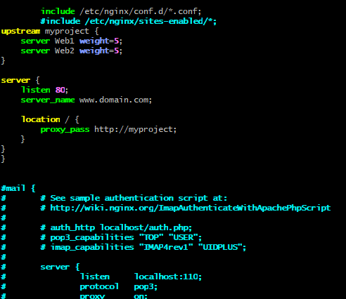
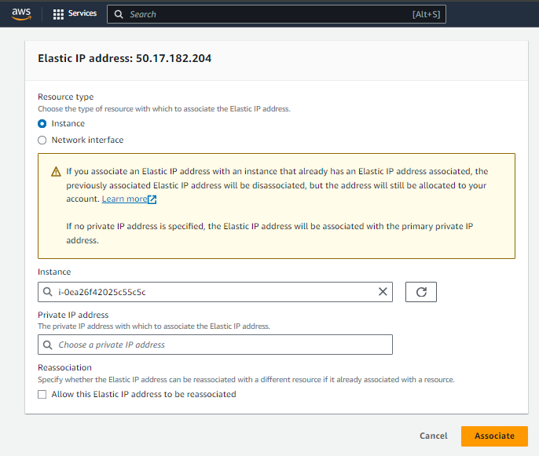
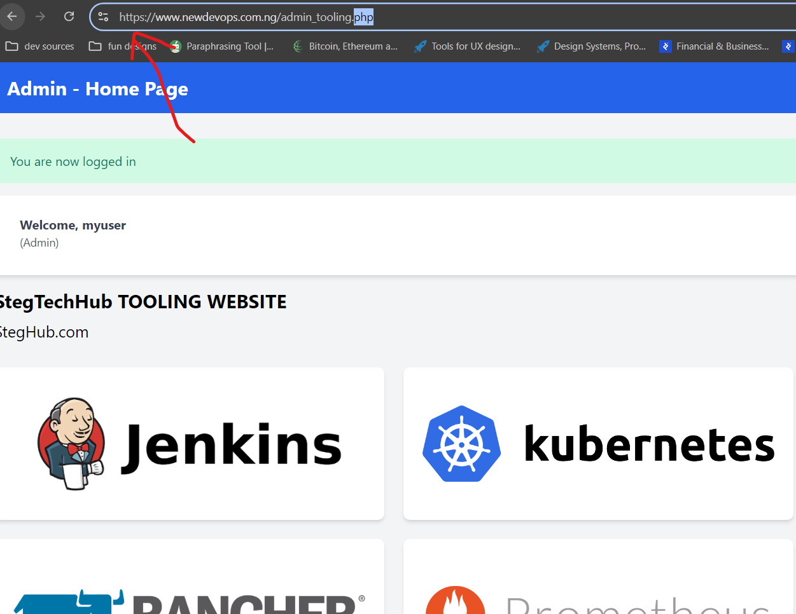
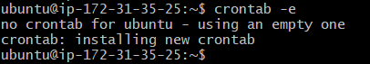

# Load Balancer Solution With Nginx and SSL/TLS

## Introduction
This documentation outlines the steps to configure an Nginx Load Balancer on an **Ubuntu Server 24.04 LTS** EC2 instance. The load balancer will distribute web traffic between two web servers, using SSL/TLS certificates to secure the connection. This project ensures that all communications to the tooling web solution are secure and efficiently balanced.

### Key Objectives:
- Configure Nginx as a load balancer.
- Register a domain and associate it with an Elastic IP.
- Set up SSL/TLS certificates for secure connections using **Certbot**.
- Automate SSL certificate renewal.

---

## Part 1: Configure Nginx as a Load Balancer

### Step 1: Prepare the Environment
1. **Create EC2 Instance**:
   - Launch a new EC2 instance based on **Ubuntu Server 24.04 LTS** and name it **Nginx LB**.
   - Ensure the security group allows:
     - TCP Port **80** (HTTP) for regular traffic.
     - TCP Port **443** (HTTPS) for secure traffic.

2. **Update the `/etc/hosts` file**:
   - Add the private IP addresses and hostnames of the web servers (e.g., Web1 and Web2).
   - Example entry in `/etc/hosts`:
     ```
     <Web1-IP>   Web1
     <Web2-IP>   Web2
     ```

     

### Step 2: Install and Configure Nginx as Load Balancer
1. **Update the instance**:
   ```bash
   sudo apt update
   ```

2. **Install Nginx**:
   ```bash
   sudo apt install nginx
   ```
   

3. **Configure Nginx**:
   - Open the Nginx configuration file:
     ```bash
     sudo vi /etc/nginx/nginx.conf
     ```
   - Insert the following configuration into the `http` section:
     ```nginx
     upstream myproject {
         server Web1 weight=5;
         server Web2 weight=5;
     }

     server {
         listen 80;
         server_name www.domain.com;
         
         location / {
             proxy_pass http://myproject;
         }
     }
     ```
   - **Note**: Comment out the line:
     ```nginx
     # include /etc/nginx/sites-enabled/*;
     ```

     


4. **Restart Nginx**:
   ```bash
   sudo systemctl restart nginx
   sudo systemctl status nginx
   ```

   

### Step 3: Verify Load Balancer Configuration
- Check if Nginx is running and that the traffic is being distributed across Web1 and Web2.

---

## Part 2: Configure SSL/TLS Certificates

### Step 1: Register a Domain and Associate with Elastic IP
1. **Register a domain**:
   - Use a domain registrar such as **Godaddy.com**, **Domain.com**, or **Bluehost.com** to register a domain name (e.g., .com, .net, .org).
   - In this case, I am making use `newdevops.com.ng`

2. **Allocate an Elastic IP**:
   - In the AWS Management Console, allocate an Elastic IP and associate it with your **Nginx LB** server. This ensures that your IP address remains static.

   

   

3. **Update DNS A Record**:
   - Update the DNS settings in your domain registrar to point your domain name to the Elastic IP of **Nginx LB**.

### Step 2: Update Nginx to Recognize the New Domain
1. **Update Nginx Configuration**:
   - Modify the `nginx.conf` file to update the `server_name` with your new domain:
     ```nginx
     server_name www.<your-domain-name.com>;
     ```

     

2. **Restart Nginx**:
   ```bash
   sudo systemctl restart nginx
   ```

### Step 3: Install SSL/TLS Certificates
1. **Install Certbot**:
   - Ensure the **snapd** service is active:
     ```bash
     sudo systemctl status snapd
     ```
   - Install Certbot:
     ```bash
     sudo snap install --classic certbot
     sudo ln -s /snap/bin/certbot /usr/bin/certbot
     ```

     

2. **Request an SSL Certificate**:
   - Use Certbot to request an SSL/TLS certificate:
     ```bash
     sudo certbot --nginx
     ```

     

3. **Verify Secured Access**:
   - Access your domain via HTTPS:
     ```
     https://<your-domain-name.com>
     ```
   - You should see a padlock icon, indicating a secure connection.

### Step 4: Automate SSL/TLS Certificate Renewal
1. **Test Renewal**:
   - Run a dry-run test for certificate renewal:
     ```bash
     sudo certbot renew --dry-run
     ```

2. **Set Up Cron Job for Auto-Renewal**:
   - Schedule automatic renewal by editing the cron file:
     ```bash
     crontab -e
     ```
   - Add the following line to schedule renewal twice a day:
     ```bash
     * */12 * * * root /usr/bin/certbot renew > /dev/null 2>&1
     ```

     

---

## Lessons Learned:
- **Elastic IPs**: Associating an Elastic IP with the load balancer ensures stability in IP addressing, which is crucial when linking a domain to the instance. It was important to understand how AWS Elastic IPs provide consistency across restarts.
- **Nginx Configuration**: The key to correctly configuring the load balancer lies in understanding the `upstream` block, which manages traffic distribution. Learning how to fine-tune traffic weights allows for better load management across servers.
- **SSL/TLS Setup**: The integration of **Certbot** and Nginx for SSL/TLS certificates was an insightful experience, showing how quickly secure connections can be set up and how automation with cron jobs can streamline maintenance.
- **DNS Management**: Registering a domain and managing DNS records was a crucial step to ensure the domain resolved correctly to the load balancer. Understanding A records and how DNS propagation works was critical.
- **Automation**: Automating SSL certificate renewals using **cron** was a valuable exercise in maintaining secure communication without manual intervention.

This project has reinforced key principles of load balancing, secure web traffic handling, and automating routine tasks to maintain high availability and security in cloud infrastructure.


