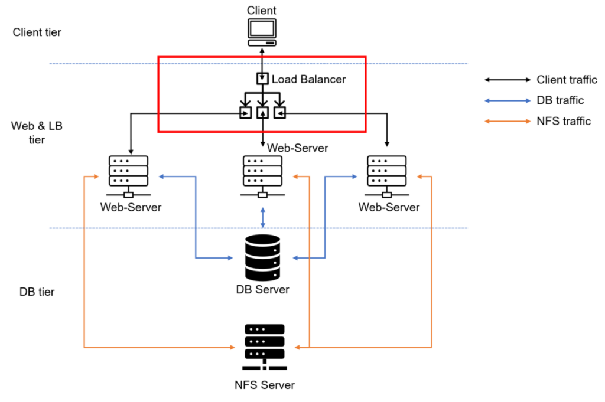
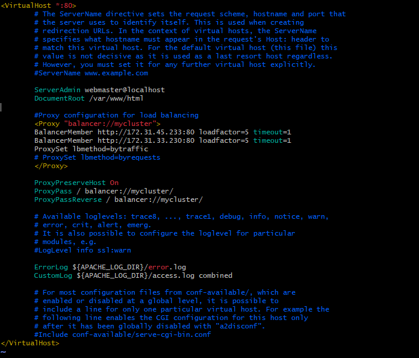
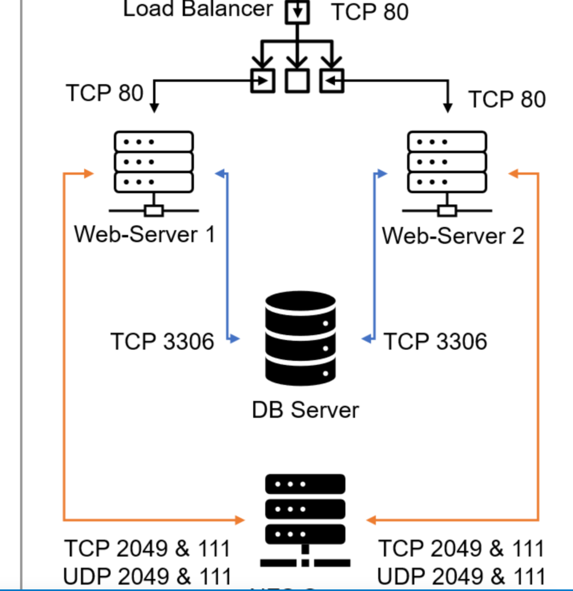

# Deploying and Configuring an Apache Load Balancer for the Tooling Website Solution


In this project, we deploy and configure an Apache Load Balancer on an Ubuntu 24.04 EC2 instance to distribute incoming web traffic across two RHEL8 web servers. This solution ensures that users accessing the tooling website are evenly served by both web servers, improving performance and reliability.

This project extends the [DevOps Tooling Website Solution](https://github.com/AyopoB/StegHub-PBL/tree/main/DevOps-tooling-website-solution), where we previously deployed a website across multiple servers. Now, by implementing a load balancing solution using Apache, we aim to distribute traffic evenly among the web servers, thereby improving the scalability and reliability of our application.





## Steps Involved
- [Prerequisites](#prerequisites)

- [ Step 1: Launch the Apache Load Balancer (Project-8-apache-lb)](#step-1-launch-the-apache-load-balancer-project-8-apache-lb)

- [Step 2: Install and set up Apache on the Load Balancer
](#step-2-install-and-set-up-apache-on-the-load-balancer)
- [Step 3: Configure Load Balancing](#step-3-configure-load-balancing)
- [Step 4: Test the Load Balancer and Verify Logs on the Web Servers](#step-4-test-the-load-balancer-and-verify-logs-on-the-web-servers)
- [Step 5:  Configure Local DNS Names (Optional)](#step-5--configure-local-dns-names-optional)


## Prerequisites

Ensure you have:
- Two RHEL8 Web Servers
- One MySQL DB Server (Ubuntu 20.04)
- One RHEL8 NFS server

## Step 1: Launch the Apache Load Balancer (Project-8-apache-lb)

1. Create an Ubuntu 20.04 EC2 instance and name it Project-8-apache-lb, and open TCP port 80 by creating an inbound rule in the security group for this instance.


2. SSH into the Project-8-apache-lb instance:

## Step 2: Install and set up Apache on the Load Balancer

1. Install Apache:
```bash
sudo apt update
```
```bash
sudo apt install apache2 -y
```


```bash
sudo apt-get install libxml2-dev
```
>Installs the libxml2 development libraries


2.  Enable the necessary Apache modules for load balancing:
```bash
sudo a2enmod rewrite
sudo a2enmod proxy
sudo a2enmod proxy_balancer
sudo a2enmod proxy_http
sudo a2enmod headers
sudo a2enmod lbmethod_bytraffic
```


3. After enabling the modules, restart Apache to apply the changes:
```bash
sudo systemctl restart apache2
```

4. Ensure Apache is up and running:
```bash
sudo systemctl status apache2
```


## Step 3: Configure Load Balancing
1. Open the Apache configuration file:
```bash
sudo vi /etc/apache2/sites-available/000-default.conf
```

2. Add the following configuration within the <VirtualHost *:80> section:
```apache
<VirtualHost *:80>
    <Proxy "balancer://mycluster">
        BalancerMember http://<WebServer1-Private-IP-Address>:80 loadfactor=5 timeout=1
        BalancerMember http://<WebServer2-Private-IP-Address>:80 loadfactor=5 timeout=1
        ProxySet lbmethod=bytraffic
        # ProxySet lbmethod=byrequests
    </Proxy>

    ProxyPreserveHost On
    ProxyPass / balancer://mycluster/
    ProxyPassReverse / balancer://mycluster/
</VirtualHost>
```


> Replace <WebServer1-Private-IP-Address> and <WebServer2-Private-IP-Address> with the private IPs of your two RHEL8 web servers.




> The lbmethod=bytraffic distributes incoming load based on traffic load.
> bytraffic balancing method will distribute incoming load between the  Web Servers according to current traffic load. We can control in which proportion the traffic must be distributed by loadfactor parameter. Other methods are bybusyness, byrequests, heartbeat

3. Restart Apache to Apply Changes:
```bash
sudo systemctl restart apache2
```


## Step 4: Test the Load Balancer and Verify Logs on the Web Servers
1. Access the public IP of your Project-8-apache-lb instance in a browser: 
```bash
http://<Load-Balancer-Public-IP>/index.php
```

- Note: If in the previous project, you mounted /var/log/httpd/ from your Web Servers to the NFS server - unmount them and make sure that each Web Server has its own log directory, do the following steps on the two web servers:

    - Check Existing NFS Mounts:
    ```bash
    df-h
    ```

    - Stop Apache to Prevent Logging Disruption:
    ```bash
    sudo systemctl stop httpd
    ```

    - To unmount the /var/log/httpd/ directory, run:
    ```bash
    sudo umount /var/log/httpd
    ```

    - Verify that the unmount was successful by running `df -h`.
    > This command should no longer display the /var/log/httpd mount.

    - Check /etc/fstab for Persistent NFS Mount:

        - Open the /etc/fstab file with a text editor:
        ```bash
        sudo vi /etc/fstab
        ```
        - Find the line that mounts the NFS directory (it will look similar to this):
        ```javascript
        <nfs-server-IP>:/mnt/logs    /var/log/httpd    nfs    defaults    0 0
        ```

        Comment out the line by adding a # at the beginning, or delete the line entirely:
        ```javascript
        #<nfs-server-IP>:/mnt/logs    /var/log/httpd    nfs    defaults    0 0
        ```

        - Save and close the file.
    - Recreate the Local Log Directory
        - If the /var/log/httpd/ directory was mounted from NFS, it may no longer exist locally on the web server. Recreate it:
        ```bash
        sudo mkdir -p /var/log/httpd
        ```

        - Set the appropriate ownership and permissions:
        ```bash
        sudo chown apache:apache /var/log/httpd
        sudo chmod 755 /var/log/httpd
        ```
    - Restart Apaches
    ```bash
    sudo systemctl start httpd
    ```


> If configured correctly, the requests will be balanced between the two web servers.

2. On both RHEL8 web servers, monitor incoming requests by running:

```bash
sudo tail -f /var/log/httpd/access_log
```


- Refresh the browser page several times, and you should see requests being distributed evenly across both servers


## Step 5:  Configure Local DNS Names (Optional)
1. Open the /etc/hosts file on the Load Balancer (LB) server:

```bash
sudo vi /etc/hosts
```

2. In the opened file, add the private IP addresses and arbitrary names for both of your web servers:
```bash
<WebServer1-Private-IP-Address>  Web1
<WebServer2-Private-IP-Address>  Web2
```


3. Save the file and exit the editor.

4. Now, update the Apache configuration file to use these names instead of the IP addresses. Open the Apache configuration file (e.g., /etc/apache2/sites-available/000-default.conf) and modify the BalancerMember lines:

```bash
sudo vi /etc/apache2/sites-available/000-default.conf
```

- Change : 
```bash
BalancerMember http://<WebServer1-Private-IP-Address>:80 loadfactor=5 timeout=1
BalancerMember http://<WebServer2-Private-IP-Address>:80 loadfactor=5 timeout=1
```


- To :
```bash
BalancerMember http://Web1:80 loadfactor=5 timeout=1
BalancerMember http://Web2:80 loadfactor=5 timeout=1
```


5. Restart Apache to Apply Changes: After making these changes, restart Apache to apply the new configuration: 
```bash
sudo systemctl restart apache2
```
6. Test if the names resolve correctly from the Load Balancer by using curl:
```bash
curl http://Web1
curl http://Web2
```

- Web1:


- Web2:


The Setup now looks like this:




## Lessons Learned:

This project reinforced the importance of managing server configurations and ensuring that dependencies like logging directories are properly set up. Proper unmounting of NFS and maintaining individual logs on each server is crucial for debugging and monitoring purposes. Additionally, understanding Apache’s load balancing modules like `mod_proxy_balancer` and choosing the right load balancing method, such as `bytraffic`, can optimize server performance.


