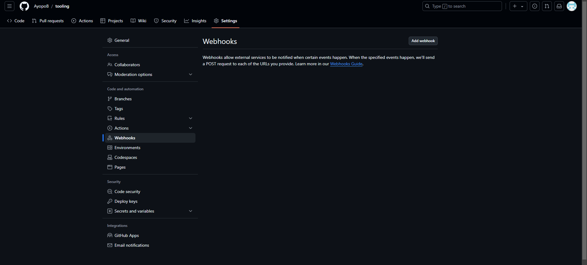
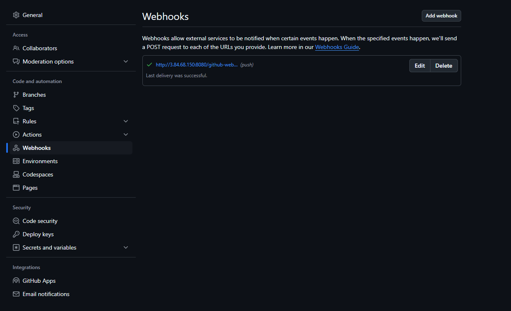
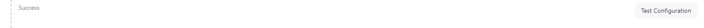
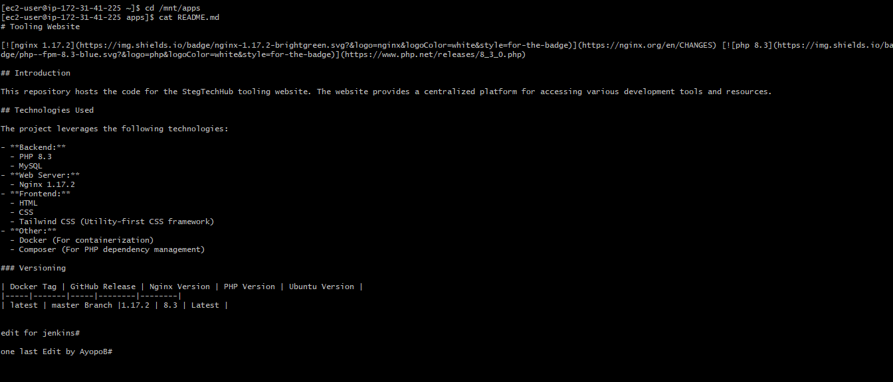

# Tooling Website Deployment Automation with Jenkins


### **Introduction**

In the previous project, we implemented horizontal scalability by adding multiple web servers to the tooling website and set up a load balancer to distribute traffic between them. This setup worked well for two or three servers, but manually configuring dozens or hundreds of servers is inefficient. 

DevOps practices aim to ensure agility, fast releases, and repeatability through automation. One of the most effective tools for automating tasks is **Jenkins**, an open-source automation server. Jenkins helps in implementing **CI/CD** (Continuous Integration/Continuous Delivery), which accelerates software delivery while maintaining code quality.

### **What is Continuous Integration (CI)?**

According to CircleCI, **Continuous Integration (CI)** is a strategy in which developers frequently commit small chunks of code to a shared repository. Each commit triggers automatic builds and tests to detect issues early and streamline development.

In this project, you will use Jenkins to automatically update the Tooling Website whenever code changes are pushed to your GitHub repository. This CI implementation will ensure that changes are deployed seamlessly.

### **Objectives**

- Enhance the architecture from **Project 8** by introducing a Jenkins server.
- Automate the deployment of source code changes from GitHub to the NFS server where the tooling website is hosted.
- Configure a Jenkins job to pull changes from GitHub and deploy them to the NFS server automatically.

### **Jenkins: Overview**

Jenkins, initially developed as **Hudson** by Kohsuke Kawaguchi at Sun Microsystems, is one of the most popular CI/CD tools available today. It integrates easily with version control tools such as GitHub and can automate tasks like building, testing, and deploying applications.

### **Updated Architecture**

Upon completing this project, the  architecture will look like this:

1. **Jenkins Server**: This server will monitor changes in the GitHub repository and trigger deployment to the NFS server.
2. **NFS Server**: Jenkins will deploy the updated source code to this server, which will sync with the web servers.
3. **Web Servers**: These RHEL web servers will serve the tooling website using the code deployed on the NFS shared storage.
4. **Load Balancer**: The existing load balancer will continue distributing traffic among the web servers for better load management.


## Step 1: Install Jenkins Server on AWS EC2

1. Create an EC2 Instance for Jenkins
- Instance type: Ubuntu Server 24.04 LTS
- Name: Jenkins
- Security Group Settings: Open ports 22 (SSH).


2. Install Java Development Kit (JDK)
- Since Jenkins is a Java-based application, install the default JDK package:
```bash
sudo apt update
sudo apt install default-jdk-headless -y
``` 


- Verify the JDK installation:
```bash
java -version
```


3. Install Jenkins
    - Add Jenkins repository and key:
    ```bash
    sudo wget -O /usr/share/keyrings/jenkins-keyring.asc https://pkg.jenkins.io/debian-stable/jenkins.io-2023.key

    echo "deb [signed-by=/usr/share/keyrings/jenkins-keyring.asc] https://pkg.jenkins.io/debian-stable binary/" | sudo tee /etc/apt/sources.list.d/jenkins.list > /dev/null

    ```

    

    
    - Update package list and install Jenkins:
    ```bash
    sudo apt update
    sudo apt-get install jenkins -y
    ```

    


4. Ensure Jenkins is running:
```bash
sudo systemctl start jenkins
sudo systemctl status jenkins
```


By default, Jenkins uses TCP port 8080, so the server will be accessible via this port.

5. Open Port 8080 in Security Group
- Go to your EC2 instance's Security Group in the AWS Management Console.
- Create a new Inbound Rule to allow traffic on port 8080

    - Type: Custom TCP
    - Port range: 8080
    - Source: Anywhere (0.0.0.0/0) or your specific IP address range for better security.

    


6. Access Jenkins for Initial Setup
    1. Open your browser and visit:
    ```
    http://<Jenkins-Server-Public-IP-Address>:8080
    ```
    

    2. Jenkins will prompt you for an admin password.
    
    3. Retrieve the password from the server using:
    ```bash
    sudo cat /var/lib/jenkins/secrets/initialAdminPassword
    ```
    4. Paste the password into the browser and continue the setup.

    
7. Install Suggested Plugins
- During setup, you will be prompted to install plugins.
- Choose the Suggested Plugins option for a smoother experience.


8. Create an Admin User
- After plugin installation, create your admin user (username, password, etc.).
- This completes the Jenkins setup, and you will be redirected to the Jenkins dashboard.


## Step 2: Configure Jenkins to Retrieve Source Code from GitHub Using Webhooks

In this step, we will configure a Jenkins job that automatically retrieves the source code from our GitHub repository via webhooks. This is an essential part of automating the build and deployment process, where Jenkins will trigger a job every time a change is pushed to GitHub.

1. Enable Webhooks in Your GitHub Repository

    1. Navigate to your GitHub repository.
    2. Go to Settings > Webhooks.

    
    
    3. Click on Add webhook.
    4. In the Payload URL field, enter the URL of your Jenkins server followed by `/github-webhook/`
    ``` 
    http://<Jenkins-Server-Public-IP-Address>:8080/github-webhook/
    ``` 
    5. Set Content type to application/json.
    6. Leave Secret blank (for now), and select Just the push event under the "Which events would you like to trigger this webhook?" section.
    7. Click Add webhook.

    

    


2. Create a Jenkins Job (Freestyle Project)
    1. Log in to your Jenkins dashboard.
    2. Click New Item to create a new job.
    3. Name your job (e.g., `tooling_github`), and select Freestyle project.
    4. Click OK to proceed.
    


3. Configure Git Repository in Jenkins
    1. In the job configuration page, scroll down to the Source Code Management section.
    2. Choose Git.
    3. In the Repository URL field, paste the URL of your GitHub repository (e.g., https://github.com/<your-username>/tooling).

    


    4. Under Credentials, either
        - Select Add to input your GitHub credentials (username and password or personal access token).
        - If you already have credentials saved, select them from the dropdown.


    5. Ensure that the Branch to build is set to */master or the branch you want Jenkins to track.


4. Manual Build Test

    - Scroll down and click Save.
    - To test the configuration manually, go to the project page and click Build Now.
    - The build process will start, and you can monitor the output by clicking the build number (#1) and selecting Console Output.
    - If the build succeeds, congratulations! You've successfully configured your first Jenkins build.

    


5. Automate Builds with GitHub Webhook
    - Go back to the Configuration page of your Jenkins job by clicking Configure.
    - Scroll down to the Build Triggers section.
    - Check the box for GitHub hook trigger for GITScm polling. This enables Jenkins to trigger a build automatically when changes are pushed to the GitHub repository.
    - Save the configuration.


6. Add Post-Build Actions

To ensure the build artifacts (resulting files) are saved, configure Post-build Actions:

- In the Jenkins job configuration, scroll to the Post-build Actions section.

- Choose Archive the artifacts.

- In the Files to archive field, enter `**/*` to archive all files generated during the build.

- Click Save.


7. Test the Webhook Configuration
    - Make a change to any file in your GitHub repository (for example, edit the README.md file) and push the changes to the master branch.
    - Check your Jenkins dashboard — a new build should automatically trigger as a result of the webhook.
    - Once the build is complete, you can find the archived artifacts under:
    ```javascript
    /var/lib/jenkins/jobs/tooling_github/builds/<build_number>/archive/
    ```


We have now successfully set up an automated Jenkins job that receives files from GitHub via webhook triggers. This method is considered a "push" because GitHub initiates the file transfer when changes are pushed.

By default, the artifacts are stored on Jenkins server locally
```bash
ls /var/lib/jenkins/jobs/tooling_github/builds/<build_number>/archive/
```


## Step 3: Configure Jenkins to Copy Files to NFS Server via SSH

In this step, we'll configure Jenkins to copy the build artifacts from the Jenkins server to your NFS server using the "Publish Over SSH" plugin. This allows the web servers to access the updated files stored on the NFS server.

1. Install the "Publish Over SSH" Plugin
    1. Log in to your Jenkins dashboard.
    2. Click on Manage Jenkins > Manage Plugins.
    3. Go to the Available tab.
    4. Search for "Publish Over SSH" and select it.
    5. Click Install without restart to install the plugin.

    

2. Configure SSH Connection to NFS Server
    1. After installing the plugin, go to the Jenkins dashboard.

    2. Click on Manage Jenkins > Configure System.

    3. Scroll down to the Publish over SSH section.

    4. Click Add and configure the SSH connection to your NFS server:
        - Private Key: Paste the contents of your `.pem` file that you use to connect to the NFS server via SSH.
        - Name: Choose an arbitrary name for this configuration (e.g., `NFS-server-DT`).
        - Hostname: Enter the private IP address of your NFS server (you can find this in your AWS EC2 dashboard).
        - Username: Set it to `ec2-user` (assuming you're using RHEL 8).
        - Remote Directory: Enter `/mnt/apps`, which is the mount point for your web servers.

        
        

    5. Click Test Configuration to ensure the SSH connection works. You should see Success if everything is set up correctly. Make sure that port 22 is open on your NFS server to allow SSH connections.

    


3. Configure Jenkins Job to Copy Artifacts to NFS Server
    1. Go back to your Jenkins job configuration page by selecting Configure from the project dashboard.
    2. Scroll to the Post-build Actions section.
    3. Click on Add post-build action and select Send build artifacts over SSH.
    4. In the SSH Server dropdown, select the NFS server configuration you created earlier (`NFS-server-DT`).
    5. Set the Source files field to `**` (this will send all files and directories produced by the build).
   
    6. Click Save.

    


4. Test the Configuration
    1. Go to your GitHub repository and make a change (e.g., modify the README.md file).
    2. Push the change to the master branch. The GitHub webhook will trigger a Jenkins job automatically.
    3. Monitor the job in Jenkins and check the Console Output for the following line:

    ```makefile
    SSH: Transferred <number_of_files> file(s)
    Finished: SUCCESS
    ```

    

5. Verify Files on NFS Server
    1. SSH into your NFS server:
    ```bash
    ssh -i <path-to-your-pem-file> ec2-user@<NFS-Server-IP>
    ```

    2. Navigate to the `/mnt/apps` directory:
    ```bash
    cd /mnt/apps
    ```

    3. Check the updated `README.md` file:

    ```bash
    cat README.md
    ```

    4. If the changes you made in the GitHub repository are reflected in the file, your configuration is working as expected.





If it's not working, change permissions of NFS Server:
```bash
sudo chown ec2-user /mnt/apps
sudo chmod -R 777 /mnt/apps
sudo chmod 755 /mnt/apps
```


### Obstacles Encountered and How They Were Overcome

During the automation process, a few challenges arose:

1. **NFS Server Permission Issues:**
   - Initially, when attempting to transfer files from Jenkins to the NFS server, Jenkins was unable to write to the `/mnt/apps` directory due to insufficient permissions. This issue was resolved by changing the ownership of the `/mnt/apps` directory to `ec2-user` and adjusting the permissions to allow Jenkins to write files.
   - Command used:
     ```bash
     sudo chown ec2-user:ec2-user /mnt/apps
     sudo chmod 755 /mnt/apps
     sudo chmod 777 /mnt/apps
     ```
   - This ensured that Jenkins could deploy files while maintaining proper security practices.


### Lessons Learned

1. **Importance of Automation in DevOps:**
   - This project highlighted the immense value of automation in scaling DevOps operations. Instead of manually updating each web server, Jenkins allowed seamless CI/CD workflows, automatically triggering deployments upon code changes. Automation ensures consistent and reliable updates, reducing human error and saving time.

2. **Permission Management is Critical:**
   - Proper permission management on both the NFS server and Jenkins server was crucial for ensuring smooth file transfers and secure access. The right combination of user and group ownership, along with appropriate read/write permissions, played a significant role in resolving access issues while maintaining security.

3. **Efficient Use of Jenkins Plugins:**
   - Leveraging the `Publish Over SSH` plugin in Jenkins greatly simplified the process of transferring artifacts. It was a practical solution that avoided the need for custom scripts, showing how Jenkins plugins can enhance functionality and integrate different environments.

4. **Webhooks for CI/CD:**
   - Configuring GitHub webhooks to trigger Jenkins builds every time code is pushed to the repository illustrated the power of Continuous Integration (CI). It ensured the tooling website was always up-to-date with the latest changes, allowing for agile and responsive deployment workflows.

5. **Learning from Setup Errors:**
   - During this project, the setup errors, such as those with permissions, served as a reminder of the complexity involved in cloud-based deployments. However, these obstacles also offered valuable learning opportunities and reinforced the need for detailed planning when working with multi-server environments.

---

### Conclusion

By automating the tooling website deployment with Jenkins, we transformed what would have been a time-consuming manual process into a highly efficient CI/CD pipeline. This approach not only ensured quick and reliable updates but also enhanced the overall scalability of the system. Through the challenges faced, valuable lessons in server permissions, SSH access, and Jenkins configuration were learned, which will be applied in future projects to create more robust and automated systems.

This setup serves as a solid foundation for future enhancements, such as incorporating automated testing and monitoring tools, to further optimize the DevOps workflow.

