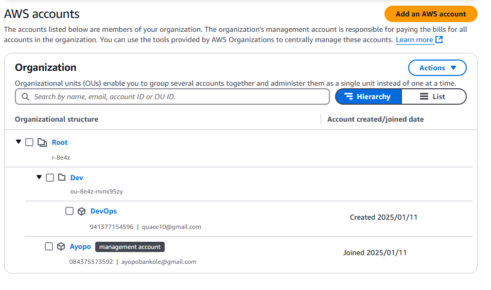
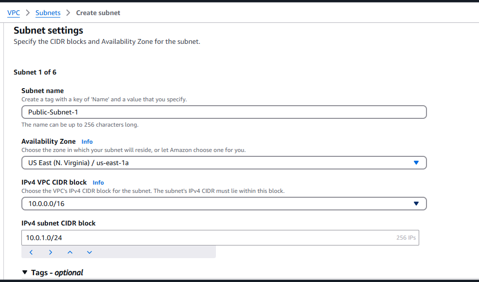
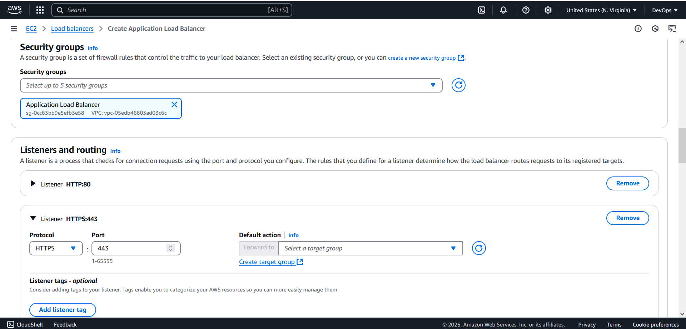
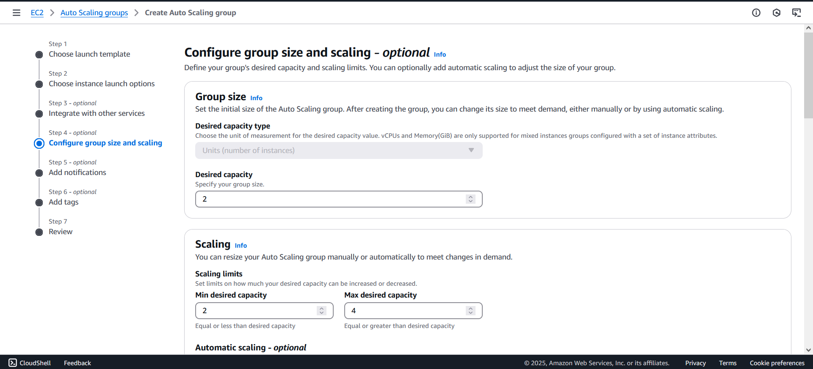
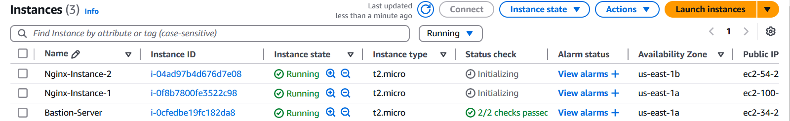
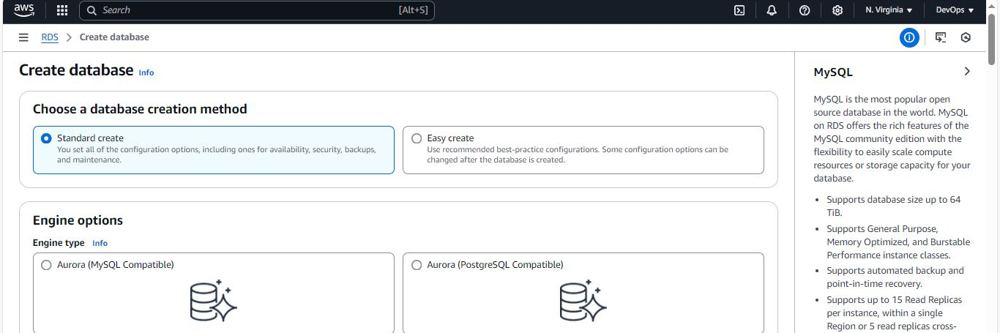

# AWS Cloud Project Documentation: Hosting Two Company Websites Using Reverse Proxy Technology

You will design and implement a secure AWS VPC (Virtual Private Cloud) infrastructure for a fictional company, Ayops. This infrastructure will host Ayops's primary business website, powered by the WordPress Content Management System (CMS), and a Tooling Website (PHP/MySQL) tailored for their DevOps team. To improve security and optimize performance, the solution will incorporate NGINX as a reverse proxy. The project emphasizes cost-effectiveness, robust security, and scalability. The objective is to create an architecture that ensures high availability for both the WordPress and Tooling websites, can seamlessly handle traffic surges, and minimizes operational costs.

## Step 1: Starting Your AWS Cloud Project

### Overview
Before proceeding with the core tasks of hosting websites, certain foundational steps must be completed to set up your AWS environment. These steps include creating and configuring AWS accounts, establishing an organization structure, and preparing domain and DNS configurations.

### Prerequisites
1. **AWS Account Access:** Ensure you have access to an AWS account with administrative permissions.
2. **Additional Email Address:** Prepare an additional email address for creating the DevOps sub-account.
3. **Stable Internet Connection:** To ensure uninterrupted access to AWS services and domain registrar websites.
4. **Basic Knowledge:** Familiarity with AWS Management Console navigation will help.

---
## We are following the architectural Diagram below:


### 1. Configure Your AWS Account and Organization Unit
#### Steps:
1. **Log in to your AWS Account:**
   - Open the [AWS Management Console](https://aws.amazon.com/console/).
   - Use your credentials to log in.

2. **Set Up AWS Organizations:**
   - Navigate to **AWS Organizations** from the AWS Management Console.
   - Choose **Create Organization** and select the **All features** mode to enable advanced account management.
   - Watch a [tutorial](https://www.youtube.com/watch?v=9PQYCc_20-Q) for guidance if needed.

---

### 2. Create an AWS Master Account (Root Account)
The root account serves as the primary account to manage sub-accounts and billing for your organization.

#### Steps:
1. Open the [AWS Management Console](https://aws.amazon.com/console/).
2. Sign up for an AWS account using a valid email address and phone number.
3. Provide payment details and verify your identity.
4. Once complete, this account becomes the **Root Account**.

---

### 3. Create a Sub-Account Named "DevOps"
Sub-accounts are managed under the root account for organizing workloads.

#### Steps:
1. Log in to your AWS Root account.
2. Navigate to **AWS Organizations** > **Accounts**.
3. Click **Add an Account**, then select **Create Account**.
4. Enter the following details:
   - **Account Name:** DevOps

   - **Email Address:** Use the additional email prepared earlier.
5. Confirm and wait for AWS to complete account creation.
6. Note down the login credentials sent to the additional email.

    

   
---

### 4. Create and Configure an AWS Organization Unit (OU)
Organizational Units help structure your AWS accounts for better management.

#### Steps:
1. Navigate to **AWS Organizations** > **Organizational Units**.
2. Click **Create Organizational Unit**.
3. Enter the name of the OU as **Dev**.(We will launch Dev resources in there)
4. Click **Create** to finalize.


---

### 5. Move the Sub-Account to the Dev OU
#### Steps:
1. Go to **AWS Organizations** > **Accounts**.
2. Locate the **DevOps** account.

3. Drag and drop it into the **Dev** OU, or select the account and click **Move**.
4. Confirm the changes.




---

### 6. Log In to the Newly Created Sub-Account
#### Steps:
1. Navigate to the [AWS Management Console](https://aws.amazon.com/console/).
2. Use the email address and credentials for the **DevOps** account to log in.


---

### 7. Register a Free/paid Domain Name
AWS requires a domain name to map resources such as web servers.

#### Steps:
1. Visit [Cloud dns free domain](https://www.cloudns.net/main/).
2. Click on Create Zone, > Free Zone
3. Type in the name of your choice, Click on "Create"
4. There you have a new domain registered

   

---

### 8. Create a Hosted Zone in AWS and Map It to Your Domain
Hosted zones manage DNS records for your domain in AWS Route 53.

#### Steps:
1. Log in to the **DevOps** account.
2. Navigate to **Route 53** > **Hosted Zones**.
3. Click **Create Hosted Zone** and enter:
   - **Domain Name:** Enter the free domain you registered on Freenom.
   - **Type:** Public Hosted Zone.

   

4. Note down the name server (NS) records provided by AWS.


5. Update the DNS settings in your Freenom domain registrar account:
   - Replace Dmainking’s default name servers with the ones from AWS Route 53.
   - Save changes and wait for propagation (this may take a few minutes to hours).

   

   >newdevops.ip-ddns.com


---

### 9. Tagging Resources
Proper tagging ensures better organization and management of resources.

#### Steps:
1. While creating or configuring any resource, add the following tags:
   - **Project:** Assign a meaningful name to your project (e.g., `WebsiteProxy`).
   - **Environment:** Specify the environment (e.g., `Dev`).
   - **Automated:** Set to `No` if the resource is created manually, or `Yes` if created via automation tools like CloudFormation or Terraform.

#### Example:
For a Hosted Zone:
```plaintext
Key: Project     | Value: WebsiteProxy
Key: Environment | Value: Dev
Key: Automated   | Value: No
```

---


# AWS Cloud Project Documentation: Hosting Two Company Websites Using Reverse Proxy Technology  

## Step 2: Set Up a Virtual Private Cloud (VPC)  

A Virtual Private Cloud (VPC) allows you to logically isolate your network within AWS, ensuring secure communication between resources. This step involves creating a VPC, configuring subnets, setting up routing, and ensuring connectivity.  

---

### **1. Reference the Architectural Diagram**  
Before proceeding, ensure you have a clear architectural diagram to guide your configuration. The diagram should outline the VPC, subnets (public and private), routing tables, NAT gateways, and compute resources. Keep the diagram accessible throughout the setup. The diagram for this is below:


---

### **2. Create a VPC**  
1. Log in to the **AWS Management Console**.  
2. Navigate to **VPC Dashboard** > **Your VPCs**.  

   

3. Click **Create VPC** and provide:  
   - **Name Tag:** A descriptive name (e.g., `Project-VPC`).  
   - **IPv4 CIDR Block:** Define the address range, such as `10.0.0.0/16`.  
   - **Tenancy:** Default (to avoid higher costs of dedicated instances).  
4. Click **Create VPC**.  

   

- Enable DNS resolution and DNS hostnames from VPC settings.


   

---

### **3. Create Subnets**  
Subnets divide the VPC into public and private sections.  

1. Navigate to **VPC Dashboard** > **Subnets**.  
2. Click **Create Subnet** and provide:  
   - **Name Tag:** Example - `Public-Subnet-1` or `Private-Subnet-1`.  
   - **VPC:** Select the VPC created earlier.  

   

   - **Availability Zone (AZ):** Choose one within the region.  
   - **CIDR Block:** Assign a subset of the VPC range (e.g., `10.0.1.0/24` for public, `10.0.2.0/24` for private).  
3. Repeat the process for all required subnets (e.g., 2 public and 2 private subnets).  

   - Public Subnet 1 (Availability Zone A):
      - CIDR Block: 10.0.1.0/24
      - Availability Zone: A
      - Name: Public-Subnet-1

         

   - Private Subnet 1 (Availability Zone A):
      - CIDR Block: 10.0.2.0/24
      - Availability Zone: A
      - Name: Private-Subnet-1

         

   - Public Subnet 2 (Availability Zone B):
      - CIDR Block: 10.0.3.0/24
      - Availability Zone: B
      - Name: Public-Subnet-2

         

   - Private Subnet 2 (Availability Zone B):
      - CIDR Block: 10.0.4.0/24
      - Availability Zone: B
      - Name: Private-Subnet-2

         

   - Private Subnet 3 (Availability Zone A):
      - CIDR Block: 10.0.5.0/24
      - Availability Zone: A
      - Name: Private-Subnet-3

         

   - Private Subnet 4 (Availability Zone B):
      - CIDR Block: 10.0.6.0/24
      - Availability Zone: B
      - Name: Private-Subnet-4

         

   -List of newly created subnets
      
      
---

### **4. Create Route Tables and Associate Them**  
#### Public Route Table:  
1. Navigate to **VPC Dashboard** > **Route Tables**.  
2. Click **Create Route Table**.  
   - **Name Tag:** Example - `Public-RouteTable`.  
   - **VPC:** Select your VPC. 

   

3. Associate the route table with the public subnets:  
   - Click **Subnet Associations** > **Edit Subnet Associations**.  
   - Select the public subnets and save.  
   
   

#### Private Route Table:  
1. Repeat the above steps to create a private route table.  

   

2. Associate it with the private subnets.

   

---

### **5. Create an Internet Gateway**  
1. Navigate to **VPC Dashboard** > **Internet Gateways**.  
2. Click **Create Internet Gateway** and provide:  
   - **Name Tag:** Example - `Project-IGW`. 

   

3. Attach it to the VPC:  
   - Select the Internet Gateway > **Actions** > **Attach to VPC**. 
   

   


#### Edit Public Route Table:  
1. Select the **Public Route Table**.  
2. Add a route:  
   - **Destination:** `0.0.0.0/0`.  
   - **Target:** The Internet Gateway (IGW) you created.  
3. Save changes.  

   

---

### **6. Allocate Elastic IPs**  
Elastic IPs provide static public IP addresses.  

1. Navigate to **EC2 Dashboard** > **Elastic IPs**.  
2. Click **Allocate Elastic IP Address**.  
3. Allocate three Elastic IPs:  
   - Assign one for the NAT Gateway.  
   - Reserve two for the Bastion hosts.  

      
---

### **7. Create a NAT Gateway**  
1. Navigate to **VPC Dashboard** > **NAT Gateways**.  
2. Click **Create NAT Gateway**.  
   - **Subnet:** Choose a public subnet.  
   - **Elastic IP:** Assign one of the Elastic IPs allocated earlier.  

      

3. Associate the NAT Gateway with the private route table:  
   - Add a route in the **Private Route Table**.  
   - **Destination:** `0.0.0.0/0`.  
   - **Target:** NAT Gateway.  

      

      
---

### **8. Create Security Groups**  
Security Groups act as virtual firewalls for your instances.  

#### **For Nginx Servers:**  
- Allow access only from the Application Load Balancer (ALB).  
- For now, use placeholder rules:  
  - **Protocol:** TCP.  
  - **Port Range:** 443.  
  - **Source:** `0.0.0.0/0` (temporary placeholder).  

   

#### **For Bastion Hosts:**  
- Allow SSH access only from your workstation:  
  - Obtain your workstation's public IP:  
    ```bash
    curl www.canhazip.com
    ```  
  - Add rules:  
    - **Protocol:** TCP.  
    - **Port Range:** 22.  
    - **Source:** Your public IP.  

    

#### **For Application Load Balancer (ALB):**  
- Allow access from the internet:  
  - **Protocol:** all traffic 
  - **Port Range:** all 
  - **Source:** `0.0.0.0/0`.  

   

#### **For Web Servers:**  
- Allow access only from Nginx servers.  
- Use placeholders for now:  
  - **Protocol:** TCP.  
  - **Port Range:** 80.  
  - **Source:** `0.0.0.0/0` (temporary).  

  

#### **For Data Layer (RDS and EFS):**  
- Allow access only from:  
  - **Web Servers** to RDS.  
  - **Nginx Servers and Web Servers** to EFS.  
- Inbound Rules:
  - Protocol: TCP
    Port: 3306
    Source: Webserver-SG
  - Protocol: TCP
    Port: 2049
    Source: NGINX-SG
  - Protocol: TCP
    Port: 2049
    Source: Webserver-SG

%20sg.png)

---

### Notes:    
- Test the connectivity between subnets to ensure proper routing.  
- Assign meaningful tags to all resources for better management.  


---

## Step 3: Set Up Compute Resources  

After establishing the VPC and networking infrastructure, the next step is to provision the necessary compute resources, such as EC2 instances, load balancers, and auto-scaling groups. These resources will power your web servers, bastion hosts, and Nginx servers.

---

### **1. Provision EC2 Instances for Nginx**  
Nginx will serve as the reverse proxy server for your websites.  

#### Steps to Provision EC2 Instances for Nginx:  
1. Navigate to the **EC2 Dashboard** in AWS.  
2. Click **Launch Instance** and follow these settings:  
   - **Name:**  Assign meaningful names (e.g., Nginx-Instance-1 and Nginx-Instance-2).

    

   - **Amazon Machine Image (AMI):** Select the **CentOS** AMI.  

   

   - **Instance Type:** Choose a T2 instance family (e.g., `t2.micro`).  
   - **VPC:** Select the VPC created in Step 2.  
   - **Subnet:** Select a public subnet from the ones you created earlier.  
   - **Security Group:** Assign the appropriate security group (refer to Step 2 for Nginx SG).  

   
 
3. Proceed to **Add Storage** and configure as needed.  
4. **Review and Launch** the instance.  


Once the instance is launched, **connect** to it using SSH and install the required software:

```bash
sudo yum update -y
sudo yum install -y python ntp net-tools vim wget telnet epel-release htop nginx
```


---

### **2. Create an AMI for Nginx**  
Creating an AMI allows you to launch identical instances in the future.  

1. In the **EC2 Dashboard**, select your running Nginx instance.  
2. Click **Actions** > **Image and Templates** > **Create Image**.  
3. Provide a name for the image, such as `Nginx-AMI`.  
4. Click **Create Image**.  


Once done, AWS will start creating the AMI. This process might take a few minutes, depending on the size of your instance.


---

### **3. Prepare Launch Templates for Nginx (One Per Subnet)**  
Launch templates define the configuration of EC2 instances, including the AMI, instance type, and other settings.  

1. Navigate to **EC2 Dashboard** > **Launch Templates**.  
2. Click **Create Launch Template**.  


3. Provide:  
   - **Template Name:** Example - `Nginx-Launch-Template-1`.  
   - **AMI ID:** Select the Nginx AMI you created.  
   - **Instance Type:** `t2.micro` or similar.  
   - **Subnet:** Choose the public subnet for the template.  


4. Review all configurations.

5. Click **Create Launch Template**.  
6. Repeat the process for the other subnet if needed.  

---

### **4. Configure Target Groups for Nginx**  
Target groups allow the load balancer to direct traffic to your EC2 instances.  

Before  we do this,  Let's **Request TLS Certificates from AWS Certificate Manager (ACM)**  

To secure your websites with HTTPS, you will need to request a TLS certificate from ACM.

1. Navigate to **AWS Certificate Manager (ACM)**.  
2. Click **Request a certificate** and select **Public certificate**.  


3. Request a **wildcard certificate** for your domain, such as `newdevops.ip-ddns.com`.


4. **Validate the domain** using DNS validation.  
5. Once validated, **tag the resource** for easy identification.  


---
#### **Application Load Balancer to Route Traffic to Nginx**

This ALB will handle HTTPS traffic, offload SSL/TLS certificates, and route traffic intelligently to the Nginx servers.

1. **Create an Internet-Facing ALB**:
   - Navigate to **EC2 Dashboard** > **Load Balancers** > **Create Load Balancer** > **Application Load Balancer**.

   

   - Select **Internet-facing** as the scheme.
   - **Listeners**:
     - Add a listener for HTTPS (Port 443).
   - **VPC and Subnets**:
     - Select the appropriate VPC.
     - Choose public subnets in each Availability Zone.

     

     

     

     

2. **Configure SSL/TLS Certificates**:
   - Choose the **ACM Certificate** you created earlier for your domain.

   

3. **Set Security Groups**:
   - Assign a security group allowing HTTPS (Port 443) from anywhere or restrict to trusted IPs for testing.

   

4. **Create Target Group**:
   - Navigate to **Target Groups** > **Create Target Group**.
   - Select **Instances** as the target type.

   

   - Protocol: TCP.
   - Port: 80 (Nginx listens on HTTP).
   - Add the Nginx EC2 instances to the target group.

   

   

   

5. **Register Nginx Instances**:
   - In the ALB configuration, associate the target group you created for Nginx.


---


---

### **6. Configure Auto-Scaling for Nginx**  
Auto-scaling ensures that the number of Nginx instances adjusts based on demand.  

1. Navigate to **EC2 Dashboard** > **Auto Scaling Groups**.  
2. Click **Create Auto Scaling Group** and follow these steps:  
   - **Launch Template:** Select the Nginx launch template.  
   - **VPC:** Choose the VPC created earlier.  
   - **Subnets:** Select the public subnets.  
   - **Target Group:** Select the Nginx target group.  
3. Set the **desired capacity** to 2, with a **minimum capacity** of 2 and a **maximum capacity** of 4.  
4. Under **Scaling Policies**, set the policy to scale out when CPU utilization exceeds 90%.  
5. Enable **Health checks** for both EC2 and ALB.  
6. **Create an SNS topic** to send notifications when scaling occurs.  
7. Click **Create Auto Scaling Group**.





---


### **Set Up Compute Resources for Bastion**

#### **1. Provision EC2 Instances for Bastion**  
Bastion hosts provide secure access to instances in private subnets. You will need to provision Bastion EC2 instances in each Availability Zone (AZ) where the Nginx servers are located.

1. Go to the **EC2 Dashboard** > **Launch Instance**.  
2. Choose **CentOS AMI** for the instance.  
3. Select the **instance type** (e.g., `t2.micro` or equivalent). 



4. Ensure the instance is launched in the **same Region and Availability Zone (AZ)** as the Nginx servers.  
5. Under **Configure Instance Details**, choose the **VPC** and **Public Subnet** (public subnets for Bastion).  
6. Assign an **Elastic IP** to each Bastion instance after launch. This will allow SSH access from your local machine.  


7. Add the necessary **Security Group**:  
   - Allow **SSH** access (Port 22) only from your **public IP** (which you can find by running `curl www.canhazip.com` in your terminal).  
8. Install necessary software on the Bastion host by logging in via SSH and running the following:

```bash
sudo yum update -y
sudo yum install -y python ntp net-tools vim wget telnet epel-release htop ansible git
```

#### **2. Create an AMI for Bastion**  
Once the Bastion EC2 instance is properly configured, create an Amazon Machine Image (AMI) from it to facilitate launching additional Bastion instances if required.

1. In the **EC2 Dashboard**, select the Bastion EC2 instance.  
2. Click **Actions** > **Image and Templates** > **Create Image**.  
3. Provide a name for the image, such as `Bastion-AMI`.  
4. Click **Create Image**.  


#### **3. Prepare Launch Template for Bastion (One per Subnet)**  
Launch templates define the configuration for EC2 instances, making it easier to deploy new instances.

1. In the **EC2 Dashboard**, go to **Launch Templates**.  
2. Click **Create Launch Template**.  
3. Fill in the following:  
   - **Template Name**: Example - `Bastion-Launch-Template-1`.  
   - **AMI ID**: Choose the Bastion AMI created earlier.  
   - **Instance Type**: `t2.micro` or similar.  
   - **VPC**: Choose your existing VPC.  
   - **Subnet**: Choose the appropriate public subnet.  
4. In **Advanced Details**, configure **UserData** to update the system and install Ansible and Git:  

```bash
#!/bin/bash
# Update system packages
sudo yum update -y

# Install EPEL repository (required for Ansible)
sudo yum install -y epel-release

# Install Ansible and Git
sudo yum install -y ansible git

```

5. Click **Create Launch Template**.  
6. Repeat the process for additional subnets if needed.


#### **4. Configure Target Groups for Bastion Hosts**  
Target groups route traffic from the load balancer to the EC2 instances. Since Bastion instances are used for SSH access, you'll set up a TCP target group for SSH.

1. Navigate to **EC2 Dashboard** > **Target Groups**.  
2. Click **Create target group**.  
3. Set up the following parameters:  
   - **Target type**: Instances.  
   - **Protocol**: TCP.  
   - **Port**: 22 (for SSH).  
4. Register the Bastion instances in the target group and ensure they pass the health check.

#### **5. Configure Auto-Scaling for Bastion Hosts**  
Auto-scaling ensures that Bastion hosts are available based on the load. You can scale the Bastion host group up or down depending on CPU utilization.

1. Navigate to **EC2 Dashboard** > **Auto Scaling Groups**.  
2. Click **Create Auto Scaling Group** and fill in the following:  
   - **Launch Template**: Choose the Bastion launch template created earlier.  
   - **VPC**: Choose the VPC.  
   - **Subnets**: Select both public subnets.  
   - **Target Group**: Choose the Bastion target group.  
3. Set the **desired capacity** to 2, **minimum capacity** to 2, and **maximum capacity** to 4.  
4. Set the **Scaling Policy** to scale out when CPU utilization reaches 90%.  
5. **Enable health checks** for both EC2 instances and the Application Load Balancer (ALB).  
6. Ensure there is an **SNS topic** configured to send notifications when scaling occurs.

---

### **Set Up Compute Resources for Web Servers**

#### **1. Provision EC2 Instances for Web Servers (WordPress & Tooling)**  
You will need to provision separate EC2 instances for your WordPress and Tooling websites. These instances should be deployed in multiple Availability Zones for high availability.

1. **Launch EC2 Instances**:  
   - For **WordPress**: Use the CentOS AMI and launch an EC2 instance per Availability Zone.  
   - For **Tooling**: Launch a similar EC2 instance per Availability Zone.  
2. Install the required software on both the WordPress and Tooling EC2 instances:  

```bash
sudo yum update -y
sudo yum install -y python ntp net-tools vim wget telnet epel-release htop php
```

For **WordPress** instances, ensure you install the WordPress-specific packages by running:

```bash
sudo yum install -y wordpress
```

3. **Create an AMI** for both WordPress and Tooling EC2 instances:  
   - Navigate to **Actions** > **Image and Templates** > **Create Image**.  
   - Provide a name for the AMI (e.g., `WordPress-AMI` and `Tooling-AMI`).

#### **2. Prepare Launch Templates for Web Servers (One per Subnet)**  
Launch templates simplify instance configuration. You will create one launch template per subnet for both WordPress and Tooling.

1. In the **EC2 Dashboard**, go to **Launch Templates**.  
2. Click **Create Launch Template** and configure the settings:  
   - **Template Name**: Example - `WordPress-Launch-Template`.  
   - **AMI ID**: Choose the respective AMI for WordPress or Tooling.  
   - **Instance Type**: Choose `t2.micro` or the appropriate instance size.  
   - **Subnet**: Choose the appropriate public subnet.  
3. Under **Advanced Details**, configure **UserData** for WordPress:  

```bash
#!/bin/bash
yum update -y
yum install -y wordpress
systemctl start httpd
systemctl enable httpd
```

4. Click **Create Launch Template**.  
5. Repeat for the Tooling instances, adjusting the software to fit the needs of your Tooling website.


---


**Application Load Balancer (ALB)**, **EFS**, **RDS**, and **Route53 DNS**:

---

### **Configure Application Load Balancer (ALB)**


#### **Application Load Balancer to Route Traffic to Web Servers**

This internal ALB will route traffic from Nginx to WordPress and Tooling web servers.

1. **Create an Internal ALB**:
   - Navigate to **EC2 Dashboard** > **Load Balancers** > **Create Load Balancer** > **Application Load Balancer**.
   - Select **Internal** as the scheme.
   - **Listeners**:
     - Add a listener for HTTPS (Port 443).
   - **VPC and Subnets**:
     - Select the appropriate VPC.
     - Choose private subnets in each Availability Zone.

2. **Configure SSL/TLS Certificates**:
   - Use the wildcard certificate from ACM for your domain.

3. **Set Security Groups**:
   - Create a security group that allows HTTPS traffic only from the Nginx instances.

4. **Create Target Groups for Web Servers**:
   - Create a separate target group for WordPress and Tooling instances:
     - **Instances** as the target type.
     - Protocol: TCP.
     - Port: 80.
   - Register WordPress and Tooling instances in their respective target groups.

5. **Health Check**:
   - Ensure the health check passes for each target group.


---

### **Set Up Elastic File System (EFS)**

1. **Create an EFS Filesystem**:
   - Navigate to **EFS Dashboard** > **Create File System**.
   - Choose the appropriate VPC.

   

   

2. **Create Mount Targets**:
   - For each Availability Zone, create an **EFS mount target**:
     - Associate it with the private subnets for data layers.
     - Attach the security group that allows NFS traffic.

     

3. **Configure Security Groups**:
   - Add NFS (Port 2049) inbound rules for the Nginx and Web Server instances' security groups.

4. **Create an Access Point**:
   - Provide a name for the access point.
   - Leave other settings as default.

   

5. **Mount EFS on EC2 Instances**:
   - SSH into each Nginx and Web Server instance.
   - Use the following commands to mount the EFS:

```bash
sudo yum install -y amazon-efs-utils
sudo mkdir /mnt/efs
sudo mount -t efs -o tls fs-<filesystem-id>:/ /mnt/efs
```

---

### **Set Up RDS (Relational Database Service)**

1. **Create a KMS Key**:
   - Navigate to **KMS Dashboard** > **Create Key** > **Symmetric Key**.
   - Use this key to encrypt the RDS instance.

2. **Create a Subnet Group**:
   - Navigate to **RDS Dashboard** > **Subnet Groups**.
   - Add private subnets for the data layer to the group.

3. **Create an RDS Instance**:
   - Navigate to **RDS Dashboard** > **Create Database**.
   - Choose **MySQL 8.x**.
   - Use the **Dev/Test Template** for cost savings.
   - For **Multi-AZ Deployment**:
     - Select "Do not create a standby instance" if you are testing.
   - Allocate storage appropriately.
   - Use the KMS key for encryption.
   - Ensure the database is deployed in the private subnets.
   - Disable public access.

4. **Configure Backup and Monitoring**:
   - Enable automated backups and set retention.
   - Export logs to CloudWatch for analysis.

   

   

   

   

---

### **Configuring DNS with Route53**

1. **Create Alias Records**:
   - Navigate to **Route53 Dashboard** > **Hosted Zones**.
   - For the **root domain (e.g., newdevops.ip-ddns.com)**:
     - Create an **Alias Record** pointing to the DNS name of the Internet-facing ALB.
   - For the **Tooling subdomain (e.g., tooling.newdevops.ip-ddns.com)**:
     - Create an **Alias Record** pointing to the DNS name of the internal ALB.

2. **Validate DNS Records**:
   - Use tools like `dig` or `nslookup` to verify that the records are resolving correctly.
   - Open a browser to confirm that the websites are accessible at their respective URLs.


   

   

---


